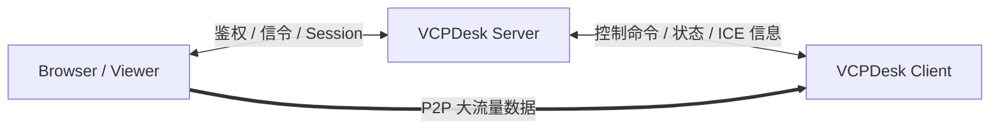
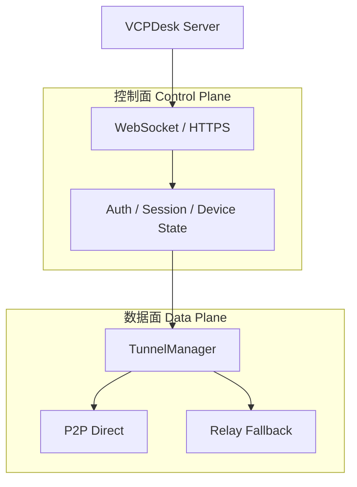
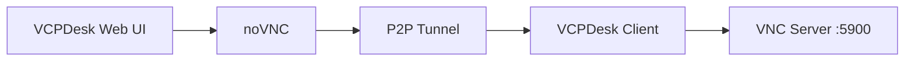
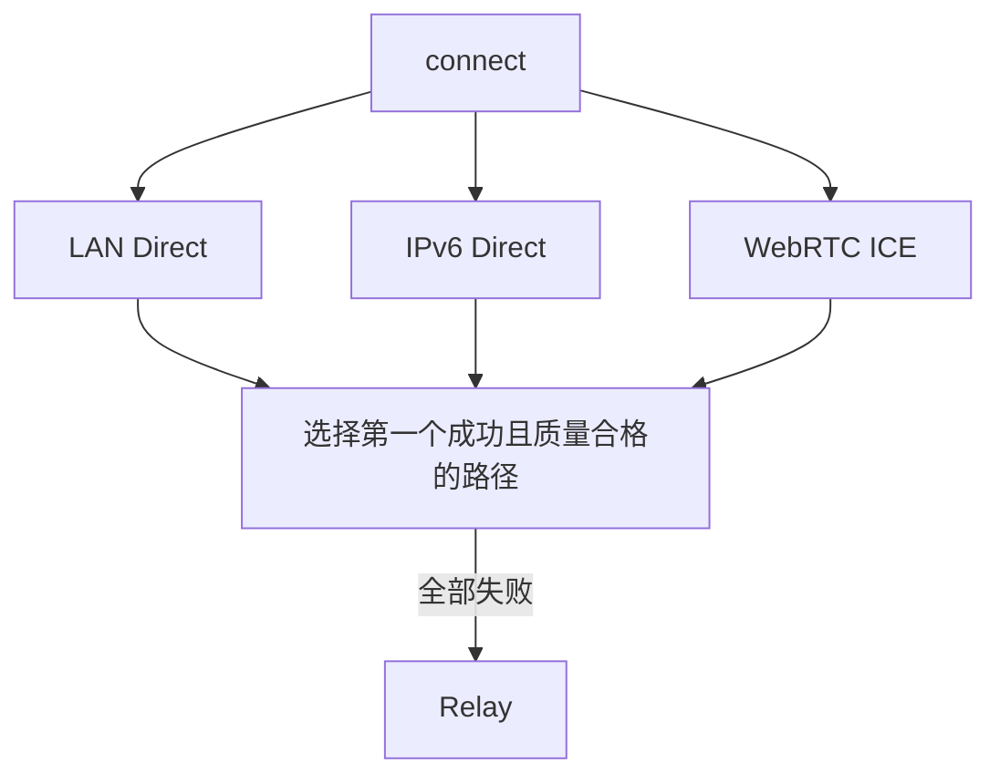
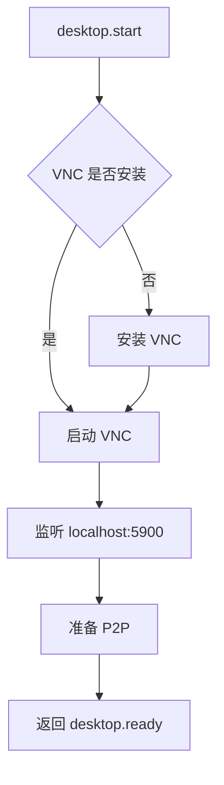
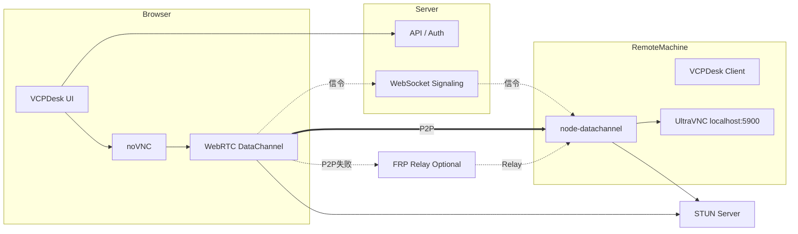
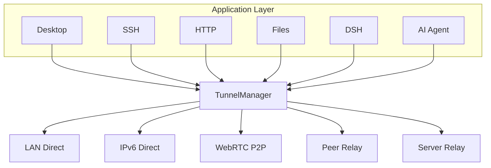

# VCPDesk 轻量远程桌面与 P2P 隧道解决方案

## 1. 文档目标

本文用于设计一套可集成到现有 VCPDesk / Node.js 技术栈中的轻量远程桌面能力。

核心目标：

- 足够简单，不引入庞大的远程运维平台。
- 控制面与数据面彻底分离。
- Server 主要负责鉴权、设备状态、信令、会话管理。
- 大流量数据尽可能采用 P2P 直连，降低服务器带宽成本。
- 远程桌面第一阶段复用成熟 VNC 技术，不自研屏幕协议。
- 浏览器端使用 noVNC。
- 网络层抽象为 TunnelManager / TunnelProvider。
- P2P 失败后才进入 Relay / FRP 等兜底路径。
- 后续可扩展 SSH、HTTP、本地端口、文件传输、AI Agent 等能力。

---

# 2. 核心设计原则

## 2.1 Server 管理连接，但尽量不承载数据

理想架构：



Server 主要承担：

- 登录与身份认证
- 权限检查
- 设备在线状态
- 创建远程会话
- 信令交换
- ICE Candidate 交换
- P2P 协商
- 会话生命周期
- 审计
- 心跳
- 控制命令

Server 不应该默认承担：

- 桌面图像
- 文件传输大流量
- VNC 数据
- SSH 数据
- 本地 Web 服务代理数据
- AI 大模型数据

---

## 2.2 控制面和数据面分离



控制面负责“告诉双方应该做什么”。

数据面负责“真正把数据送过去”。

两者不能混在同一个长连接中。

---

# 3. 技术分层

建议将整个能力拆成四层：

```text
业务层
├── Remote Desktop
├── SSH
├── HTTP Preview
├── File Transfer
├── AI Agent
└── Custom TCP Service

桌面协议层
├── VNC
├── RDP（未来）
└── Video/WebRTC Desktop（未来）

隧道层
├── LAN Direct
├── IPv6 Direct
├── WebRTC P2P
├── QUIC / Custom P2P（未来）
└── Relay

基础网络层
├── STUN
├── ICE
├── UDP Hole Punching
├── UPnP / NAT-PMP / PCP（未来）
└── Relay / FRP
```

---

# 4. 第一阶段远程桌面方案

第一版不建议自己实现：

- 屏幕采集
- 鼠标键盘协议
- Framebuffer 更新
- 图像差分
- 剪贴板协议

直接复用 VNC。

推荐：

### Windows

- UltraVNC

### Linux

- TigerVNC
- x0vncserver
- Wayland 环境根据发行版选择 TigerVNC w0vncserver 或其他兼容实现

### 浏览器

- noVNC

---

# 5. VNC 的定位

VNC 本质是一套远程桌面技术。

核心协议：

> RFB（Remote Framebuffer Protocol）

简单理解：

```text
远程机器屏幕
      ↓
VNC Server
      ↓
RFB 数据
      ↓
VNC Client / noVNC
      ↓
用户看到桌面

用户鼠标键盘
      ↓
VNC Client
      ↓
RFB
      ↓
VNC Server
      ↓
远程系统
```

VNC 只负责：

- 屏幕同步
- 鼠标
- 键盘
- 剪贴板
- 远程桌面交互

VNC 不负责：

- NAT 穿透
- 用户系统
- 设备管理
- Server 调度
- P2P
- Relay

因此非常适合和 VCPDesk 的网络层分离。

---

# 6. 浏览器端架构

浏览器使用 noVNC。



逻辑上相当于：

```text
noVNC
  │
  │ RFB
  ▼
VCPDesk P2P Tunnel
  │
  │ RFB
  ▼
VCPDesk Client
  │
  ▼
127.0.0.1:5900
  │
  ▼
VNC Server
```

---

# 7. 为什么网络必须 P2P 优先

服务器带宽昂贵时：

如果使用中继：

```text
Browser
   ↓
Server
   ↓
Client
```

桌面、文件等所有数据都会经过 Server。

假设远程桌面平均 5 Mbps：

```text
5 Mbps × 3600 秒 ÷ 8
≈ 2.25 GB / 小时
```

多个会话并发后，Server 带宽成本会迅速增加。

P2P 模型：

```text
Browser
   ═══════════════
        P2P
   ═══════════════
Client

Server 仅交换少量信令
```

这样 Server 的主要压力变成：

- WebSocket 长连接
- Session
- ICE 信息
- 状态管理

而不是大流量转发。

---

# 8. STUN、TURN、ICE 的定位

## 8.1 STUN

STUN 的作用：

> 帮助节点知道自己在 NAT 外部表现出来的公网 IP 和端口。

例如：

```text
Client
192.168.1.10:5000
    ↓
Router NAT
    ↓
1.2.3.4:43821
    ↓
STUN Server
```

STUN Server 返回：

```text
Public Endpoint:
1.2.3.4:43821
```

STUN 只帮助发现地址。

不承载业务大流量。

所以：

> STUN 带宽成本非常低。

---

## 8.2 TURN

TURN 的作用：

> P2P 无法建立时，由 TURN Server 中继双方全部数据。

```text
Browser
   ↓
TURN Server
   ↓
Client
```

因此 TURN 会承担：

- 桌面流量
- 文件流量
- 所有 P2P 失败后的数据

所以：

> TURN 是高带宽基础设施。

对于 VCPDesk：

- STUN 可以作为基础设施
- TURN 不应作为常规路径
- TURN / Relay 只能作为 fallback

---

## 8.3 ICE

ICE 可以理解为：

> 自动收集和选择最佳连接路径的机制。

ICE Candidate 通常包括：

- host candidate：本地地址
- server reflexive candidate：STUN 获得的公网映射
- relay candidate：TURN 分配的地址

可以简单理解：

```text
ICE
 │
 ├── LAN Direct
 ├── Public IPv6
 ├── STUN P2P
 └── TURN Relay
```

然后自动挑选最佳路径。

---

# 9. P2P 推荐方案

因为 Viewer 是浏览器，因此推荐：

> WebRTC DataChannel

原因：

浏览器无法直接创建普通：

- TCP Socket
- UDP Socket
- QUIC Socket

WebRTC 原生提供：

- ICE
- STUN
- TURN
- UDP Hole Punch
- DTLS
- DataChannel
- NAT Traversal

---

# 10. Node.js Client 推荐实现

VCPDesk Client 如果使用 Node.js，可以考虑：

## 10.1 node-datachannel

建议作为首选。

特点：

- Node.js API
- 底层 native WebRTC 实现
- DataChannel
- Windows/Linux/macOS
- 性能较好

VCPDesk Client：

```text
node-datachannel
      │
      ▼
WebRTC DataChannel
      │
      ▼
Browser
```

---

## 10.2 werift

另一个选择：

- TypeScript 实现
- 更容易阅读和修改
- Node.js 集成自然
- 适合验证原型

如果追求：

- 简单
- 易调试
- 纯 TS

可以考虑 werift。

如果追求：

- 性能
- 稳定数据通道

优先 node-datachannel。

---

# 11. P2P 建连流程

```mermaid
sequenceDiagram
    participant B as Browser
    participant S as VCPDesk Server
    participant C as VCPDesk Client
    participant STUN as STUN Server

    B->>S: create desktop session
    S->>C: prepare P2P session

    B->>STUN: ICE/STUN discovery
    C->>STUN: ICE/STUN discovery

    B->>S: SDP Offer + ICE Candidates
    S->>C: Forward Offer/Candidates

    C->>S: SDP Answer + ICE Candidates
    S->>B: Forward Answer/Candidates

    B-->>C: UDP Hole Punch / ICE Connectivity Check

    alt P2P Success
        B==>>C: WebRTC DataChannel
    else P2P Failed
        B->>S: fallback request
        S->>C: create relay tunnel
    end
```

---

# 12. 网络路径优先级

推荐优先级：

```text
1. LAN Direct
2. IPv6 Direct
3. WebRTC P2P
4. Peer Relay（未来）
5. Server Relay / FRP
```

第一版可以简化：

```text
LAN
 ↓
WebRTC P2P
 ↓
FRP / Relay
```

---

# 13. 为什么 IPv6 值得优先

如果 Viewer 和 Client 都拥有公网 IPv6：

```text
Viewer IPv6
    │
    ═════════════
    │
Client IPv6
```

理论上无需 NAT 穿透。

只需要处理：

- 防火墙
- 鉴权
- Session
- 临时开放策略

因此 IPv6 Direct 应当作为未来 Path Discovery 的重要能力。

---

# 14. 不建议串行尝试所有网络路径

错误方式：

```text
先试 LAN 5 秒
失败
再试 P2P 5 秒
失败
再试 Relay
```

用户体验会很差。

推荐：

> 并行竞速。



---

# 15. TunnelManager 抽象

整个 P2P 能力不要只为远程桌面设计。

应该抽象成通用隧道。

建议：

```ts
interface TunnelManager {
  open(options: OpenTunnelOptions): Promise<TunnelSession>
  close(sessionId: string): Promise<void>
}

interface OpenTunnelOptions {
  deviceId: string

  target: {
    host: string
    port: number
    protocol?: 'tcp' | 'udp'
  }

  preferredModes?: TunnelMode[]
}

type TunnelMode =
  | 'lan'
  | 'ipv6'
  | 'webrtc-p2p'
  | 'peer-relay'
  | 'server-relay'
  | 'frp'

interface TunnelSession {
  id: string
  mode: TunnelMode
  latency?: number
  localEndpoint?: string
  remoteEndpoint?: string
}
```

---

# 16. TunnelProvider

内部进一步拆分：

```ts
interface TunnelProvider {
  canConnect(ctx: TunnelContext): Promise<boolean>
  connect(ctx: TunnelContext): Promise<TunnelConnection>
  close(connectionId: string): Promise<void>
}
```

具体实现：

```text
TunnelManager
   │
   ├── LanTunnelProvider
   ├── IPv6TunnelProvider
   ├── WebRTCTunnelProvider
   ├── PeerRelayProvider
   └── ServerRelayProvider
```

第一阶段：

```text
TunnelManager
   │
   ├── LanTunnelProvider
   ├── WebRTCTunnelProvider
   └── FrpRelayProvider
```

---

# 17. 远程桌面模块抽象

远程桌面不应该知道网络细节。

```ts
interface DesktopBackend {
  install(): Promise<void>
  start(): Promise<void>
  stop(): Promise<void>
  getEndpoint(): Promise<DesktopEndpoint>
}

interface DesktopEndpoint {
  protocol: 'vnc' | 'rdp'
  host: string
  port: number
}
```

Windows：

```text
UltraVNCBackend
      │
      ▼
127.0.0.1:5900
```

然后交给 TunnelManager：

```text
DesktopBackend
      │
      ▼
TunnelManager.open()
```

---

# 18. VCPDesk Client 工作流程

用户点击：

> 远程桌面

Server 下发：

```json
{
  "type": "desktop.start",
  "sessionId": "desktop_xxx"
}
```

Client：



---

# 19. 安全策略

VNC Server 不应该直接暴露公网。

推荐：

```text
VNC Server
127.0.0.1:5900
```

只允许 VCPDesk Client 在本机访问。

外部访问：

```text
Browser
   ↓
加密 P2P Tunnel
   ↓
VCPDesk Client
   ↓
127.0.0.1:5900
```

这样即使 VNC 自身认证能力有限，也不会直接暴露。

---

# 20. Session 安全设计

每次创建临时远程桌面 Session：

```json
{
  "sessionId": "desktop_xxx",
  "deviceId": "pc-001",
  "userId": "user-001",
  "expiresAt": 1760000000,
  "permissions": [
    "desktop.view",
    "desktop.control"
  ]
}
```

建议：

- 短期 Session Token
- 单次连接
- 自动过期
- Server 统一签发
- Client 验证 Session
- P2P 建立后继续做端到端鉴权
- Session 结束立即关闭 VNC 或释放临时资源

---

# 21. Relay 的定位

Relay 只是：

> 最后兜底。

抽象：

```text
RelayProvider
   │
   ├── FRP
   ├── TURN
   ├── Custom Relay
   └── Peer Relay
```

第一阶段：

```text
RelayProvider
   │
   └── FRP
```

未来可以替换，不影响业务层。

---

# 22. 为什么不建议第一版直接使用 MeshCentral

MeshCentral 很强，但它已经包含：

- 用户
- ACL
- Device
- Agent
- Terminal
- Files
- Desktop
- Relay
- Web UI
- 权限体系

而 VCPDesk 已经拥有大量类似能力。

因此会产生重复：

```text
VCPDesk Device System
       +
MeshCentral Device System

VCPDesk Agent
       +
MeshAgent

VCPDesk Auth
       +
MeshCentral Auth
```

如果目标是：

> 只增加远程桌面

使用 VNC + noVNC + 自有 TunnelManager 更简单。

---

# 23. 为什么不建议第一版自研远程桌面协议

自研意味着需要实现：

- 屏幕采集
- 脏矩形检测
- 编码
- H264/H265/AV1
- 硬件加速
- 鼠标键盘
- 分辨率
- 多屏
- 剪贴板
- 帧率
- 延迟控制
- 拥塞控制

成本非常高。

第一版：

> VNC 足够完成运维和 GUI 控制。

后续有高性能需求，再引入：

```text
DesktopBackend
   │
   ├── VNCBackend
   ├── RDPBackend
   └── VideoDesktopBackend
```

---

# 24. MVP 设计

建议 MVP 只实现：

## Server

- 设备在线状态
- Remote Desktop Session API
- WebSocket Signaling
- ICE Candidate 转发
- Session 鉴权
- Relay fallback

## Client

- UltraVNC 安装
- UltraVNC 启停
- localhost:5900
- node-datachannel
- WebRTC DataChannel
- DataChannel ↔ TCP Proxy
- FRP fallback

## Browser

- noVNC
- RTCPeerConnection
- DataChannel
- Signaling
- Remote Desktop UI

## 基础设施

- STUN Server
- VCPDesk Server
- 可选 FRP Relay

---

# 25. MVP 总体架构



---

# 26. 后续扩展

同一套 TunnelManager 可以继续支持：

## SSH

```text
Browser
   ↓
P2P Tunnel
   ↓
Client
   ↓
127.0.0.1:22
```

## 本地 Web 服务

```text
Browser
   ↓
P2P Tunnel
   ↓
Client
   ↓
127.0.0.1:3000
```

## PostgreSQL

```text
Developer Tool
   ↓
P2P Tunnel
   ↓
Client
   ↓
127.0.0.1:5432
```

## DSH

```text
VCPDesk
   ↓
P2P Tunnel
   ↓
Remote Client
   ↓
DSH Local API
```

## 文件传输

文件传输甚至可以不经过 TCP 代理，直接使用：

```text
WebRTC DataChannel
```

实现真正的 Client ↔ Client P2P 文件传输。

---

# 27. 长期架构



---

# 28. 推荐开发阶段

## Phase 1：最小可用

目标：

> 浏览器可以控制一台 Windows 机器。

实现：

- UltraVNC
- noVNC
- Node.js Client
- WebRTC DataChannel
- STUN
- Signaling

---

## Phase 2：可靠性

增加：

- FRP fallback
- Session timeout
- 自动重连
- 质量检测
- P2P / Relay 状态展示
- 日志
- 审计

---

## Phase 3：智能路径

增加：

- LAN Direct
- IPv6 Direct
- 多路径竞速
- 延迟检测
- 自动 Path Selection
- NAT 类型统计

---

## Phase 4：通用 Tunnel

把能力扩展为：

```text
VCP Tunnel
```

支持：

- Desktop
- SSH
- HTTP
- TCP
- UDP
- Files
- Agent communication

---

## Phase 5：高级 P2P

根据实际规模再考虑：

- libp2p
- QUIC
- Peer Relay
- NAT-PMP
- UPnP
- PCP
- Distributed Relay

不建议 MVP 就实现这些。

---

# 29. 最终技术选型建议

| 模块 | 第一阶段推荐 |
|---|---|
| Server | Node.js |
| Control Channel | WebSocket |
| Browser Desktop | noVNC |
| Windows VNC | UltraVNC |
| Linux VNC | TigerVNC |
| Browser P2P | WebRTC DataChannel |
| Node Client P2P | node-datachannel |
| NAT Discovery | STUN |
| Path Selection | ICE |
| Relay | FRP fallback |
| Session | VCPDesk 自有 |
| Auth | VCPDesk 自有 |
| Device Management | VCPDesk 自有 |

---

# 30. 最终结论

整个方案可以总结成一句话：

> VCPDesk Server 负责“找到设备、授权双方、协商连接”，真正的大流量数据尽可能在 Browser 与 Client 之间直接 P2P 传输。

远程桌面层：

```text
VNC + noVNC
```

网络层：

```text
LAN / IPv6 / WebRTC P2P
          ↓
      Relay fallback
```

控制层：

```text
VCPDesk WebSocket / API
```

最终形成：

```text
             VCPDesk Server
          Control / Signaling
                  │
        ┌─────────┴─────────┐
        │                   │
     Browser             Client
        │                   │
        ╰════ P2P Tunnel ═══╯
                  │
             localhost
                  │
           VNC / SSH / HTTP
```

这套架构最大的价值不是“做一个远程桌面”。

而是建立一套：

> **低服务器带宽成本、P2P 优先、协议无关的 VCPDesk 通用远程隧道能力。**

远程桌面只是它的第一个应用。
