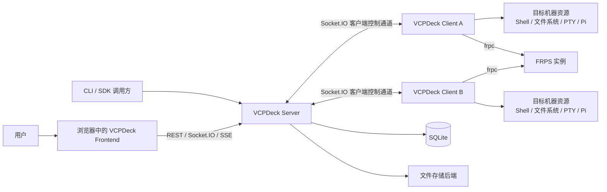
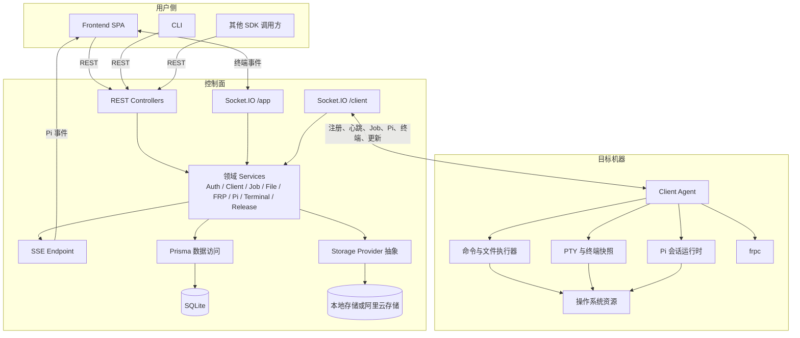
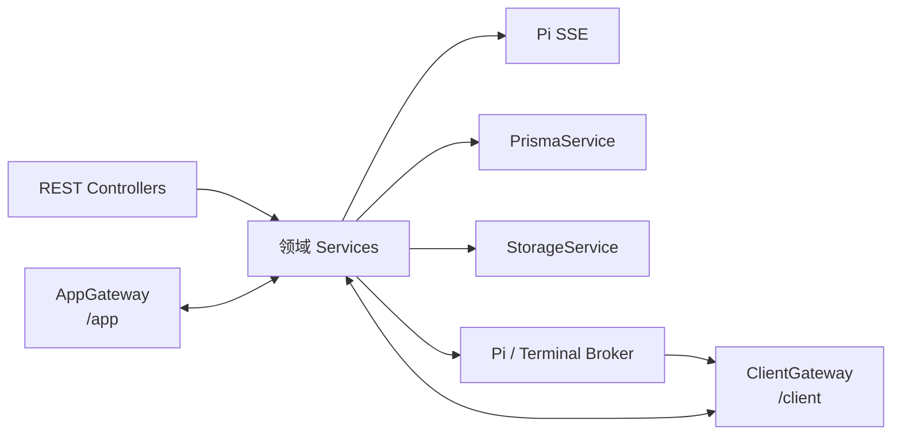
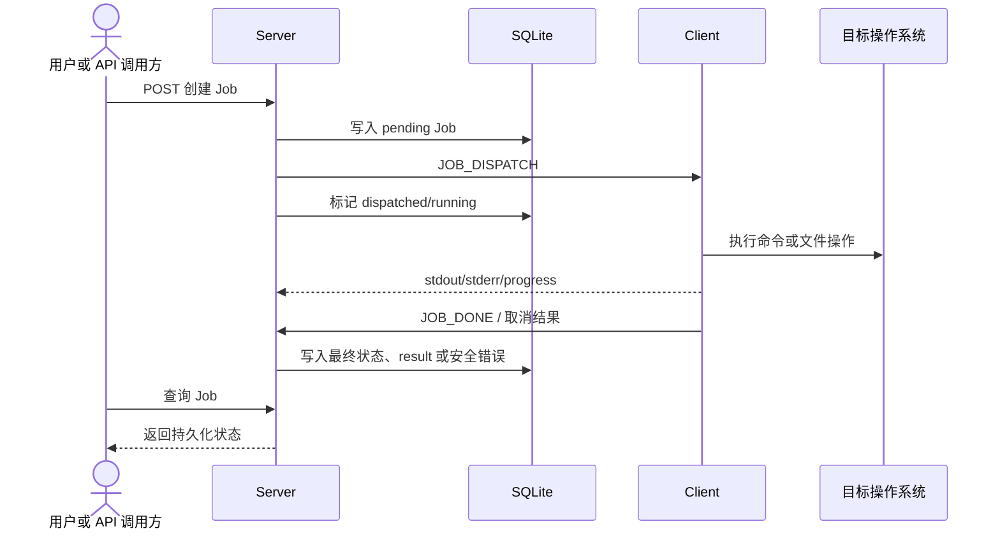
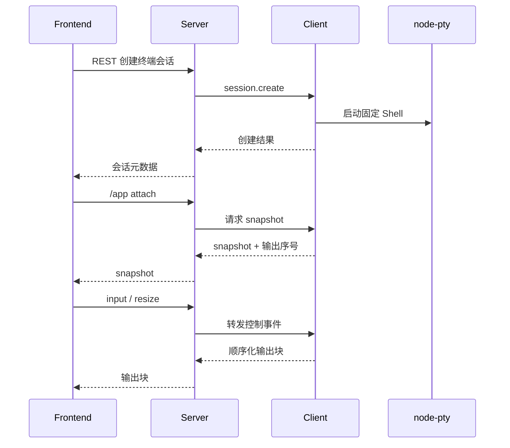
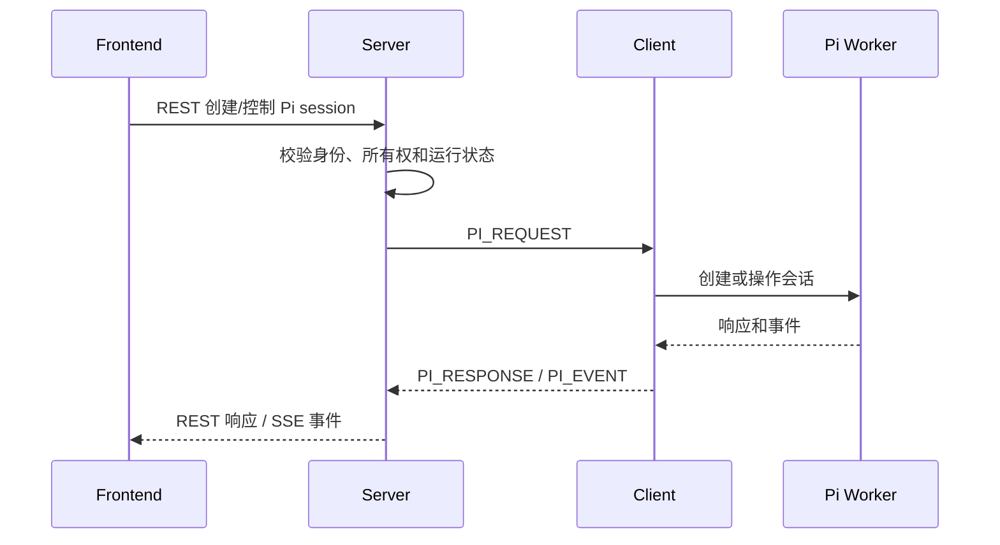
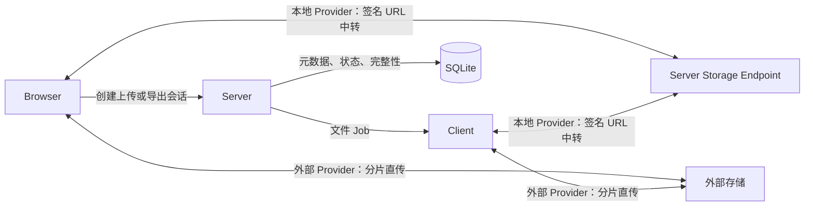
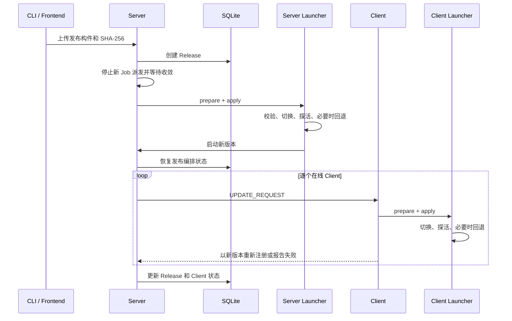
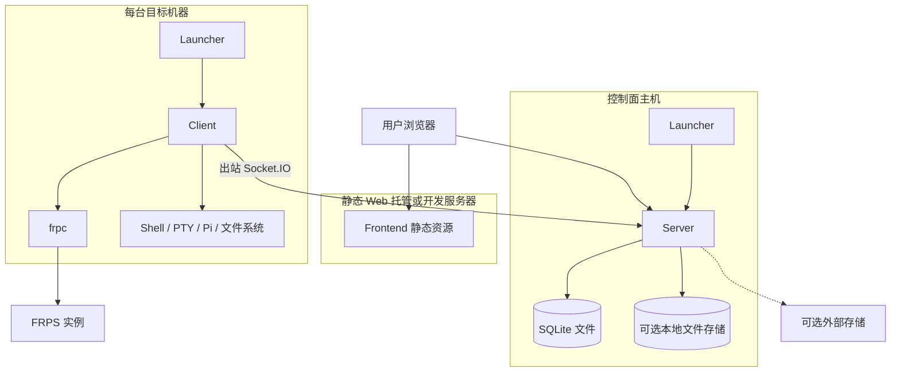

# VCPDeck 系统架构

> 状态：Current｜维护责任：架构维护者｜最后核验：2026-08-15｜适用版本：当前 `main`
>
> 本文描述当前仓库已经落地的系统结构、运行组件、通信边界、数据归属和关键链路。产品定位与长期愿景见 [`README.md`](../README.md)，具体技术版本和选型理由见 [`tech-stack.md`](./tech-stack.md)，单项功能的协议细节见文末专题文档。

## 1. 架构范围

VCPDeck 当前是一个以 Server 为控制中心、以 Client 为远程执行节点的个人 AI 协作驾驶台。系统解决以下架构问题：

- 统一管理多台目标机器的在线状态和能力；
- 通过持久化 Job 调度远程命令、文件和 FRP 操作；
- 在浏览器中提供远程终端和远程 Pi 会话；
- 将身份、任务状态、会话元数据和发布状态集中保存在 Server；
- 通过独立 Launcher 守护并更新 Server 与 Client。

本文只描述现有代码。README 中的 TODO 工作流、VCPToolBox 双向桥接、聊天与规则引擎属于产品愿景，目前没有对应运行组件，因此不纳入当前架构图。

## 2. 架构原则

1. **Server 是控制面的中心**  
   浏览器、SDK 和 CLI 不直接控制远程机器；所有业务操作先进入 Server，由 Server 完成认证、状态管理和调度。

2. **Client 主动建立出站连接**  
   Client 通过 Socket.IO 主动连接 Server，不要求 Server 直接访问目标机器。FRP 用于暴露明确配置的网络服务，不替代控制通道。

3. **持久状态与实时资源分离**  
   身份、Job、文件元数据、FRP 映射、终端会话元数据和发布记录由 Server 持久化；进程、PTY、Pi 会话和 frpc 等实时资源实际运行在 Client。

4. **控制流与数据流按场景分工**  
   REST 负责资源和命令入口，Socket.IO 负责双向实时控制，SSE 负责远程 Pi 的浏览器事件流，文件内容根据存储后端走 Server 中转或外部存储直传。

5. **进程生命周期独立于业务进程**  
   Launcher 在 Server/Client 进程之外负责拉起、探活、版本切换和失败回退，避免业务进程自行替换自身。

6. **共享协议而不共享运行时状态**  
   `@vcpdeck/shared` 统一事件名、DTO、错误码和运行时解析器；各进程只通过公开协议通信，不跨包访问对方内部状态。

## 3. 系统上下文



系统中的核心信任关系是：

- 用户和自动化调用方只信任并访问 Server；
- Server 通过 PSK 接受 Client 连接；
- Client 只执行通过已认证控制通道收到且通过协议校验的请求；
- Server 保存控制面状态，但不拥有目标机器上的实时进程和 PTY。

## 4. 运行组件

### 4.1 组件视图



### 4.2 组件职责

| 组件 | 运行位置 | 主要职责 | 不负责 |
| --- | --- | --- | --- |
| Frontend | 浏览器 | 驾驶台交互、REST 调用、终端渲染、消费 Pi SSE | 直接访问数据库或远程机器 |
| SDK | 浏览器或 Node.js 调用方 | 类型安全的 REST API 封装和错误归一化 | Socket.IO/SSE 生命周期、服务端业务状态机 |
| CLI | 操作员机器或自动化环境 | 管理用户级/项目级目标环境；当前负责发布包上传；构建 Pi Skill 的单文件入口 | 承担 Server/Client 运行逻辑，或让项目配置直接定义 Server/凭据 |
| Server | 控制面主机 | 认证、资源 API、Client 连接、Job 调度、状态持久化、实时流代理、更新编排 | 直接在远程机器执行命令或持有远程 PTY |
| Client | 每台目标机器 | 能力探测、命令与文件操作、PTY、Pi、frpc、状态上报 | 用户身份管理和全局业务状态持久化 |
| Launcher | Server/Client 所在主机 | 守护业务进程、准备 Node.js、应用更新、探活和回退 | Job 调度与业务协议处理 |
| SQLite | Server 主机 | 保存控制面关系数据和状态记录 | 保存终端正文、PTY 或远程进程内存 |
| Storage Provider | Server 本地或外部存储 | 保存跨机器传输的文件内容和发布构件 | 作为 Job 队列或业务数据库 |
| FRPS | 可被目标网络访问的主机 | 接收 frpc 连接并暴露配置的 TCP/HTTP 服务 | 承担 VCPDeck Client 控制通道 |

## 5. Server 内部边界

Server 采用“入口适配器 → 领域服务 → 基础设施”的分层协作方式：



主要边界如下：

- **REST Controllers**：验证 HTTP 输入、取得操作者身份并调用领域服务；
- **ClientGateway**：维护 `/client` namespace，处理注册、心跳、Job、Pi、终端和更新事件；
- **AppGateway**：维护 `/app` namespace，认证浏览器连接并代理交互式终端；
- **领域 Services**：拥有业务状态转换和资源约束，不把规则放入 Frontend 或 Client；
- **Broker**：关联 Server 发出的请求与 Client 的响应，隔离 Gateway 和具体领域状态机；
- **PrismaService**：持久化控制面数据；
- **StorageService**：隔离本地与阿里云存储差异，签发并校验传输能力。

Server 没有引入 Redis、BullMQ 等独立队列。Job 记录保存在 SQLite 中，调度器从持久状态选择待执行 Job，并通过在线 Client 的 Socket.IO 连接下发。

## 6. Client 内部边界

Client 启动后完成能力探测并连接 Server。其内部职责可分为：

- **连接与注册**：维护 Socket.IO 连接、PSK 握手、注册、心跳和断线重连；
- **Dispatcher**：根据判别联合中的 Job 类型，将请求路由到命令、文件、传输或 FRP 处理器；
- **Executor**：以子进程执行命令，流式上报输出，并支持超时和取消；
- **File/Transfer Handler**：执行远程文件操作并与 Storage 完成导入/导出；当前 rootDir 绑定、symlink 和不存在目标父链校验仍有缺口，详见 [`design/remote-files.md`](./design/remote-files.md)；
- **Terminal Manager**：创建和管理 PTY，生成 headless 快照，处理断线保留与进程清理；当前 snapshot/output 序列、上游 gap、持久状态同步和本地过期上报仍有偏移，详见 [`design/remote-terminal.md`](./design/remote-terminal.md)；
- **Pi Supervisor**：在目标项目上下文中管理 Pi worker 和会话；
- **FRP Daemon**：管理 frpc 配置和进程；
- **Update Handler**：配合本机 Launcher 准备并应用新版本。

Client 的长期要求是只接受 Shared 定义并经过运行时解析的消息。Pi/Terminal 已有严格 parser；exec 和文件 Job 仍存在 Client 侧宽泛断言及文件 payload 缺双端 parser 的实现偏移。命令、路径和环境等不可信输入必须在进入具体执行器前完成校验。

## 7. 通信边界

| 通道 | 方向 | 用途 | 认证与状态 |
| --- | --- | --- | --- |
| REST `/api/*` | Browser/SDK/CLI → Server | 登录、资源 CRUD、Job、文件、FRP、Pi、终端元数据和发布 | Cookie 会话或 Bearer Token；少量健康/登录端点公开 |
| Socket.IO `/client` | Server ↔ Client | 注册、心跳、Job、文件、FRP、Pi、终端、更新 | PSK；连接与 Client 记录绑定 |
| Socket.IO `/app` | Browser ↔ Server | 终端 attach、输入、输出、resize、控制权和重同步 | Cookie 会话或握手 Bearer Token |
| SSE | Server → Browser | 远程 Pi session 事件 | Cookie 会话；EventSource 自动重连 |
| 签名文件 URL | Browser/Client ↔ Storage | 文件和发布构件的数据传输 | 短期签名、过期时间及完整性校验 |
| FRP | Client frpc ↔ FRPS | 暴露用户明确创建的 TCP/HTTP 映射 | FRPS Token 和实例配置 |
| Launcher 本机控制通道 | Server/Client → 本机 Launcher | 准备与应用更新 | 仅本机监听并使用随机控制 Token |

控制通道和文件数据通道相互独立：创建文件操作仍由 Server 认证并形成 Job，但大文件内容可以根据 Storage Provider 直接在 Browser/Client 与外部存储之间传输。

## 8. 数据归属

| 数据或资源 | 权威位置 | 持久性说明 |
| --- | --- | --- |
| 身份、Credential、登录会话 | Server / SQLite | 持久化；Token 以哈希形式校验 |
| Client 清单与最后状态 | Server / SQLite | 持久化；在线连接和 socket lease 属于运行时状态 |
| Job 状态、payload、result、进度和安全错误 | Server / SQLite | 持久化；`file.writeText` 正文进入 payload，`file.readText` 正文进入 result，命令和文本内容都应按敏感数据处理 |
| 文件元数据 | Server / SQLite | 持久化 |
| import/export 文件正文和发布构件 | Storage Provider | 本地目录或外部存储；通过签名能力访问；`readText/writeText` 小文本例外地进入 Job |
| FRPS 实例和映射配置 | Server / SQLite | 持久化；实际 frpc 进程在 Client |
| 终端会话元数据与生命周期审计 | Server / SQLite | 持久化，但不记录终端正文、快照和重连 Token |
| 活跃 PTY、终端输出缓存和快照 | Client 内存 | Client 是活跃终端资源的权威；断线后按保留策略清理 |
| 远程 Pi 运行状态 | Server 状态机 + Client 会话 | Server 管理所有权和生命周期，Client 持有实际 Pi worker/session |
| Release 及各 Client 更新状态 | Server / SQLite | 持久化并可在 Server 重启后恢复编排 |
| 当前版本、历史版本和回退点 | 各主机 Launcher 目录 | 由 Launcher 管理，不存入业务进程内存作为唯一事实来源 |

## 9. 关键执行链路

### 9.1 远程 Job



同一 Client 的调度受 Server 调度器管理。Client 断线时，Server 不假设远程操作已经停止；重连后应通过状态报告对账。当前 exec 的终局补报仍有缺口，文件 handler/transfer 也未完整进入状态报告，因此不能保证所有 disconnected Job 自动收敛。

### 9.2 交互式终端



Server 管理会话元数据、浏览器 attachment、operator/viewer 控制权和最小审计；Client 管理真实 PTY。浏览器断线不等价于关闭 PTY，重新 attach 时通过 snapshot 和序号恢复；当前 snapshotSeq 与网络 output seq 并非严格同一计数点，不能把恢复链路描述为无缺口持久流。

### 9.3 远程 Pi



REST 承担有明确结果的控制命令，SSE 承担持续事件流。Server 维护 session/run 的所有权、锁和重连对账；实际 Agent 会话运行在目标机器的 Client。

### 9.4 文件传输

文件操作由 Job 控制，但文件内容根据存储后端采用不同路径：



Server 始终负责身份认证、传输会话和 Job 状态；完整性保证取决于 Provider 与传输方向，使用外部直传时文件正文无需经过 Server 进程。目标机器上的路径解析、轻量文件操作、导入落位和导出读取由 Client 执行，当前 rootDir、symlink、import SHA-256、取消和断线补报仍存在已知缺口，见 [`design/remote-files.md`](./design/remote-files.md)。

### 9.5 发布与自更新



Launcher 是更新过程中的进程级权威；Server 是全局发布编排和审计状态的权威。Server 重启后根据持久化 Release 状态恢复客户端更新阶段。

## 10. 部署视图



Frontend 构建产物随发布包分发并由 Server 同源托管（`server/public/`，SPA 回退到 `index.html`，见 [ADR-0013](./adr/0013-frontend-bundled-with-server.md)），开发环境仍由 Vite 提供、NestJS Server 监听 API 端口；生产环境也可将静态资源和 API 部署在不同主机（不随包时），通过允许的 Origin 和反向代理进行连接。

Client 和 Server 都可以由 Launcher 守护。SQLite 与本地 Storage 应放在 Server 的持久化目录中，不应随版本目录切换而丢失。

## 11. 安全与故障边界

### 11.1 身份与连接

- Browser REST 使用服务端 opaque HttpOnly Session Cookie；SDK/自动化调用可使用 opaque Bearer Credential；SQLite 只保存 Token 摘要，详见 [`design/identity-and-authentication.md`](./design/identity-and-authentication.md)；
- `/app` Socket.IO 复用 Cookie 或握手 Token，并把连接绑定到已认证 Actor；REST 与 `/app` 当前分别实现认证，既有 Socket 不会因后续禁用/撤销被主动断开；
- `/client` Socket.IO 使用独立 PSK，不使用普通用户身份；
- Client 注册、能力和状态报告仍属于不可信协议输入，Server 必须解析后再使用；
- 文件签名 URL 和 Launcher 控制 Token 都是短期、受范围约束的能力，不应写入普通日志。

### 11.2 故障隔离

- **Client 断线**：Server 保留持久状态，待 Client 重连后对账；不会把断线简单等同于执行失败；
- **Server 重启**：SQLite 中的业务状态保留，在线 socket、SSE 订阅和内存 Broker 需要重新建立；
- **Frontend 刷新**：资源状态从 REST 恢复，终端通过重新 attach 获取 snapshot，Pi 事件流重新订阅；
- **Storage 故障**：影响文件正文传输，但不应绕过 Job 和文件元数据的状态约束；
- **Launcher 更新失败**：由本机版本目录和健康探测执行回退，并向全局编排报告结果；
- **FRPS 故障**：只影响相应映射，不影响 Client 到 Server 的 Socket.IO 控制连接；当前同一 Client 仅有单个 frpc runtime，Server 多实例模型不等于该 Client 可同时连接多个 FRPS，详见 [`design/frp.md`](./design/frp.md)。

## 12. 包与运行时的关系

仓库中的 package 不都对应独立进程：

```text
编译期库：shared、sdk
浏览器运行时：frontend
控制面进程：server
目标机器进程：client
进程守护：launcher（每台需要守护/更新的主机各自运行）
操作入口：cli、skills/vcpdeck
```

内部依赖遵循以下方向：

```text
shared  ←  sdk  ←  frontend
   ↑         ↑
   ├──────── server
   ├──────── client
   ├──────── cli
   └──────── launcher
```

图中的箭头表示“被依赖”。Server、Client 和 Frontend 之间没有源码级互相调用，它们通过共享协议定义的网络边界协作。

## 13. 相关文档

- [技术栈](./tech-stack.md) — 技术版本、工具和选型理由
- [远程命令与脚本执行设计](./design/remote-execution.md) — exec command/script、输出、取消和安全边界
- [远程文件设计](./design/remote-files.md) — 文件 Typed Job、目标路径、轻量操作、导入/导出和失败边界
- [Storage 子系统设计](./design/storage.md) — File/Provider、Local/Alibaba 数据路径和故障边界
- [远程终端设计](./design/remote-terminal.md) — PTY、Session、attach、控制权、snapshot、重连和失败边界
- [远程 Pi 会话设计](./design/remote-pi.md) — Worker、Session/Run、REST/SSE、隐私和重连边界
- [身份与认证设计](./design/identity-and-authentication.md) — Identity、Cookie、Bearer、Actor、admin 和撤销边界
- [FRP 设计](./design/frp.md) — FrpsInstance、Mapping、Typed Job、frpc、凭据和恢复边界
- [Release 与自更新设计](./design/release-and-update.md) — Release 编排、Launcher、更新和回退边界
