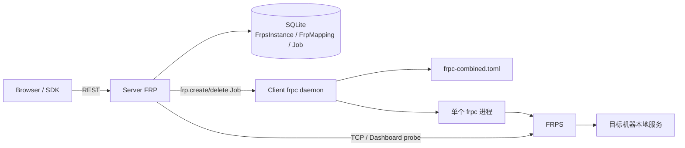

# VCPDeck FRP 设计

> 状态：Current｜维护责任：FRP/Client 维护者｜最后核验：2026-08-24｜适用版本：当前 `main`
>
> 事实来源：`packages/shared/src/index.ts`、`packages/server/src/frp/`、`packages/server/src/events/client.gateway.ts`、`packages/client/src/frpc-daemon.ts`、`packages/sdk/src/frp.ts`、Frontend FRP 页面、Prisma schema

本文描述当前已经实现的 FRPS 实例配置、端口映射、Typed Job 和 Client frpc 运行模型。字段级 REST 端点以 Shared、Controller、SDK 和 [`protocols.md`](../protocols.md) 为准。Server 中心控制面、SQLite 和 Typed Job 的长期选择分别见 [`ADR-0001`](../adr/0001-control-plane-and-outbound-clients.md)、[`ADR-0002`](../adr/0002-sqlite-prisma-control-plane.md) 和 [`ADR-0004`](../adr/0004-typed-job-kernel.md)。

## 1. 范围与非目标

当前 FRP 提供：

- Server/SQLite 中的 FrpsInstance CRUD；
- 一个逻辑默认实例；
- FRPS TCP/Dashboard probe 和 proxy 摘要；
- 每个实例的端口范围；
- FrpMapping 创建、分页查询、详情和删除；
- `provisioning/active/inactive/deleting/error` 状态与 FRPS Dashboard 完成确认；
- `frp.create/delete/list` Typed Job；
- Client 按平台发现 frpc，并生成合并 TOML、启动/重启单个 frpc；
- Client 断线时 Server 把 active mapping 标为 inactive；
- SDK 与 Frontend 的实例和映射管理。

当前不提供：

- VCPDeck 自身控制通道经 FRP 建立；
- FRPS 的安装、升级、HA、证书签发或用户管理；
- 每 Client 多个独立 frpc runtime；
- Client 重启后按 SQLite 自动重建全部映射；
- frpc 进程持续健康监督（创建/删除时会确认 FRPS 注册状态，但不持续巡检）；
- 按 Identity/Client 隔离 FRPS 凭据；
- FRPS Token 加密存储或 API 脱敏；
- UDP、STCP、XTCP、SUDP 等代理类型；
- 对 FRP 暴露服务的应用层认证、防火墙或 TLS 自动配置。

FRP 用于暴露操作者明确选择的目标服务，不替代 Server ↔ Client `/client` 控制通道。

## 2. 组件与职责



| 组件 | 当前职责 |
| --- | --- |
| `FrpsInstancesController/Service` | 实例 CRUD、默认实例、环境变量迁移、probe、REST DTO |
| `FrpController/Service` | 严格解析、映射持久化、Client/capability/单实例检查、端口分配、Typed Job 和 Dashboard 收敛 |
| `PortAllocator` | 进程内串行分配、DB 与本次严格 Dashboard 查询的已用端口合并 |
| `ClientGateway` | 派发 Job、调用映射收敛、回滚编排、断线置 inactive |
| Client `frpc-daemon` | 内存 proxy registry、合并 TOML、单 frpc 启停和 Job 回报 |
| FRPS | 接收 frpc、暴露 remotePort/customDomain；不由 VCPDeck 持久化运行状态 |
| Frontend/SDK | 实例、probe、映射 CRUD 的调用和展示 |

## 3. 数据权威

| 数据或资源 | 权威位置 | 当前持久性 |
| --- | --- | --- |
| FrpsInstance 配置 | Server / SQLite | 持久化，包括明文秘密 |
| FrpMapping 期望配置 | Server / SQLite | 持久化；删除在 FRPS 确认消失后才删记录 |
| 创建/删除调度状态 | Server Job / SQLite | 持久化；payload 可能含 FRPS Token |
| proxy registry | Client 进程内 `proxies` | Client 重启后丢失 |
| 当前 FRPS 连接信息 | Client `lastFrpsInfo` | 进程内，仅保存最后一次 create 的实例 |
| 合并 frpc TOML | Client 工作目录 | 明文磁盘文件 |
| frpc 进程 | Client OS | 非持久资源，无独立 Supervisor |
| FRPS 已注册 proxy | FRPS runtime / Dashboard | probe 时读取，不是 Server 持久权威 |
| mapping status | Server/SQLite 的操作投影 | `active` 表示操作时 Dashboard 已确认，不等于持续健康或公网可达 |

FrpMapping 记录表达控制面期望；实际 proxy 是否注册并可访问必须结合 Client 进程、frpc 日志、FRPS Dashboard、防火墙和本地服务检查。

## 4. FrpsInstance

当前实例字段包括：

- name；
- serverAddr/serverPort；
- authToken；
- dashboardScheme/Host/Port/User/Password；
- portRangeStart/End；
- isDefault；
- createdAt/updatedAt。

Server 可以存储多个 FrpsInstance。创建或 update `isDefault=true` 会清除其他默认标记；另有 set-default 端点。删除实例前检查是否仍有 FrpMapping 关联。

### 4.1 默认实例一致性

“只能有一个逻辑默认实例”当前由应用代码约定，不是数据库唯一约束：

- 可以创建全部 `isDefault=false` 的实例；
- update 可把当前默认实例设为 false；
- setDefault 先清除原默认，再更新目标，没有事务；
- 并发请求或目标不存在时可能出现无默认实例；
- create/update 的清除与写入也不是单事务。

未显式传 `frpsInstanceId` 创建映射时，没有默认实例会失败。

### 4.2 首次环境变量迁移

Server 启动时，若 FrpsInstance 表为空，会从以下变量创建一个默认实例：

- `FRP_PUBLIC_HOST`；
- `FRPS_BIND_PORT`；
- `FRPS_TOKEN`；
- `FRP_DASHBOARD_SCHEME/HOST/PORT/USER/PASSWORD`；
- `FRP_PORT_RANGE_START/END`。

一旦数据库中存在任何实例，环境变量不再更新现有配置。当前缺失变量时会使用开发默认，包括 `127.0.0.1`、`test-frp-token` 和 Dashboard `admin/admin`；生产首次启动前必须显式配置或在启动后立即替换，不能把这些默认值视为安全配置。

## 5. Probe

`POST /api/frp/instances/:id/probe` 执行：

1. 对 serverAddr/serverPort 做最多约 5 秒 TCP connect；
2. 配置 dashboardHost 时，使用 Basic Auth 请求 `/api/serverinfo`；
3. 认证成功后并行请求 `/api/proxy/tcp|http|https`；
4. 返回 TCP、Dashboard、auth、version、proxy 摘要和 usedPorts。

无 Dashboard 时 `ok` 等于 TCP 可达，但 `authValid=false`、`proxies=null`。有 Dashboard 时 `ok` 当前只等于 Dashboard authValid，不同时要求 tcpReachable。因此 probe 是诊断摘要，不是完整端到端映射健康保证。

外部错误文本当前可能进入 ProbeResult.error。Dashboard 网络/TLS/解析失败被安全地收敛为不可达，但错误码和消息还没有稳定 allowlist。

## 6. 映射创建

```text
POST /api/frp/mappings
  → Shared 严格解析；检查 Client 在线/capability/单 FrpsInstance
  → 要求 Dashboard 可认证，检查 DB + FRPS proxy name
  → TCP 分配 remotePort；HTTP/HTTPS 使用 customDomain
  → 创建 provisioning FrpMapping + running frp.create Job
  → Gateway 立即派发
  → Client 原子更新内存 proxy、写 TOML，等待 frpc spawn
  → Client 回 JOB_DONE（只代表本地动作完成）
  → Server 轮询 Dashboard；proxy 出现后 active/done
  → 未确认则派发 delete 回滚；回滚失败保留 error
```

支持 proxyType：`tcp/http/https`。name 可选，缺省为 `<proxyType>-<localPort>`，冲突追加短随机后缀；同一 FrpsInstance 内由数据库唯一约束兜底。TCP 可选 remotePort 且禁止 customDomain；HTTP/HTTPS 必须提供 customDomain 且不分配 remotePort。Shared parser 拒绝未知字段、非法端口、类型冲突和危险名称字符，默认确认时限 30 秒（1–300）。

### 6.1 active 的含义

Client 的 JOB_DONE 只表示本地配置写入且收到 child `spawn` 事件；Server 必须再从 FRPS Dashboard 观察到相同 proxyType/name 才把 mapping 标为 active 并完成 Job。active 因此表示“本次操作时 Client 本地动作和 FRPS 注册都已确认”，但仍不检查目标 local service、DNS、TLS 或公网访问，且 frpc 后续退出只写 Client 日志，不主动更新 mapping。因此 active 不是持续健康保证。

## 7. 端口分配

PortAllocator 当前：

- 使用 Server 进程内 Promise queue 串行 allocate；
- 查询 SQLite 中所有非空 FrpMapping.remotePort；
- 配置 Dashboard 时再读取目标 FRPS 的 TCP/HTTP/HTTPS proxy 端口；
- Dashboard 不可达时降级为仅 DB 检查；
- preferredPort 必须位于实例范围且未出现在 used 集合；
- 未指定时选择范围内第一个空闲端口；
- release 是 no-op，依赖 DB 记录删除表示释放。

当前 DB 查询没有按 frpsInstanceId 过滤，所以不同 FRPS 实例也不能复用同一 remotePort。该策略偏保守，但不等于每实例独立端口池。进程内锁也不适用于多 Server；当前架构本就不支持多 Server 共享 SQLite。

## 8. Client frpc 运行模型

Client 发现顺序：

1. `VCPDECK_FRPC_PATH` 指向存在文件；
2. Release 中与平台/架构匹配的内置路径；
3. 不可用则不声明 `frp` capability。

当前内置候选覆盖 win32-x64、linux-x64 和 linux-arm64。工作目录默认 `~/.vcpdeck/frp`，可由 `VCPDECK_FRPC_WORK_DIR` 覆盖。

Client 使用单组进程级状态：

```text
proxies[]
daemonProcess
lastFrpsInfo
frpc-combined.toml
```

每次 create/delete 都重写整份 TOML并重启唯一 frpc。TOML 包含 serverAddr/serverPort/authToken 和所有内存 proxy。

### 8.1 多实例关键偏移

Server 数据模型允许每个 FrpMapping 关联不同 FrpsInstance，但 Client 没有按实例分组 runtime：

- 新 create 把 lastFrpsInfo 改为该 Job 的实例；
- 随后使用这一实例配置重写包含所有 proxies 的单个 TOML；
- 原来属于其他实例的 proxy 也会被送往最后一个实例；
- delete 后重启同样使用 lastFrpsInfo。

因此当前 Server 强制“同一 Client 的所有映射使用同一个 FRPS 实例”；发现已有其他实例映射时，新建请求失败。不能把 Server 的多实例 CRUD 描述成同一 Client 可同时连接多个 FRPS。

长期方向需维护者另行决定并新增 ADR：

1. Server 强制每个 Client 绑定单个 FrpsInstance；或
2. Client 按 FrpsInstance 管理多个独立 frpc runtime、配置和进程。

本次文档迁移不替代码作出该选择。

## 9. 删除、断线与重启

### 9.1 删除

当前 Server 删除流程：

1. 创建 running `frp.delete` Job，把 mapping 置为 deleting 并返回 operationJobId；
2. 派发 Client delete；
3. Client 从内存 registry 删除并重启/停止 frpc，失败时恢复 registry 和旧配置；
4. Client JOB_DONE 后，Server 轮询 Dashboard；
5. proxy 消失后才删除 FrpMapping，Job done；
6. 超时、Dashboard 故障或 Client 失败时保留 error mapping 和安全错误摘要，可再次 DELETE 重试。

创建确认失败使用同一删除链自动回滚。回滚成功后原创建 Job 以 error 终结并说明已回滚；回滚失败保留 `FRP_ROLLBACK_FAILED`。

### 9.2 Client 断线

Client Socket 断开时，Server 把该 Client 当前 active mapping 标为 inactive。FRP 数据连接与控制 Socket 独立，frpc 可能仍继续工作，因此 inactive 表示“Server 失去 Client 状态确认”，不必然表示公网映射已停止。

### 9.3 Client 重启

Client proxy registry 只在内存中，重启后为空；当前没有读取 SQLite FrpMapping 并重新派发/重建 frpc 的自动恢复。Server 记录可保留但映射不会自行恢复，需人工删除/重建或单独实现 reconciliation。

## 10. Typed Job 与取消

当前类型：

- `frp.create`：payload 包含 mapping、local endpoint、remote endpoint 和 frpsInfo；
- `frp.delete`：payload 包含 mappingId/name；
- `frp.list`：返回 Client 内存 registry 摘要。

FRP Job 进入通用 Job 表，但 `FrpService` 直接创建内部 Job 时当前没有写 createdByIdentityId/name/via。Job payload 中的 frp.create 包含 FRPS authToken，因而 SQLite、备份和 Job detail 都必须按秘密处理。

Client 通用 cancel registry 主要跟踪 exec 进程，运行中的 FRP Job 没有可靠取消语义。create/delete 是快速本地配置切换，超时/断线时结果不明，调用方不能盲目重试。

## 11. 凭据与安全

当前 FrpsInstance 的 authToken、dashboardUser 和 dashboardPassword：

- 以明文保存在 SQLite；
- 通过 FrpsInstanceInfo 的 create/get/list/update 响应原样返回；
- 所有有效业务 Identity 都可调用 FRP API；
- Frontend 表单持有并可显示；
- authToken 进入 frp.create Job payload；
- Client 将 authToken 明文写入 `frpc-combined.toml`；
- Dashboard Basic Auth 经网络发送，使用 http 时没有传输加密。

部署要求：

- SQLite、备份、Job detail、Client 工作目录和日志按高敏感秘密保护；
- Dashboard 优先使用 HTTPS 或受控管理网络，不能暴露公网；
- FRPS Token 使用高熵值，不能保留 `test-frp-token`；
- Dashboard 不能保留 admin/admin；
- frpc 工作目录限制为 Client 运行账户可读；
- 不把 probe、DTO、表单或错误对象复制到普通日志/Issue；
- FRP 暴露的目标服务必须自行提供认证/TLS/ACL，FRP 本身不增加应用授权。

长期应设计写入专用 DTO、读取脱敏摘要、秘密更新语义和受控存储；不能简单在 Frontend 隐藏字段后宣称已安全。

## 12. API 摘要

FrpsInstance：

```text
POST   /api/frp/instances
GET    /api/frp/instances?page=&pageSize=
GET    /api/frp/instances/:id
PUT    /api/frp/instances/:id
DELETE /api/frp/instances/:id
POST   /api/frp/instances/:id/probe
POST   /api/frp/instances/:id/set-default
```

FrpMapping：

```text
POST   /api/frp/mappings
GET    /api/frp/mappings?clientId=&page=&pageSize=
GET    /api/frp/mappings/:id
DELETE /api/frp/mappings/:id
```

实例和映射列表使用 `PaginatedResult<T>`，pageSize 最大 100。当前 Controller 多数失败返回 Nest `BadRequestException` 文本，没有稳定 FRP code 集合；客户端不能解析中文 message 进行分支。

## 13. 运维

创建映射前：

1. Client 在线并声明 frp；
2. Client 平台有可运行 frpc；
3. 实例不是开发默认凭据；
4. probe TCP/Dashboard；
5. 确认同一 Client 现有映射都使用同一个 FrpsInstance；
6. 校验端口范围、防火墙、DNS/customDomain 和目标本地服务。

故障排查：

- `active` 但不可达：查 frpc stderr、FRPS Dashboard、local service、防火墙和域名；
- mapping inactive：区分 Client 控制 Socket 断线与 frpc 实际停止；
- Client 重启：不要期待映射自动恢复；
- 删除后仍可达：按 FRPS Dashboard 查孤儿 proxy，保留证据后人工清理；
- 多实例切换后旧映射异常：检查单 frpc/lastFrpsInfo 偏移；
- 端口“在另一实例空闲但无法分配”：当前 DB 端口集合跨实例全局占用；
- probe ok 但服务不可达：probe 不检查 local endpoint 和完整代理链；
- frpc 退出后 Server 仍 active：当前没有持续进程状态回报。

备份恢复应包括 SQLite、FRPS 独立配置和必要的 Client frpc 工作目录；但恢复 TOML不能代替控制面 reconciliation，且文件中含明文 Token。

## 14. 兼容与变更

以下变化需同步 Shared、Server、Client、SDK 和 Frontend：

- FrpsInstance/FrpMapping 字段和默认语义；
- `frp.create/delete/list` payload/result；
- capability 名称、frpc 构件路径或支持平台；
- 多实例 runtime 模型；
- secret 脱敏/更新 DTO；
- mapping 状态或删除收敛；
- proxyType、端口池或 Dashboard API；
- Client 重连 reconciliation。

同一 Client 多实例支持或强制单实例绑定会改变数据不变量、迁移和运行模型，实施前必须新增 ADR。升级 frpc/frps 时要成对验证配置语法、Dashboard API 和真实 TCP/HTTP/HTTPS 映射。

## 15. 测试门禁

1. 实例 CRUD、分页、默认唯一性、并发/失败原子性和关联删除保护；
2. 环境变量首次迁移、非空 DB 不覆盖和生产默认拒绝；
3. strict parser、端口/范围、host/scheme/domain、未知字段和稳定错误；
4. probe TCP、Dashboard auth、TLS、超时、异常 JSON和部分 proxy 类型失败；
5. 端口分配并发、preferredPort、实例隔离语义和 Dashboard 降级；
6. Client capability、构件路径、TOML escaping、文件权限和 spawn 失败；
7. 单实例多 mapping create/delete/restart；
8. 不允许误宣称的同 Client 多实例场景；决策落地后测试对应 invariant；
9. frpc 延迟失败/退出、Server status 收敛和真实可达性；
10. Client Socket 断线、Client 进程重启、Server 重启和 reconciliation；
11. 删除派发失败、孤儿 proxy、端口提前复用和幂等恢复；
12. cancel/timeout/重复 Job 和 Job Actor；
13. REST/Frontend/日志/DB备份/Job detail 不泄露秘密；
14. Windows/Linux 真实 FRPS/frpc TCP/HTTP/HTTPS E2E。

## 16. 当前实现偏移

1. Server 多实例模型与 Client 单 frpc/lastFrpsInfo 不一致，同一 Client 跨实例映射不可靠；
2. authToken/dashboardPassword 明文存库并通过 REST 原样返回；
3. authToken 进入 Job payload和 Client TOML；
4. 环境迁移有 `test-frp-token`、admin/admin 开发默认；
5. 默认实例无数据库约束或事务，可能出现零个/竞态；
6. 端口占用查询跨所有实例，不能在不同 FRPS 复用端口；
7. frpc 后续退出不更新 Server mapping status；
8. Client 重启不自动恢复映射；
9. Client 断线置 inactive 但 frpc 可能仍工作；
10. FRP 内部 Job 未保存 Actor，FRP Job 取消不可靠；
11. Dashboard http 默认无传输加密，probe error 缺稳定安全 allowlist；
12. 创建/删除收敛依赖 Dashboard，Server 在确认循环中重启时目前没有自动恢复该循环；Client 派发后完全不回报时也没有 FRP Job 后台超时监控。

这些缺口进入 [`roadmap.md`](../roadmap.md) 或 Issue；多实例长期 runtime 方案仍需单独 ADR。映射操作完成门见 [`ADR-0021`](../adr/0021-frp-dashboard-confirmed-mapping-lifecycle.md)。

## 17. 相关文档

- [`../architecture.md`](../architecture.md) — FRP 在控制面和部署中的位置；
- [`../domain-model.md`](../domain-model.md) — FrpsInstance、FrpMapping 和 Job；
- [`../protocols.md`](../protocols.md) — REST 与 Typed Job 协议；
- [`../security.md`](../security.md) — FRPS 凭据和公开服务风险；
- [`../deployment.md`](../deployment.md) — 构件、环境迁移和网络；
- [`../operations.md`](../operations.md) — probe、孤儿和恢复；
- [`../testing.md`](../testing.md) — 真实 FRPS/frpc 门禁。
