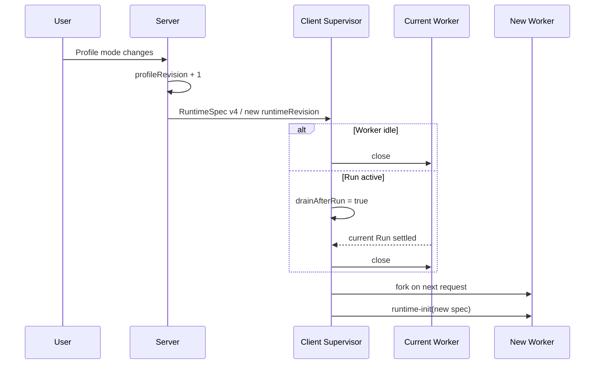

# Pi 工具 Approval / Auto / YOLO 执行模式设计

> 状态：Current（Plan 2.2 已实现）｜维护责任：Pi/Client/Server/Frontend 维护者｜最后核验：2026-09-24
> 目标版本：Pi RuntimeSpec v4 / `vcp.tool-policy` v2（已落地）
> 关联：[ADR-0033](../adr/0033-pi-tool-approval-mode.md)、[ADR-0030](../adr/0030-pi-resource-bundle-and-tool-policy.md)、[`remote-pi-control-plane.md`](./remote-pi-control-plane.md)

## 0. 落地状态

本设计已按本节口径实现；当前行为以代码、`@vcpdeck/shared` 与 Prisma schema 为准：

- `PI_RUNTIME_SPEC_PROTOCOL_VERSION = 4`，`PiProfile.toolExecutionMode`（Prisma `@default("approval")`），`parsePiRuntimeSpecV4()` 严格解析（缺字段、非法模式、未知顶层字段、v3 输入均拒绝）；
- host bridge v2（`bridgeVersion: 2` + `toolExecutionMode`，深拷贝，缺失/版本不符/模式非法即 `PI_POLICY_UNAVAILABLE`）与 `vcp.tool-policy` resource v2；**Bundle manifest 协议仍为 v1**；
- 三种模式的 Client 工具集合与策略判定按第 3.2 节矩阵实现：Approval/Auto 保持 `tools = allow ∪ confirm` 与 `excludeTools = deny`；YOLO 使用 `PI_BUILTIN_TOOL_IDS` 全集且不应用 `deny`；
- 默认值区分：数据库迁移与 API 缺省为 `approval`，Frontend 新建 Profile 显式提交 `auto`，`yolo` 只能显式选择；
- 模式变化沿用既有 Profile revision → runtimeRevision → Worker 换代（空闲淘汰、活跃 Run drain）；一个 Run 内不热切换；
- 资源依赖校验保持原规则：`confirm` 非空即要求启用 `vcp.tool-policy`，不按当前模式放宽。

已知偏移：`auto` / `yolo` 不会为 Tool Policy 创建审批 UI，但其他受信 Bundle Extension 若自行调用 `ctx.ui.confirm()` 仍会产生交互；本版本不做压制。

## 1. 目的

当前 Pi Tool Policy 已经可以控制工具的 `allow / confirm / deny`，但 `confirm` 每次调用都会进入 Extension UI 审批。对于以自动化为主的 VCPDeck，这会让一个正常任务因为多次 `bash`、`write`、`edit` 调用反复停住。

本版本增加一个 Profile 级的 **Tool Execution Mode**，让同一套 Tool Policy 可以在“人工监督”“受控自动化”和“完全信任当前 Runtime 工具集”之间切换。

- Approval / Auto 继续执行 `allow / confirm / deny` 与默认拒绝；
- YOLO 明确跳过 Tool Policy 的 allow/confirm/deny 限制；
- YOLO 只信任当前 VCPDeck Runtime 已注册/加载的工具，不自动加载机器上的任意资源；
- 当前 Run 的策略不可热替换；
- Server 仍是配置权威，Client 不持久化策略。

三种模式的产品语义：

```text
approval = 策略控制 + confirm 人工审批
auto     = 策略控制 + 无人工审批
yolo     = Tool Policy bypass + 无人工审批
```

## 2. 已实现的调用链

当前调用链是：

```text
PiProfile.toolPolicyJson / PiProfile.toolExecutionMode
    |
    v
PiProfileService.toInfo()
    |
    v
buildPiRuntimeSpecV4()
    |
    v
PiRuntimeSpecV4.toolPolicy / .toolExecutionMode
    |
    v
Client evaluateRuntimeSpec()（只接纳 v4）
    |
    v
Worker startPiAgentSession({ toolPolicy, toolExecutionMode, ... })
    |
    +--> tools / excludeTools（按模式，见 §3.2）
    |
    v
installToolPolicyBridge(policy, mode)   -> bridge v2
    |
    v
vcp.tool-policy v2
    |
    v
Pi SDK tool_call
    |
    +--> allow   -> execute
    +--> confirm -> approval: ctx.ui.confirm() / auto·yolo: execute
    +--> deny    -> approval·auto: block / yolo: execute
    +--> unknown -> approval·auto: block / yolo: execute
```

主要代码事实：

| 层 | 当前触点 | 当前行为 |
| --- | --- | --- |
| Shared | `packages/shared/src/pi.ts` | RuntimeSpec v4；`PiToolPolicy` 三桶与 `PiToolExecutionMode` 严格解析 |
| Server DB | `packages/server/prisma/schema.prisma` | `PiProfile.toolPolicyJson`、`PiProfile.toolExecutionMode`（默认 `approval`） |
| Server | `packages/server/src/pi/pi-profile.service.ts` | 策略/模式持久化与 Profile revision；非法模式列 fail closed |
| Server | `packages/server/src/pi/pi-runtime-spec.ts` | v4 Spec 构建与 runtimeRevision |
| Client | `packages/client/src/pi/runtime-spec.ts` | v4 严格接纳；按模式计算 `tools` / `excludeTools` |
| Client | `packages/client/src/pi/agent-session.ts` | `approval·auto` 用 `allow ∪ confirm`/`deny`；`yolo` 用内置工具全集 |
| Client | `packages/client/src/pi/tool-policy-bridge.ts` | bridge v2，传 `toolPolicy` + `toolExecutionMode` |
| Bundle | `packages/client/src/pi-bundle/tool-policy/index.ts` | 三模式决策矩阵；仅 `confirm + approval` 调用 `ctx.ui.confirm()` |
| Frontend | `packages/frontend/src/pages/pi-profiles-panel.tsx` | Profile 三桶 + 执行模式单选；新建默认 `auto` |

因此本功能只需要给现有策略执行链增加一个独立模式，不需要重写权限基础设施。

## 3. 领域语义

### 3.1 Profile 新字段

```ts
export const PI_TOOL_EXECUTION_MODES = ["approval", "auto", "yolo"] as const;

export type PiToolExecutionMode =
  (typeof PI_TOOL_EXECUTION_MODES)[number];
```

Profile：

```ts
interface PiProfileInfo {
  // existing fields
  toolPolicy: PiToolPolicy;
  toolExecutionMode: PiToolExecutionMode;
}
```

### 3.2 决策矩阵

| Policy bucket | Approval | Auto | YOLO |
| --- | --- | --- | --- |
| `allow` | execute | execute | execute |
| `confirm` | ask, then execute/reject | execute | execute |
| `deny` | reject | reject | execute |
| unknown/unlisted | reject | reject | execute if the tool is actually registered by the Runtime |

在 Approval / Auto 中，`allow` 与 `confirm` 都属于“能力已启用”；二者的差别只在 Approval 模式下是否需要人工确认。YOLO 不使用三桶决定调用许可，而是以“当前 Runtime 实际注册/加载的工具”为能力边界。

### 3.3 决策优先级

Approval / Auto 的固定顺序：

```text
deny
  >
unknown/unlisted
  >
allow
  >
confirm + approval
  >
confirm + auto
```

实际函数建议集中为纯函数，避免 Bundle handler 中继续散落条件：

```ts
type PiToolDecision = "allow" | "approve" | "deny";

function resolvePiToolDecision(
  mode: PiToolExecutionMode,
  policy: PiToolPolicy,
  toolName: string,
): PiToolDecision {
  if (mode === "yolo") return "allow";
  if (policy.deny.includes(toolName)) return "deny";
  if (policy.allow.includes(toolName)) return "allow";
  if (!policy.confirm.includes(toolName)) return "deny";
  return mode === "auto" ? "allow" : "approve";
}
```

## 4. 版本边界

本功能涉及四种版本，不应混为一个数字：

| 对象 | 发布前 | 当前 | 原因 |
| --- | ---: | ---: | --- |
| RuntimeSpec | 3 | 4 | 新字段会改变 Client 实际执行策略 |
| Tool Policy host bridge | 1 | 2 | Worker 需要向 Bundle 扩展传模式 |
| `vcp.tool-policy` resource | 1 | 2 | 扩展执行新决策矩阵 |
| Bundle manifest protocol | 1 | 1 | manifest 结构本身不变 |

RuntimeSpec 与 bridge 都属于 fail-closed 安全边界，不能用“字段缺失时猜默认值”跨版本兼容。

## 5. Shared 协议设计

### 5.1 类型

`packages/shared/src/pi.ts` 增加：

```ts
export const PI_TOOL_EXECUTION_MODES = ["approval", "auto", "yolo"] as const;
export type PiToolExecutionMode =
  (typeof PI_TOOL_EXECUTION_MODES)[number];
```

建议提供：

```ts
export function isPiToolExecutionMode(
  value: unknown,
): value is PiToolExecutionMode;
```

### 5.2 RuntimeSpec v4

新增而不是修改 v3 parser：

```ts
export interface PiRuntimeSpecV4 {
  schemaVersion: 4;
  specId: string;
  profileId: string;
  profileRevision: number;
  providers: PiRuntimeProviderSpec[];
  modelPolicy: {
    defaultModel: { provider: string; modelId: string };
    allowedModels: PiModelRef[];
    defaultThinkingLevel: string;
  };
  toolPolicy: PiToolPolicy;
  toolExecutionMode: PiToolExecutionMode;
  requiredBundle?: {
    protocolVersion: number;
    bundleVersion: string;
    resourceIds: string[];
  };
  runtimeRevision: string;
}
```

`parsePiRuntimeSpecV4()` 必须：

- 精确校验顶层键；
- 要求 `schemaVersion === 4`；
- 要求 `toolExecutionMode` 必填；
- 只接受 `approval` / `auto` / `yolo`；
- 继续复用现有 Provider、Model、Tool Policy、Bundle 严格校验。

`PI_RUNTIME_SPEC_PROTOCOL_VERSION` 更新为 `4`。

### 5.3 Admin DTO

`packages/shared/src/pi-admin.ts`：

```ts
export interface PiProfileInfo {
  // existing
  toolPolicy: PiToolPolicy;
  toolExecutionMode: PiToolExecutionMode;
}

export interface PiProfileCreateInput {
  // existing
  toolPolicy?: PiToolPolicy;
  toolExecutionMode?: PiToolExecutionMode;
}
```

`PiProfileUpdateInput` 继续是 Partial。

## 6. Server 持久化与迁移

### 6.1 Prisma

`PiProfile` 增加：

```prisma
toolExecutionMode String @default("approval")
```

数据库仍用 String，合法枚举由 Shared parser / Service 边界严格保证，不接受任意值透传。

### 6.2 迁移策略

既有 Profile：

```text
approval
```

原因：升级前 `confirm` 就是逐次审批。迁移后保持原行为比默认自动化更重要。

新建 Profile 的产品默认由 Frontend 显式提交：

```text
auto
```

Server 在 API 调用者省略该字段时使用：

```text
approval
```

因此形成：

```text
安全默认 = approval
产品默认 = auto
```

### 6.3 PiProfileService

`PiProfileRow`、`toInfo()`、`create()`、`update()` 全部接入字段。

更新 Profile 时模式变化继续触发既有：

```ts
revision: { increment: 1 }
```

不增加独立 `executionModeRevision`。

非法数据库值不得静默改成 approval/auto/yolo，应按 `PI_CONFIG_UNAVAILABLE` fail closed。

## 7. Server RuntimeSpec

`buildPiRuntimeSpecV4()`（原 `buildPiRuntimeSpecV3` 合并入此函数）构建 v4 Spec：

```ts
buildPiRuntimeSpecV4(...)
```

其中：

```ts
toolPolicy: {
  allow: [...profile.toolPolicy.allow],
  confirm: [...profile.toolPolicy.confirm],
  deny: [...profile.toolPolicy.deny],
},
toolExecutionMode: profile.toolExecutionMode,
```

`computeRuntimeRevision()` 已包含 `profileRevision`，Profile 模式变化会自然产生新 runtimeRevision，不需要再把 mode 单独重复进 hash 输入。

Server capability 门控必须要求 Client：

```text
runtimeSpecProtocolVersion >= 4
```

不支持 v4 的 Client 不下发可执行 Spec。

## 8. Client Runtime 与 Worker

### 8.1 evaluateRuntimeSpec

`packages/client/src/pi/runtime-spec.ts` 切换到 v4 parser：

```text
parsePiRuntimeSpecMessageV4
```

非法/旧协议继续返回：

```text
PI_RUNTIME_SPEC_INCOMPATIBLE
```

### 8.2 Worker

`packages/client/src/pi/worker.ts`：

```ts
startPiAgentSession({
  // existing
  toolPolicy: runtimeConfig.spec.toolPolicy,
  toolExecutionMode: runtimeConfig.spec.toolExecutionMode,
});
```

### 8.3 AgentSession

`PiAgentSessionOptions` 新增：

```ts
toolExecutionMode: PiToolExecutionMode;
```

Approval / Auto 的工具集合逻辑保持不变：

```text
tools = allow ∪ confirm
excludeTools = deny
```

Auto **不得**改成：

```text
tools = all builtin tools
```

这保证 Auto 只改变交互，不改变 capability。

YOLO 则必须显式改变 SDK 工具选择：不再用 Tool Policy 三桶缩小内置工具集合，`excludeTools` 也不能继续应用 `deny`。其目标是“当前平台与受信 Runtime 实际支持的全部工具”；具体构造应复用 Shared 的已知内置工具目录并尊重平台/SDK 实际可用性，而不是凭空假设机器上存在所有工具。

已启用受信 Bundle Extension 注册的工具在 YOLO 下同样允许直接调用；未启用的 Extension、项目本地资源和未加载代码不会因为 YOLO 自动进入 Runtime。

## 9. host bridge v2

`packages/client/src/pi/tool-policy-bridge.ts`：

```ts
export const PI_TOOL_POLICY_BRIDGE_VERSION = 2;

export interface PiToolPolicyBridge {
  bridgeVersion: 2;
  toolPolicy: PiToolPolicy;
  toolExecutionMode: PiToolExecutionMode;
}
```

安装顺序仍然必须发生在 Bundle 扩展 factory 加载之前：

```text
installToolPolicyBridge()
    -> createAgentSessionServices()
    -> resource loader loads vcp.tool-policy
```

bridge 中的数据继续做深拷贝，不允许 Bundle 扩展修改 Worker 持有的配置对象。

## 10. Bundle 扩展 v2

`packages/client/src/pi-bundle/tool-policy/index.ts` 的 host bridge 结构升级为：

```ts
interface HostBridge {
  bridgeVersion?: unknown;
  toolPolicy?: unknown;
  toolExecutionMode?: unknown;
}
```

factory 阶段读取一次不可变快照：

```ts
const policy = readPolicy();
```

handler：

```text
tool_call
  |
  +-- bridge invalid -----------------> PI_POLICY_UNAVAILABLE
  |
  +-- mode = yolo --------------------> execute
  |
  +-- deny ---------------------------> PI_TOOL_POLICY_DENIED
  |
  +-- unknown ------------------------> PI_TOOL_POLICY_DENIED
  |
  +-- allow --------------------------> execute
  |
  +-- confirm + auto -----------------> execute
  |
  +-- confirm + approval ------------> ctx.ui.confirm()
                                           |
                                           +-- yes -> execute
                                           +-- no/timeout -> PI_TOOL_POLICY_REJECTED
```

`ctx.ui.confirm()` 只允许出现在 `confirm + approval` 分支。YOLO 不得因为 Tool Policy 产生任何审批。

## 11. Worker revision 与模式切换

V1 只支持 Profile 级模式，因此完全复用现有 Worker 换代：



一个 Run 从开始到结束使用同一套模式。

## 12. Frontend

### 12.1 Profile 表单

在现有 Tool Policy 三桶之前增加：

```text
工具执行模式

[ 审批模式 ] [ 自动执行 ] [ YOLO ]
```

说明：

```text
自动执行
confirm 工具不再弹出人工确认；deny 和未配置工具仍然禁止。

审批模式
allow 工具直接执行；confirm 工具每次调用需要批准。

YOLO
当前 Runtime 已注册/加载的全部工具直接执行；忽略 allow/confirm/deny。
```

### 12.2 不隐藏 confirm

Auto 与 YOLO 模式下仍显示和允许编辑三桶，因为它们表达的是切回受控模式后的策略：

> 将来切到审批模式时，哪些工具要人工确认。

不得在切换到 Auto 或 YOLO 时改写三桶，否则切回 Approval/Auto 时无法恢复原分类。

### 12.3 新建 Profile 默认

Frontend 新建：

```ts
toolExecutionMode = "auto";
```

现有 baseline 保持：

```ts
allow: ["read", "grep", "find", "ls"],
confirm: ["write", "edit", "bash"],
deny: [],
```

若已发现 `vcp.tool-policy` Bundle 资源，新建 Profile 可默认启用该 resource ID；Server 对资源依赖的校验仍必须保留，Frontend 自动选择不能成为唯一约束。

### 12.4 列表投影

Profile 列表建议显示：

```text
自动执行
```

或：

```text
审批模式
```

或：

```text
YOLO
```

便于用户快速识别绑定 Client 当前使用哪种默认模式。

YOLO 必须使用明显不同的标签和说明，明确写出“忽略 Tool Policy，但不加载未启用资源、不绕过 OS 权限”。它不需要在每个 Run 或每次 Tool Call 再次确认，否则会破坏无人值守语义。

## 13. Extension UI 与 Headless 行为

Auto 与 YOLO 模式都不会为 Tool Policy 创建审批 UI，因此正常自动化不依赖 Browser 在线。

Approval 模式沿用现有 Extension UI：

```text
extension_request
    -> Owner
    -> waiting_input
    -> extension.respond
    -> running
```

无可用 Owner、取消或超时都必须保持 fail closed；不得因为调用来自后台 Job 就自动批准。

本版本只保证 `vcp.tool-policy` 遵循 Execution Mode。其他受信 Bundle Extension 如果自己直接调用 `ctx.ui.confirm()`，仍会产生独立交互；Auto/YOLO 不自动压制其他 Extension 自己定义的交互。在声称“YOLO 完全无弹窗”之前，需要单独审计这些扩展。

## 14. 错误码

本版本原则上复用已有错误：

| 场景 | 错误 |
| --- | --- |
| bridge 缺失/版本不符/形状非法 | `PI_POLICY_UNAVAILABLE` |
| deny / unknown | `PI_TOOL_POLICY_DENIED` |
| 审批拒绝/取消/超时 | `PI_TOOL_POLICY_REJECTED` |
| RuntimeSpec v4 不兼容 | `PI_RUNTIME_SPEC_INCOMPATIBLE` |
| Bundle resource 不兼容 | `PI_BUNDLE_UNAVAILABLE` |

不新增 `PI_AUTO_*` / `PI_YOLO_*` 一类错误；Execution Mode 本身不是错误来源。

## 15. 兼容矩阵

| Server | Client | 结果 |
| --- | --- | --- |
| v4 Server | v4 Client + tool-policy v2 | 正常 |
| v4 Server | 只支持 RuntimeSpec v3 | Pi 不可用，明确不兼容 |
| v4 Server | v4 Client 但 bridge/resource 仍 v1 | fail closed |
| 旧 Server v3 | 新 Client v4 only | 按既有协议协商策略处理，不得猜 Execution Mode |

发布顺序仍遵循“先让 Client 能力可识别，再让 Server 下发新协议”的兼容原则；实际发版必须结合当前 capability negotiation 的实现验证具体顺序。

## 16. 数据迁移与回滚

### 16.1 升级

迁移时：

```text
existing profile -> approval
new UI profile   -> auto
```

因此不会在数据库升级瞬间让历史 `confirm` 工具变成自动执行。

YOLO 不作为数据库迁移默认，也不作为 API 字段缺失时的默认值。它只能由调用方显式选择。

### 16.2 回滚

数据库列可保留给旧 Server 忽略，但旧 RuntimeSpec v3 无法表达 mode。回滚到只支持 v3 的 Server/Client 后，行为回到“confirm 每次审批”，不能承诺维持 Auto。

Release 说明必须明确这一点。

## 17. 测试矩阵

### 17.1 Bundle 单元测试

必须锁定：

| Mode | Bucket | 结果 | `ctx.ui.confirm` |
| --- | --- | --- | --- |
| auto | allow | execute | 0 |
| auto | confirm | execute | 0 |
| auto | deny | block | 0 |
| auto | unknown | block | 0 |
| approval | allow | execute | 0 |
| approval | confirm + approve | execute | 1 |
| approval | confirm + reject | block | 1 |
| approval | deny | block | 0 |
| approval | unknown | block | 0 |
| yolo | allow | execute | 0 |
| yolo | confirm | execute | 0 |
| yolo | deny | execute | 0 |
| yolo | unlisted but registered | execute | 0 |

额外覆盖：

- bridge missing；
- bridge version mismatch；
- mode missing/unknown；
- Tool Policy 形状非法。

### 17.2 Shared

- `PI_RUNTIME_SPEC_PROTOCOL_VERSION === 4`；
- v4 合法输入；
- 缺 `toolExecutionMode`；
- 非法 mode；
- v3 输入传给 v4 parser；
- 未知顶层字段；
- v4 envelope 与 credential/provider 匹配。

### 17.3 Server

- Profile create 默认 approval；
- 显式 auto 持久化；
- update mode 递增 revision；
- 迁移后旧 Profile 映射 approval；
- build v4 Spec 带 mode；
- 不兼容 Client 不下发 Spec。

### 17.4 Client

- runtime-spec v4 接纳；
- Worker 把 mode 传给 AgentSession；
- bridge v2 接线；
- `tools = allow ∪ confirm` 在 Approval/Auto 下保持一致；
- YOLO 不受 `deny` / unlisted 三桶限制，但仍只包含当前 Runtime 实际支持/注册的工具；
- runtimeRevision 变化时 idle Worker 淘汰；
- active Worker 当前 Run 不热切换，结算后 drain。

### 17.5 Frontend

- 新 Profile 默认 Auto；
- 编辑旧 Profile 正确回显 Approval；
- 切模式不修改三桶内容；
- Auto 文案明确 deny/unknown 仍禁止；
- Approval 文案明确只有 confirm 需要审批；
- YOLO 文案明确 deny/unknown policy 被忽略，但未启用资源与 OS/Runtime 边界不变；
- Profile 列表显示当前模式。

### 17.6 端到端

至少四条：

```text
Approval Profile
Prompt -> bash(confirm)
-> 出现审批
-> approve
-> bash 执行
```

```text
Auto Profile
Prompt -> bash(confirm)
-> 不出现审批
-> bash 直接执行
```

```text
Auto Profile
Prompt -> denied/unknown tool
-> 不出现审批
-> 工具不执行
```

```text
YOLO Profile
Prompt -> tool currently classified deny or unlisted
-> 只要 Runtime 已注册该工具
-> 不出现 Tool Policy 审批
-> 工具直接执行
```

另加负向 E2E：YOLO 不得让未启用 Bundle Extension、项目本地 Extension 或不存在于 Runtime 的工具变得可调用。

## 18. 发布门禁

实现该版本时必须同步：

- `packages/shared` 协议与 parser；
- Prisma migration；
- Server Profile/RuntimeSpec；
- Client runtime/Worker/AgentSession/bridge；
- Bundle resource 与 release/dev bundle 构建脚本；
- Frontend Profile UI；
- `docs/design/remote-pi.md` 的 Current 事实；
- `docs/compatibility.md`；
- `docs/security.md`；
- `docs/testing.md`；
- `CHANGELOG.md`。

本节清单已按第 20 节顺序全部完成：代码、测试、`docs/design/remote-pi.md`、`docs/compatibility.md`、`docs/security.md`、`docs/testing.md` 与 `CHANGELOG.md` 已同步为 v4 事实。

## 19. 后续版本

### 19.1 Session 临时 override

后续可增加：

```text
Profile default (approval / auto / yolo)
    ->
Session override
    ->
Run effective mode
```

约束：

- Run 创建时固化有效模式；
- 一个 Run 中途不热切换；
- Session override 不修改 Profile revision；
- 重连后必须能恢复或明确丢失其状态语义；
- headless Approval 无 Owner 时 fail closed。

### 19.2 Allow once / Allow for session

可在 Approval 模式增加短生命周期授权缓存，但必须明确作用域、过期、重连和 Worker 换代语义。

### 19.3 Risk Guard

长期建议增加第三层：

```text
Runtime trusted tool set
    -> Tool Execution Mode
        -> Risk Guard
```

Risk Guard 可识别：

- 危险 shell 命令；
- cwd 外路径；
- 敏感文件；
- 权限提升；
- 下载后直接执行；
- 高风险网络操作。

Risk Guard 可以强制审批或拒绝，并且应在 YOLO 下仍然生效，但不属于本版本。

## 20. 实施顺序

本次按以下批次实现（均已完成）：

1. Shared v4 + Admin DTO + parser/test；
2. Prisma migration + Server Profile + RuntimeSpec/capability 门控；
3. Client RuntimeSpec + Worker + AgentSession + bridge v2；
4. `vcp.tool-policy` v2 + Bundle resource version；
5. Frontend Profile UI；
6. 集成/E2E、兼容与零污染门禁；
7. Current 文档、兼容、安全、测试与 CHANGELOG 收口。

在修改代码符号前，按仓库规则对相关 symbol 运行 GitNexus impact；若出现 HIGH/CRITICAL blast radius，先报告再继续实现。

