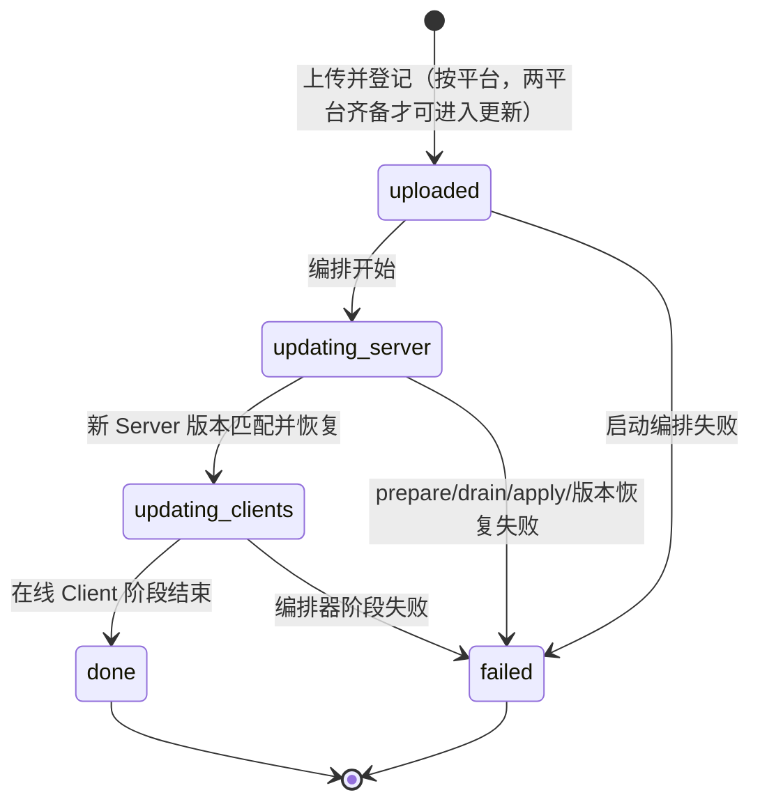
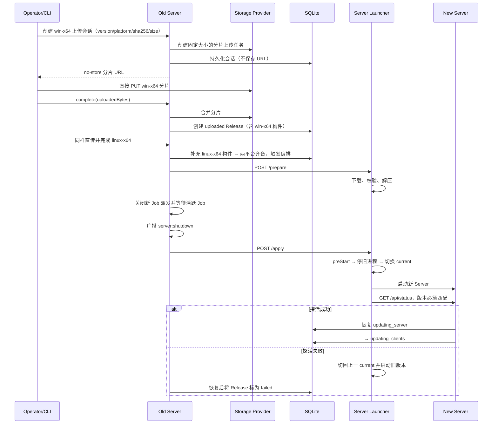
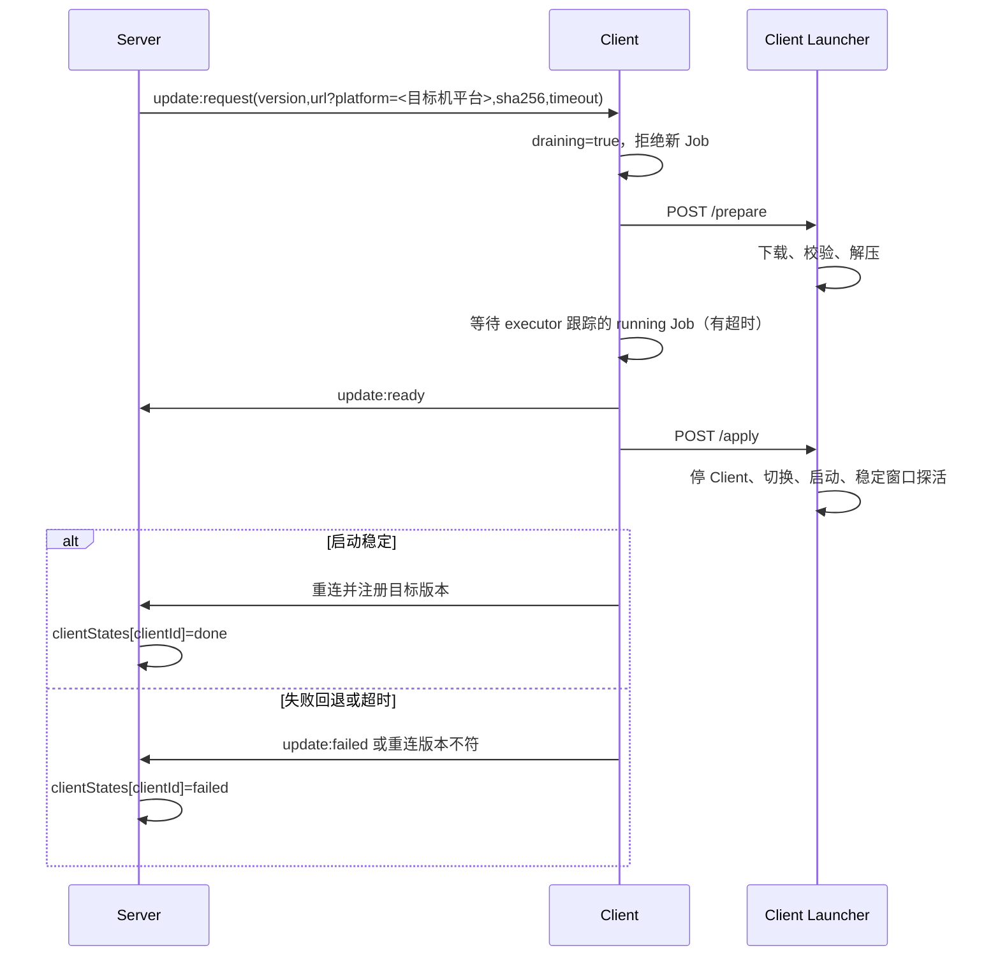

# Release 与自更新子系统设计

> 状态：Current｜维护责任：发布/运维维护者｜最后核验：2026-08-28｜适用版本：`0.6.8` / 当前 `main`

本文描述当前已经落地的 Release、Server/Client 更新和 Launcher 进程守护模型。长期决策理由见 [ADR-0003](../adr/0003-separate-launcher-for-updates.md)；构件生成、首次部署和回滚操作见 [`deployment.md`](../deployment.md)；兼容要求见 [`compatibility.md`](../compatibility.md)；故障处置见 [`operations.md`](../operations.md)。

当前核心实现已经落地，Launcher smoke 已覆盖 prepare/apply、探活和失败回退；`0.6.7` 已完成 Server → Launcher → Windows/Linux 多 Client 生产发布验收。后续版本仍必须重复执行发布门禁，不能以历史验收替代本次构件验证。

## 1. 目标与非目标

### 1.1 目标

- Server 统一接收、保存和编排 Server/Client Release；
- 业务进程不原地替换自身，由独立 Launcher 执行下载、切换、探活和回退；
- Server 更新成功后，再逐台更新在线 Client；
- 离线或晚到 Client 在后续注册时对齐最近目标版本；
- 更新前停止接受新 Job，并在有界时间内等待活跃 Job；
- Local 更新包由 Server 上传时复核 SHA-256；外部直传由 CLI 声明 SHA-256、Provider 固定上传大小并由 Launcher 下载后独立复核；
- Linux 与 Windows 使用各自可行的 current 指针方式。

### 1.2 当前非目标

- Launcher 自动更新；
- 灰度、分组、暂停/恢复和维护窗口；
- 多 Server 协调和共享连接路由；
- Frontend 静态资源的独立自动部署（当前随 Server 构件分发）；
- 数据库 schema 自动回滚；
- 发布者数字签名；
- 自动安装 Windows Service；Client 一键安装当前强制使用 PM2（Windows 为当前用户登录计划任务，Linux 为 systemd startup）；Server 仍不自动服务化；
- 对任意历史 Server/Client 版本提供兼容承诺。

## 2. 组件与职责

| 组件 | 当前职责 |
| --- | --- |
| `scripts/pack-release.ts` | 同步 Shared/SDK/CLI 与运行时版本、构建 Shared/SDK/CLI/Server/Client/Frontend/Launcher、生成并验证 `skills/vcpdeck/vcpdeck.cjs`、esbuild 单文件打包、组装最小外部依赖与 FRP、生成 manifest、archiver 产出 zip 并计算 SHA-256（详见 ADR-0012；Frontend 随 server 构件见 ADR-0013） |
| CLI `release upload/status/wait` | 解析命名/项目环境（ADR-0017）、参数与文件名，读取本地 archive、计算 SHA-256 和输出安全进度；Alibaba 模式按 Server 签发的分片 URL 直接 PUT 到 Provider，Local/旧 Server 引导使用 raw stream；`wait` 仅重试安全 GET，并同时验收 Server 版本、Release 与 Client 明细 |
| `ReleaseController` / `ReleaseUploadController` | Release 列表、Local raw 上传、外部直传会话创建/刷新/完成、构件下载和自动触发编排 |
| `ReleaseUploadService` / `ReleaseService` | 持久化上传会话与 Release、登记 Provider 元数据、状态转换和 Client 更新明细 |
| `ReleaseOrchestrator` | Server 更新、启动后恢复、在线 Client 逐台更新和后续补更 |
| `ServerDrain` / `JobScheduler` | 更新时关闭新 Job 派发闸门并等待活跃 Job 收敛 |
| Client update handler | Launcher prepare、拒绝新 Job、等待 executor 跟踪的活动 Job、ready/failed 上报和 apply |
| Launcher control server | 绑定 loopback，提供带随机 Token 的 `/prepare`、`/apply` |
| Launcher `Updater` | 下载、SHA-256 校验、解压、current 切换、探活和失败回退 |
| Launcher `Daemon` | 启动/停止业务进程、崩溃退避、Node 运行时、preStart 和探活策略 |
| `VersionStore` | Linux symlink 或 Windows state 文件形式的 current 指针 |

Launcher 是稳定的外部生命周期管理器。它随发布 zip 提供并由安装脚本首次部署到 `<app-dir>/dist/main.js`，但不随业务版本自动覆盖。Server 负责全局控制面，Client 只负责本机更新配合；任何一方都不能在没有 Launcher 的情况下可靠完成自替换和失败回退。

`/releases` 还提供默认关闭、持久化的 Client 一键安装入口（ADR-0018）和 Client 一键卸载入口。启用后，固定 Windows/Linux 命令会动态选择与运行中 Server 完全同版本且状态为 `done` 的 Release，准备用户私有 Node.js、安装 Client/Launcher，并由 PM2 只守护 Launcher。禁用只阻止新的安装请求，不影响已有 Client。卸载命令在目标机本地读取 `~/.vcpdeck/client-install.json`，删除该 Client 的 PM2 Launcher、自启配置和安装目录，保留 `client-id`、通用缓存、其他 PM2 应用以及 Server 侧数据；缺少或不一致的安装状态会安全失败，不猜测目录。

## 3. 数据与状态权威

| 信息 | 权威位置 | 说明 |
| --- | --- | --- |
| Release 元数据和阶段 | SQLite `Release` | Server 重启后恢复编排的依据 |
| 单 Client 更新结果 | `Release.clientStates` JSON | `clientId → {state,reason?,at}` |
| Release archive | Local 后端：`VCPDECK_RELEASES_DIR`，默认 `./data/releases`；外部存储后端：Provider 对象（key 记录于 `Release.archives[platform].storage`） | 必须位于应用版本目录之外；外部后端上传/下载数据面直连（ADR-0019） |
| 当前应用版本 | Launcher `apps/current` 或 `apps/state.json` | Linux 使用 symlink；Windows 使用 state 文件 |
| 已准备目标版本 | Launcher 进程内 `pendingVersion` | Launcher 重启后不保留 |
| 运行中的业务进程 | Launcher `Daemon` | Server 数据库不能证明进程仍健康 |
| Server/Client 构建版本 | `@vcpdeck/shared` 的 `VERSION` | `pnpm release --version=x.y.z` 同步并保留，提交与同版本 Git Tag 后成为正式发布 |
| archive SHA-256 | CLI 上传声明、`Release.archives[platform].sha256`、`UpdateRequest.sha256` | 当前 manifest 内的 `sha256` 留空；Local 由 Server 上传时复核，Alibaba 直传由 Launcher 下载后复核 |

业务数据、数据库、Storage 和 Release archive 必须存放在 Launcher `apps/<version>/` 之外。current 切换只改变应用构件，不迁移或恢复持久数据。

## 4. 构件与 manifest

打包脚本组装一个同时包含 Launcher、Server 和 Client 的 archive（决策见 ADR-0012）：

```text
manifest.json
launcher/
  dist/main.js               # Launcher esbuild 单文件
server/
  dist/main.js            # esbuild 单文件（业务代码 + 纯 JS 依赖内联）
  dist/frp/               # win-x64 + linux-x64 frps（linux 为裸 ELF + .gz 副本）
  generated/              # Prisma generated client
  schema.prisma           # Prisma schema（preStart 与运行时共用）
  prisma.config.cjs       # Prisma 7 CLI 强制要求
  node_modules/           # 仅外部保留：prisma CLI 栈 + libsql 双平台绑定
client/
  dist/index.js           # esbuild 单文件（主进程）
  dist/pi/worker.js       # fork worker 独立 bundle
  dist/probe-worker.js    # 能力探测 worker 独立 bundle
  dist/frp/               # win-x64 + linux-x64 frpc（linux 为裸 ELF + .gz 副本）
  node_modules/           # 仅外部保留：Pi SDK + @lydell/node-pty 双平台预编译
```

外部保留清单与理由、esbuild 选项、staging 安装配置见 ADR-0012。

当前 manifest 的有效结构为：

```json
{
  "version": "1.2.0",
  "nodeVersion": ">=24",
  "launcherMinVersion": "0.0.0",
  "sha256": "",
  "launcher": {
    "dir": "launcher",
    "entry": "dist/main.js"
  },
  "artifacts": {
    "server": {
      "dir": "server",
      "entry": "dist/main.js",
      "preStart": "node node_modules/prisma/build/index.js db push"
    },
    "client": {
      "dir": "client",
      "entry": "dist/index.js"
    }
  }
}
```

必须注意：

- archive 的 SHA-256 在压缩完成后计算，无法可靠地自包含在同一个 archive 内；
- 当前 `manifest.sha256` 留空，实际校验值由上传参数进入 `Release.sha256`，再通过更新请求交给 Launcher；
- `launcherMinVersion` 当前固定为 `0.0.0`，Launcher 尚未执行最低版本校验；
- `preStart` 是受信任构件携带的 shell 命令，当前仅 Server 使用；以显式 node_modules 相对路径调用 prisma CLI（Launcher 不保证 PATH 含 `.bin`），Windows/Linux 行为一致；
- Launcher 首次安装从 `launcher/` 复制到 `<app-dir>/dist/main.js`，已有 Launcher 默认保留，不随业务版本自动覆盖；
- Frontend 已随 Server 构件放入 `server/public/`，由 Server 同源托管；

### 4.1 跨平台 archive 与打包机要求

打包统一产出 `.zip`（纯 JS 的 archiver 生成，构建机平台无关），Server 保存与 Launcher 解压都按 `.zip` 处理，先前的 tar.gz 全链路缺口已消除。

每次发版产出两份按平台分开的 zip（win-x64 / linux-x64），构建机不再决定目标平台；Server 更新流程按目标机平台选择对应包（上传两次、下载带 `platform` 参数），详见 ADR-0012。Alibaba 后端的两个 zip 由 CLI 分片直传 Provider，Server 只处理会话和登记；Local 后端继续接收 raw stream。注意 Linux 目标机的终端后端来自 @lydell/node-pty 的 glibc 预编译包，不覆盖 musl（Alpine）环境。

linux frp 裸 ELF 在打包时从 `.gz` 包装内存解压注入 zip（开发机杀毒会删除磁盘上的裸 ELF）；`.gz` 副本仍随包保留。

## 5. Release 状态机



状态转换由 `ReleaseService.transitionStatus()` 使用当前状态条件更新，防止同一 Release 被并发推进。`done` 和 `failed` 是终态。

Client 明细状态为：

```text
pending → updating → done | failed
```

当前语义：

- Server 更新成功后才进入 Client 阶段；
- 在线 Client 按在线列表串行更新，每台等待重连、明确失败或超时；
- Client 阶段期间以旧版本注册的 Client 进入内存去重补更集合；每批更新完成后重新读取在线列表，并在阶段结束前补偿处理新增或遗漏的旧版本 Client；
- 单台 Client 失败不会阻止后续 Client，Release 最终仍可为 `done`；
- 失败明细保留在 `clientStates`；
- Client 更新判断使用“版本是否等于目标版本”，不是 SemVer 小于比较；版本更高但不相等的 Client 也可能被拉回目标版本；
- `failed` Client 当前不会自动无限重试；目标版本重新注册才是单台 Client 更新成功信号；
- Release 进入 `done` 不表示所有 Client 同时在线；离线 Client 和阶段期间上线的旧版本 Client 会在后续注册时，或通过当前阶段末尾的补偿扫描，按最近的 `updating_clients/done` 目标补更。

## 6. Server 更新流程



关键不变量：

1. `/prepare` 立即受理并在业务进程仍运行时后台完成下载、SHA-256 校验和解压（响应不等待下载完成，避免请求方 HTTP 默认超时在下载完成前切断连接）；
2. prepare 成功后才进入 drain，避免在长下载期间提前停止派发；
3. `ServerDrain` 只等待 `running/waiting_input` Job，不等待 Terminal 或 Pi 真实进程完全退出；
4. 新 Server 启动后，从 SQLite 中的活动 Release 恢复，而不是依赖旧进程内存；
5. `/api/status.serverVersion` 必须与目标版本完全相同，才进入 Client 阶段；
6. Launcher 回退应用版本，不回退数据库和其他持久数据。

Server/Client 在 `/apply` 返回后不再把「本进程未被接管」立即落库/上报失败：连接被 Launcher 掐断与进程存活无法可靠区分，终局以新进程重启后的版本对账与 Client 重连注册为准；明确的 Launcher HTTP 错误仍会标记失败。

下载入口统一为 `GET /api/releases/:version/file?platform=`（ADR-0019）：Local 后端直接 `sendFile`；外部存储后端由 Server 持凭证换取临时直链并 **302** 到直链（目标机 `fetch` 自动跟随，字节流直连存储不占 Server 带宽）；直链短时缓存、过期重新换取，短 TTL 不暴露给目标机与协议。Server 换取 Alibaba 直链遇到网络错误或 HTTP `500/502/503/504` 时最多尝试 3 次；Launcher 从该更新入口下载时，遇到网络错误或 HTTP `502/503/504` 也最多尝试 3 次，每次重新请求更新入口以换取新的临时直链。确定性 `4xx`、URL 校验、SHA-256、解压、切换和探活失败不重试，系统没有无限后台重试。

当前 `preStart` 在停止旧 Server 之前执行。默认 `prisma db push` 可能与旧 Server 同时访问数据库，且其 schema 变化不会在应用回退时自动逆转；生产发布不能把该默认钩子当作安全迁移策略。

## 7. Client 更新流程



Client 收到有效更新请求后先设置本地 drain，再调用 prepare，因此下载和解压期间 dispatcher 已拒绝新 Job。等待达到上限后，Client 仍会继续 ready/apply，所以它是“有界尽力等待”，不是所有任务完成的强保证。

当前 drain 查询复用 `executor.ts` 的活动 Job 集合，主要覆盖该 executor 跟踪的命令进程；它不构成对 File transfer、Terminal PTY 或 Pi Worker 的统一运行态屏障。因此即使查询为空，也不能推断 Client 上所有远程活动都已安全收敛。

Client 更新会停止整个 Client 进程：

- 未完成的普通子进程可能被终止；
- PTY 不能由 Server 恢复，重连后应收敛为 `interrupted`；
- Pi Worker/run 可能中断，必须按 Session/Run 身份重新对账；
- Server 中存在元数据不代表 Client 运行态仍可恢复。

Client Launcher 的健康判定是新 Client 进程连续存活约 3 秒，不验证其已成功注册 Server 或完成能力探测。Server 以目标版本重连注册作为该 Client 更新的最终成功信号。

## 8. Launcher 模型

### 8.1 目录和 current

```text
<VCPDECK_APP_DIR>/
├── control.json
├── node/
└── apps/
    ├── current -> <version>       # 非 Windows
    ├── state.json                 # Windows: {"current":"<version>"}
    ├── <current-version>/
    └── <previous-version>/
```

Launcher 首次启动前必须已经存在可启动的 current 版本。通用 `install.cjs` 会从 zip 准备 Launcher 和初始业务版本，但不自动安装 systemd 或 Windows Service；Client 一键安装器在其上增加 PM2 守护，Linux 配置 PM2 systemd startup，Windows 配置当前用户登录计划任务。

Launcher 也没有自动旧版本保留/清理策略。失败回退只有在上一版本目录仍存在且可启动时才有效；运维清理不得删除 current 或预期回退版本。

### 8.2 本地控制通道

Launcher 启动时：

1. 在 `127.0.0.1` 随机端口监听；
2. 生成随机 Token；
3. 写入 `{port,token,pid}` 到 `control.json`；
4. 将端口和 Token 通过环境变量传给被守护进程。

业务进程调用：

| 请求 | 语义 |
| --- | --- |
| `POST /prepare` | 立即受理并后台下载、SHA-256 校验、解压指定版本，完成后记录内存 `pendingVersion`；响应不等待下载完成，避免请求方 fetch 默认 300s 等待响应头超时 |
| `POST /apply` | 先等待进行中的 prepare 完成，再对 pending 版本执行 preStart、停止、切换、启动、探活和回退 |

两者都要求 `x-launcher-token`。`control.json` 是本机高敏感能力文件，应只允许 Launcher 和同一运行账户读取。Launcher 重启后 `pendingVersion` 丢失，必须重新 prepare。

### 8.3 Node 运行时

启动版本时 Launcher 按 manifest `nodeVersion`：

1. 优先使用满足约束的系统 Node；
2. 否则选择缓存中满足约束的最高版本；
3. 否则从 Node 发行索引选择并下载满足约束的最高版本。

当前约束解析只支持类似 `>=24` 的主版本下限，不是完整 SemVer range 实现。下载的 Node archive 当前没有独立发布者签名校验。

### 8.4 守护与回退

- 业务进程异常退出后按指数退避重启，连续超过上限则等待人工处理或新版本；
- Server 通过公开 `/api/status` 探活并校验版本；
- Client 通过短稳定窗口判断是否秒退；
- 新版本探活失败时切回 previous current 并重新启动；
- 如果没有 previous current，只能报告失败；
- 回退不还原数据库、Storage、Release 状态或外部副作用。

## 9. 完整性、安全和信任边界

当前构件安全模型是“可信操作者 + SHA-256 完整性”，不是完整的软件供应链签名：

- Release 上传受全局身份认证保护，但当前没有额外 admin-only 检查；
- 构件下载和 `/api/status` 是公开端点；
- Local raw 上传由 Server 重新计算 SHA-256；
- Alibaba 直传时 Server 不接收正文：Provider 创建任务固定大小，CLI 完成字节数必须匹配会话，Launcher 下载后重新计算 SHA-256；
- SHA-256 能检测内容不一致，不能证明发布者身份；
- Launcher 控制通道依赖 loopback 和随机 Token；
- 更新 URL 只接受带主机名的 HTTP/HTTPS；
- archive、manifest 和 `preStart` 都属于高信任输入，只有可信发布者可以上传；
- 当前没有独立 archive 条目路径穿越预检，不能接收不可信构件；
- Token、Cookie、签名 URL、完整 archive 内容和 preStart 输出不得进入普通日志。

增加 Ed25519 等发布者签名、固定信任公钥和密钥轮换前，不能把自动更新描述为对不可信发布链路具有来源认证。

## 10. 数据库与回滚

Launcher 的回退单位是应用版本目录，不是整个系统状态。涉及数据库变化时必须遵守：

- 发布前备份 SQLite、Storage 和 Release archive；
- 不能把开发用 `prisma db push --accept-data-loss` 当作生产迁移方案；
- schema 变化采用 expand → migrate → contract，使旧 Server 在回退窗口内仍能读取；
- preStart 成功但新 Server 探活失败时，数据库变化仍然存在；
- 若旧 Server 已不能读取新 schema，必须恢复与旧应用匹配的数据备份，而不是只切 current；
- 回滚后核对 Job、Release、File 和外部 Provider 状态，避免把窗口内副作用重复执行。

## 11. 故障与恢复边界

| 故障 | 当前结果 | 恢复方式 |
| --- | --- | --- |
| Launcher/control.json 不存在或 Token 无效 | prepare/apply 失败，Release 进入 failed 或 Client 上报 failed | 恢复 Launcher 与文件权限后重新发布/补更 |
| 下载或 SHA-256 校验失败 | 不切换 current | 核对 archive、Release.sha256、网络和磁盘 |
| 解压失败 | 目标版本可能留下不完整目录 | 删除不完整版本目录后重新 prepare |
| 目标版本目录已存在 | 仅当 manifest 可解析、版本号匹配且当前 artifact 的业务入口存在时，`prepare` 才跳过下载和校验；不完整目录会先清理再准备 | 仅含 Launcher payload 的目录会重新下载、校验和解压；完整目录继续幂等跳过 |
| preStart 失败 | 不进入 current 切换，旧进程通常仍运行 | 修复迁移/权限；核对是否已有部分 DB 副作用 |
| Server drain 超时 | Release 标为 failed，但 drain 闸门当前不会自动解除 | 检查活跃 Job；当前通常需重启 Server 恢复派发 |
| 新 Server 探活失败 | Launcher 尝试回退 previous current | 确认旧 Server 与当前 DB 兼容 |
| Client drain 超时 | 继续 apply，未完成运行态可能被终止 | 重连后对账 Job/Terminal/Pi，不伪造成功 |
| Client 重连版本不符 | Client 标记 failed | 检查 Launcher 日志和 previous 回退原因 |
| Client 离线 | 不阻塞 Release done | 后续注册时补更 |
| 上传时已有活动 Release | 新上传记录可能停留 `uploaded` | 等活动 Release 完成后人工核对并重新触发/重新发布 |
| 重复版本上传 | 当前文件移动发生在 DB 重复检查前，存在覆盖既有 archive 的风险 | 不复用版本号；核对 archive SHA 和 Release 记录 |
| 非 Windows archive | 扩展名和解压器可能不匹配 | 当前不要声称支持；先修复格式协议并做真实演练 |
| 应用回退但 DB 已升级 | 旧应用可能无法启动或错误读写 | 恢复兼容备份或部署兼容版本 |

故障恢复必须以 SQLite Release 状态、Launcher current、实际进程版本和 archive SHA 四者共同核对，不能只看单一日志或 HTTP 成功响应。

## 12. 测试与发布门禁

最低覆盖：

- Shared update 类型和事件；
- Release 状态合法/非法转换和并发条件更新；
- Local 上传 SHA 不匹配、Alibaba 直传会话持久化/分片刷新/大小/安全错误、重复版本、构件缺失和认证；
- Launcher `/prepare`、`/apply`、Token、解压和 URL 校验；
- Linux symlink 与 Windows state 指针切换；
- system/cache/download Node 选择；
- Server drain、恢复编排和版本不符回退；
- Client drain、超时、拒绝新 Job、ready/failed 和重连；
- 多 Client 串行、单机失败继续和离线补更；
- archive 路径穿越、异常 manifest 和危险 preStart；
- 数据库升级后应用回退；
- Windows/Linux 真实构件从上传到 Server/Client 更新的全链路演练。

详细命令和发布验收见 [`testing.md`](../testing.md)。当前 `scripts/smoke-launcher.cjs` 只证明 Launcher 局部流程，不替代真实 Server/Client 和数据库升级演练。

## 13. 扩展规则与已知缺口

以下变化会改变长期边界，应先评估 ADR、兼容和迁移：

- Launcher 自更新或控制协议破坏性变化；
- 多 Server、高可用 Release 编排；
- 灰度、分组或人工审批；
- 将其他独立 Frontend 构件纳入统一 Release（当前 Frontend 已随 Server 构件分发）；
- 更换 archive 格式或 manifest 版本；
- 发布者数字签名和信任根；
- 自动数据库迁移/回滚；
- 允许 N-1 Client 长期兼容。

当前优先缺口：

1. 完成跨平台 archive 与 Launcher 随包分发的真实演练；
2. 实现 `launcherMinVersion` 强制校验；
3. 建立 systemd/Windows Service 安装流程；
4. 增加构件发布者数字签名；
5. 修复 Server drain 失败后的闸门恢复；
6. 防止重复版本覆盖 archive，并处理活动 Release 期间的新上传；
7. 对 archive 条目和 manifest 做严格运行时验证；
8. 完成 Server 重启窗口 Job 对账和跨平台全链路 Release E2E；
9. 建立可回退的生产数据库迁移流程。

未实现事项统一进入 [`roadmap.md`](../roadmap.md) 或 Issue；本文只在其影响当前安全使用方式时保留已知缺口。
