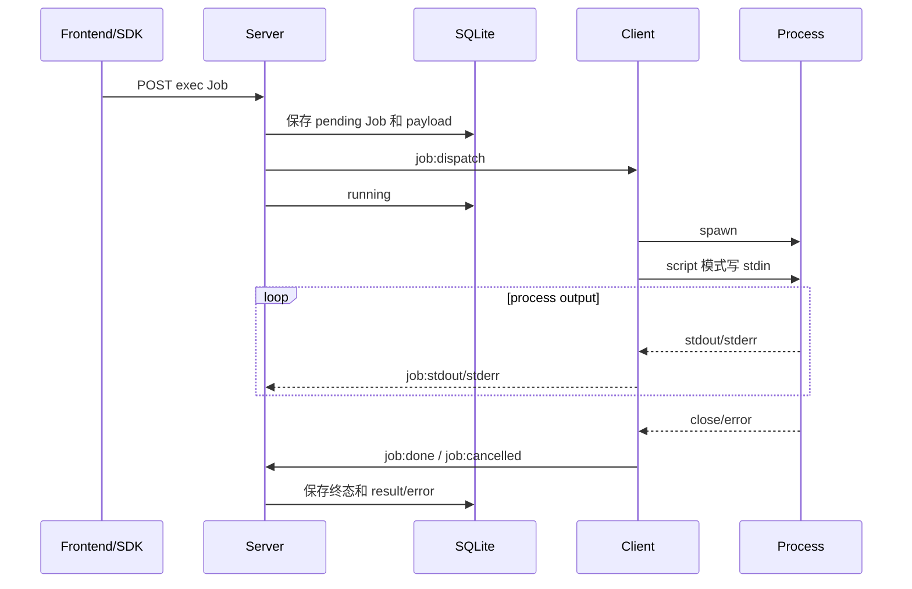

# 远程命令与脚本执行设计

> 状态：Current｜维护责任：Job/Client 维护者｜最后核验：2026-08-15｜适用版本：当前 `main`

本文描述当前 `exec` Typed Job 的命令与脚本执行链路、数据留痕、安全边界和已知缺口。Typed Job 的长期内核决策见 [ADR-0004](../adr/0004-typed-job-kernel.md)。[ADR-0010](../adr/0010-client-owned-script-runtime-registry.md) 已决定把 script 模式迁移到 Client 持有的受控 runtime registry，但该迁移**尚未完成**；当前协议仍允许调用方提交 `executable + args`，维护和使用时必须以本文的“当前实现”部分为准。

## 1. 目标与边界

`exec` 用于一次性远程执行：

- command 模式：执行短 Shell 命令；
- script 模式：将 UTF-8 源码通过 stdin 发送给一个直接启动的解释器；
- 统一使用 Job 持久化、排队、取消、断线对账和操作者审计；
- 输出最终以 exit code、stdout 和 stderr 表达。

`exec` 不是：

- 权限沙箱或容器；
- 可重新 attach 的交互终端；
- Pi Session；
- 可靠日志或无限输出存储；
- 脚本 Artifact、版本库或复用系统。

需要 PTY、持续交互和重新附着时使用 Terminal；需要 Agent 会话时使用 Pi；超大脚本、需要真实文件名或相对模块目录时，应使用受控 File/Storage 方案，而不是无限扩大 Job payload。

## 2. 当前组件职责

| 组件 | 当前职责 |
| --- | --- |
| Frontend `ExecutePanel` | 选择 command/script；script 当前直接提交 executable、空格拆分的 args 和源码 |
| Shared `ExecJobDispatch` | 定义 command 与 script 判别联合 |
| `EventsController` | 对 REST exec payload 做基础规范化，创建 Job |
| `JobService` / `JobScheduler` | 持久化 payload、最多三项普通 Job 并发、派发和终态 |
| `ClientGateway` | 接收 stdout/stderr/done/cancelled，保存最终结果并续派 |
| Client `dispatcher` | 根据 `mode` 路由到 Executor；当前缺少独立严格 parser |
| Client `executor` | spawn、stdin、输出聚合、活动进程表、取消和状态报告 |

Server 是 Job 生命周期权威，Client 是实际子进程运行态权威。SQLite 中的 running/disconnected 状态不能单独证明目标进程仍存在。

## 3. 当前协议事实

### 3.1 创建请求

`exec` 使用通用 Job 创建端点，`timeout` 位于 Job 顶层，协议和 Client `spawn` 的单位是毫秒。CLI 的 `jobs run --timeout=<seconds>` 对操作者使用秒，并在创建 Job 前转换为毫秒；`--wait-timeout` 仅控制 CLI 本地等待终态，不进入 Job。

command 模式：

```json
{
  "clientId": "client-id",
  "type": "exec",
  "payload": {
    "mode": "command",
    "command": "node --version",
    "cwd": "D:/work/project"
  },
  "timeout": 30000
}
```

当前兼容缺少 `mode` 但包含 `command` 的旧 payload。该兼容分支的校验弱于显式 command 模式，不能作为新调用方格式。

script 模式当前是：

```json
{
  "clientId": "client-id",
  "type": "exec",
  "payload": {
    "mode": "script",
    "executable": "node",
    "args": ["-"],
    "script": "console.log('hello')",
    "cwd": "D:/work/project"
  },
  "timeout": 30000
}
```

当前 Server 检查：

- mode 必须是 `command` 或 `script`；
- command 模式要求非空 command，并拒绝 executable/args/script；
- script 模式要求非空 executable、字符串 args 数组和字符串 script，并拒绝 command；
- 显式模式下 cwd 如存在必须是非空字符串；
- timeout 如存在必须是正整数。

当前未检查：

- script UTF-8 字节上限；
- stdout/stderr 上限；
- executable 是否属于允许列表；
- args 语义；
- cwd 是否位于 file roots、是否 canonical 或存在 symlink 越界；
- `exec` capability；
- script runtime capability；
- Client 入站 payload 的严格运行时解析。

### 3.2 已接受的目标协议

ADR-0010 的目标 script payload 是：

```json
{
  "mode": "script",
  "runtime": "node",
  "script": "console.log('hello')",
  "cwd": "D:/work/project"
}
```

调用方不再提交 executable、args 或 shell 开关。Client 内部维护 `runtime ID → executable + 固定 args` 映射并据实际可用性声明 `exec.script.<runtime>`。在 Shared、Server、Client、Frontend 和兼容迁移全部落地前，不能向调用方声称该目标协议可用。

## 4. 执行路径

### 4.1 command 模式

Client 当前使用：

```ts
spawn(command, {
  shell: true,
  cwd,
  timeout,
});
```

Windows 会先拼接：

```text
chcp 65001 > nul && <command>
```

用于将 cmd 输出切换为 UTF-8。其后果是：

- command 由系统 Shell 解析；
- 引号、管道、重定向、变量展开和转义遵循目标平台 Shell；
- Windows 前缀和原 command 共同构成一条 Shell 字符串；
- command 模式就是可信操作者的任意远程 Shell 执行，不提供命令 allowlist。

### 4.2 script 模式

Client 当前使用：

```ts
spawn(executable, args, {
  shell: false,
  cwd,
  timeout,
});

child.stdin.end(script, "utf8");
```

`stdin` 避免把完整源码放进 argv，也减少多层 Shell 转义问题。`shell:false` 只代表没有额外 Shell 解析层，不限制脚本访问文件、网络、环境变量或创建子进程。

当前 executable 和 args 来自外部调用方，而不是 Client registry。Frontend 的 args 输入按空白简单拆分，不支持可靠表达带空格的单个参数；API 调用方可以直接提交任意字符串数组。

### 4.3 目标 runtime registry

迁移后：

```text
runtime ID
  → Client 本地注册表
  → 绝对 executable + 固定 stdin args
  → spawn(shell:false)
```

首批候选：

| Runtime ID | 目标固定行为 |
| --- | --- |
| `node` | `process.execPath ["-"]` |
| `python` | 管理员配置/探测的 Python，`["-u", "-"]` |
| `powershell` | 认可的 pwsh/Windows PowerShell，NoProfile + NonInteractive + stdin |
| `bash` | 认可的 Bash，`["-s", "--"]` |

具体 executable 不进入 Browser/REST、Client capabilityDetails、普通日志或错误。未知 runtime 必须明确拒绝，不自动改用 Shell 或其他解释器。

## 5. 生命周期与状态



不变量：

- Job 必须先持久化，再派发；
- active process 由 Client 内存 `activeJobs` 跟踪；
- close、spawn error 和 stdin error 通过 `settle()` 避免重复终态；
- exit code 0 收敛为 done，非 0 收敛为 error；
- `EXEC_SPAWN_FAILED`、`EXEC_STDIN_FAILED`、`EXEC_TIMEOUT` 和 `EXEC_SIGNALLED` 是当前稳定基础设施错误；
- `done/error/cancelled` 是终态；
- disconnected 不是终态，Client 重连后用 status report 对账；
- Client 自主管理 timeout：超时终止进程树并上报 `EXEC_TIMEOUT`；其他无退出码的信号终止上报 `EXEC_SIGNALLED`，不再伪造成 `exitCode=1`；
- 网络或本地等待超时不证明远端没有执行，不能自动盲重试。

## 6. 输出与数据留痕

当前输出有两条路径：

1. 过程输出通过 `job:stdout/stderr` 实时发送，Server 用 `appendOutputRaw()` 把收到的 chunk 追加到同一个 `output` spool；
2. Client 同时在内存中累计完整 stdout/stderr，进程关闭时放入 `job:done`；Server 将其写入 `Job.result`。

`output` 表示 Server 观察到的跨流合并顺序，不保证与独立 `result.stdout` 或 `result.stderr` 的顺序相同。最终 `result.stdout`/`result.stderr` 分别保持各自流内容，空流当前可能省略字段。CLI `--json` 返回 Job result 与 `output`，stdout 只写最终 JSON，等待诊断写 stderr。

当前输出会出现在：

- Client 运行时内存；
- Socket.IO 终局消息；
- SQLite `Job.result`；
- 数据库备份；
- Job 详情和 Frontend 页面。

脚本源码、executable、args、cwd 同样保存在 `Job.payload`。这些字段都可能包含密钥、内部路径或业务数据。

当前 stdout/stderr 没有应用层大小上限，Client 采用字符串持续拼接。这会造成 Client 内存、Socket.IO 消息、Server 内存、SQLite 和 Browser 渲染压力。调用方不得用 exec 传输大文件或无限输出；后续必须增加有界捕获、截断标记和保留策略。

## 7. 取消、超时与断线

### 7.1 取消

当前取消流程：

1. Server 下发 `job:cancel`；
2. Client 在 `activeJobs` 查找活动进程；
3. 复用 Terminal 的平台进程树清理：Windows 执行 `taskkill /PID <pid> /T /F`，POSIX 终止独立进程组；
4. close 事件按 cancelling 标记上报 `job:cancelled`。

进程树终止只能收敛仍属于该树的进程；命令已显式 detached、提交给系统服务管理器或已产生外部副作用时，取消不会回滚这些结果。

### 7.2 超时

Client 使用独立定时器管理 `timeout`，不依赖 Node `spawn({timeout})` 的模糊信号结果。到期时先记录 timeout 原因，再清理完整进程树；close 时以 `EXEC_TIMEOUT` 收敛并保留已捕获的 stdout/stderr。POSIX exec 以独立进程组启动，Windows 使用 `taskkill /T /F`。Job REST 详情返回顶层 `timeout`，CLI 与 Frontend 可显示真实配置。

### 7.3 断线

Client Socket 断开时直接进程可以继续运行，Server 将活动 Job 标记 disconnected。中间输出不保证补传；重连时 Client 只能根据当时仍在 `activeJobs` 中的进程报告状态。进程 close 后记录会被删除，如果终局事件在断线期间发出，当前没有持久 spool 保证重连补报，Job 可能长期停留 disconnected。若 Client 进程自身重启，原活动表和由它持有的子进程关联也会丢失，Server 不得伪造恢复成功。

## 8. 安全边界

### 8.1 当前信任模型

当前系统是少量可信操作者的单信任域。任意有效业务身份都具备远程操作能力，exec 没有额外 admin-only 检查。该模型不等于安全隔离：

- command 可运行任意 Shell 命令；
- script 当前可选择任意 executable 和 args；
- cwd 当前可由调用方提交任意非空字符串；
- 进程继承 Client OS 运行账户权限和默认环境；
- script/runtime registry 即使落地，也只约束解释器选择，不限制脚本代码本身。

若引入非完全可信用户，必须先实现资源级授权、审批和审计，不能仅隐藏 Frontend 按钮。

### 8.2 强制要求

- Client 使用权限受控的专用 OS 账户；
- command/script、stdout/stderr、cwd、executable 和 args 不进入普通日志或错误；
- 错误只返回稳定 code 和安全 message，不返回 stack 或完整本地路径；
- 脚本不得嵌入长期凭据；
- REST/Job 查询必须按敏感数据接口保护；
- 禁止把 runtime registry 描述为沙箱；
- 新增 parser 时 Server 和 Client 都必须拒绝未知/额外危险字段；
- 在 cwd root/canonical 校验落地前，只能由可信操作者提交工作目录。

## 9. 当前实现与 Accepted ADR 的偏移

下列项目是待修复偏移，而不是已接受的新长期边界：

| Accepted 方向 | 当前实现 |
| --- | --- |
| script 只提交 runtime ID 和源码 | 提交并执行 executable + args |
| Client 内部持有 runtime 映射 | 未实现 runtime registry |
| Client 按实际运行时声明 capability | 只声明宽泛 `exec` |
| Server 创建前检查 exec/runtime capability | `JobService.create()` 当前未检查 exec |
| 双端严格运行时解析 | Server 只有手写基础校验；Client 使用类型断言和非空断言 |
| 工作目录来自受控 root/canonical path | 当前只检查非空字符串 |
| 受控大小和稳定错误 | 无 script/output 上限，无稳定 timeout 错误 |
| 取消收敛远程执行 | 已按平台终止进程树；显式 detached/系统服务与外部副作用仍不回滚 |

维护者修改这些区域时，应朝 ADR-0010 和 ADR-0004 收敛，而不是继续扩大 arbitrary executable 协议。若要放弃该方向，必须新增 ADR supersede ADR-0010。

## 10. 迁移顺序

迁移必须作为一项跨端兼容变更实施：

1. 定义 runtime ID、格式、固定 args、错误码、script/output/cwd 上限和协议版本策略；
2. 在 Client 实现 registry、启动探测和 `exec.script.<runtime>` capability；
3. Shared 增加 runtime payload 和严格 parser；
4. Server 根据目标 Client capability 验证并仅派发 runtime ID；
5. Client 入站再次解析，并在 registry 中解析 executable；
6. Frontend/SDK/CLI 改为选择 runtime，不接受 executable/args；
7. 决定旧 `executable + args` payload 的有限迁移窗口，并明确拒绝条件；
8. 增加 script/output 有界捕获、cwd root 校验和进程树终止；
9. 完成 Windows/Linux、Node/Python/PowerShell/Bash 的真实测试；
10. 升级 Current 文档和 CHANGELOG 后，才可宣布目标协议 Current。

不能只改 Frontend，也不能由 Server 将 runtime 静默重新拼成任意 command 字符串。

## 11. 测试门禁

最低覆盖：

- command/script 判别联合和互斥字段；
- 旧 command payload 兼容及拒绝非法类型；
- runtime ID 格式、未知 runtime 和 capability 拒绝；
- Client registry 不向外泄露 executable 路径；
- script 空字符串、多行、Unicode、引号和反斜杠；
- UTF-8 script/output 边界、截断标记和敏感内容不入日志；
- spawn、stdin、close、timeout、cancel 竞态只产生一个终态；
- Windows/Linux 进程树终止，无后代进程残留；
- cwd root、canonical path 和 symlink 越界；
- 断线继续执行、断线期间终局事件丢失、重连对账和 Client 重启；
- 最终 stdout/stderr 的持久化、大小和页面安全渲染；
- Node/Python/PowerShell/Bash stdin 语义的真实环境 smoke；
- command 模式和现有普通 Job 调度不回归。

示例和测试只能使用无破坏性的临时目录与合成脚本，不执行真实删除、凭据读取或外部攻击命令。

## 12. 扩展与退出条件

出现以下需求时，不应继续扩大单条 script payload：

- 脚本超过有界消息上限；
- 需要真实文件名、扩展名、`__file__` 或脚本目录；
- 需要相对 import/module；
- 需要 Artifact 版本、审批、复用、缓存或签名；
- 目标运行时不能可靠从 stdin 执行；
- 需要结构化结果或文件产物生命周期。

此时应设计受控 Script Artifact/FileRef 模型，并评估新的 ADR。引入容器/沙箱、每运行时独立权限或远程执行审批同样属于新的安全与部署决策。
