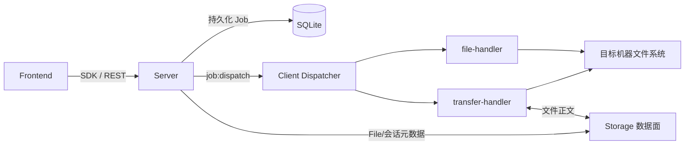

# VCPDeck 远程文件设计

> 状态：Current｜维护责任：Client/Server 文件模块维护者｜最后核验：2026-08-15｜适用版本：当前 `main`
>
> 事实来源：`packages/shared/src/index.ts`、`packages/sdk/src/files.ts`、`packages/server/src/events/`、`packages/server/src/job/`、`packages/server/src/file/`、`packages/client/src/file-handler.ts`、`packages/client/src/transfer-handler.ts`、`packages/client/src/filesystem-roots.ts`

本文说明目标机器文件系统操作、文件 Typed Job、Client 路径处理、导入/导出交接及当前失败边界。Storage Provider、File 对象、签名能力和分片会话见 [`storage.md`](./storage.md)；字段级 REST/Socket.IO 语义见 [`../protocols.md`](../protocols.md)。

## 1. 范围与非目标

当前远程文件能力分为两类：

1. **轻量文件操作**：通过 Job payload/result 和 Socket.IO 传输路径、文本及结构化结果；
2. **文件导入/导出**：Job 负责控制状态，文件正文经 Local Storage 中转或 Alibaba 外部直传。

本文负责第一类能力和传输发生在目标机器的一侧，不负责重复描述 Provider 内部实现。

当前不提供：

- 通用同步盘、目录递归传输或文件版本控制；
- 跨 Client 原子复制/移动；
- 持久断点续传；
- 文件 Job 的进程重启恢复；
- 多租户文件授权或独立于当前可信操作者模型的路径 ACL；
- 文件系统沙箱。Client 文件操作继承 Client OS 账户权限。

## 2. 组件与职责

| 组件 | 当前职责 |
| --- | --- |
| Frontend Files Panel | 发现根目录、浏览和编辑小文本、创建目录、移动、删除、上传和下载 |
| SDK `files` | 把轻量操作包装为 Job create + wait；封装上传/导出会话端点 |
| `EventsController` | 接收 Job 和传输会话请求；当前只对 exec payload 做专用规范化 |
| `JobService` | 检查 Client 在线和 capability，持久化 Job，编排 import/export 与 FileRef |
| `ClientGateway` | 下发 Job，接收 progress/done/cancel 结果并推进调度 |
| Client `dispatcher` | 按 `file.*` type 路由到文件或传输 handler |
| `file-handler` | 根发现、轻量 fs 操作和当前路径解析 |
| `transfer-handler` | import/export、HTTP 流、分片、进度和临时文件 |
| File/Storage 模块 | File 元数据、Provider、短期能力和传输会话；详见 `storage.md` |

## 3. Job 类型与 capability

当前文件 Job 使用普通 Typed Job 内核，创建时先写入 SQLite，再由每 Client 最多三个通用 Job 槽调度。

| capability | Job 类型 |
| --- | --- |
| `file.read` | `file.roots`、`file.list`、`file.stat`、`file.readText`、`file.export` |
| `file.write` | `file.writeText`、`file.mkdir`、`file.delete`、`file.move`、`file.import` |

Capability 是 Client 能力声明，不是用户权限。Server 创建 Job 时检查声明，但当前文件 Job 存在以下协议边界：

- Shared 定义了 payload/result 接口和稳定错误码，但通用 `JobDispatch` 对非 exec 仍允许 `type: string + payload: Record<string, unknown>`；
- Server 没有文件 payload 的专用严格运行时 parser；
- Client handler 直接用类型断言读取 `rootDir`、`path`、`content`、FileRef 和大小；
- 未知字段、错误类型和畸形 FileRef 尚未在 Server/Client 双端一致拒绝。

因此 TypeScript 接口不能被视为当前运行时安全边界。

## 4. 轻量文件操作

| Job | 当前实现 | 重要边界 |
| --- | --- | --- |
| `file.roots` | Windows 探测可访问的 `A:\\`–`Z:\\`；Linux/macOS 通常返回 `/`，根读取失败时回退 home | 返回值用于 UI/Pi 选根，但普通文件 Job 的 `rootDir` 当前未强制来自该列表 |
| `file.list` | `readdir(...,{withFileTypes:true})` 后并发 `stat` | 单个 entry 的 stat 失败会被忽略；非目录类型统一投影为 `file` |
| `file.stat` | 返回名称、`file/dir`、大小和 mtime | 名称从请求 path 取末段；其他特殊文件投影为 `file` |
| `file.readText` | 先 stat，再按 UTF-8 整体读取 | SDK/Frontend 默认 `maxBytes=262144`，但调用方可提交其他值，当前没有全局硬上限 |
| `file.writeText` | 写入同目录 `.vcpdeck-tmp-<uuid>` 后 rename | 正文和路径进入 Job/SQLite；无应用层大小上限；rename 失败时不保证清理临时文件 |
| `file.mkdir` | `mkdir(...,{recursive:true})` | 重复创建已存在目录通常成功 |
| `file.delete` | `rm(...,{recursive,force:true})` | 非递归删除非空目录前返回冲突；不存在路径因 force 可报告成功 |
| `file.move` | 同一 root 内 `rename(source,destination)` | `overwrite=false` 先检查目标；`overwrite=true` 只跳过检查，替换行为和跨设备行为取决于平台 |

`file.readText` 的 content 会随 `job:done` 返回并持久化到 `Job.result`；`file.writeText` 的 content 会随 `job:dispatch` 下发并持久化到 `Job.payload`。只有 import/export 的大文件正文绕开 Job JSON。当前不能笼统声明“文件内容不进入 Socket.IO 或数据库”。

`writeText` 的“临时文件 + rename”降低了直接写目标时的半写风险，但当前没有 fsync、崩溃一致性、跨平台原子覆盖或失败后必然清理的保证。`move(overwrite=true)` 同样不是统一的跨平台原子替换协议。

## 5. 路径边界

### 5.1 当前算法

轻量操作和 import/export 共用 `resolveSafePath(rootDir,userPath)`：

1. 使用 `path.resolve()` 规范化 root 和目标；
2. Windows 下把路径转为小写并统一为 `/`；
3. 要求目标等于 root 或具有 `root + "/"` 前缀；
4. 尝试对已存在目标执行 `realpath()` 并再次做前缀判断；
5. 返回规范化后的绝对目标路径。

这可以拒绝一部分显式 `..` 和跨盘 lexical escape，但当前不能构成完整 root 授权或 symlink 防护。

### 5.2 当前已知缺口

1. `rootDir` 由调用方随 Job 提交；Server 和 Client 都没有强制它必须来自 `file.roots`。
2. `resolveSafePath()` 允许目标等于 root，因此在调用方自选 root 的前提下，写、移、删可以作用于该 root 本身。
3. `realpath()` 的越界异常由同一个宽泛 `catch` 捕获并忽略；当前已存在 symlink/junction 的越界拒绝并未可靠生效。
4. 对尚不存在的写入目标，最终路径 `realpath()` 失败后只保留 lexical 前缀检查；父目录 symlink/junction 可能绕过预期边界。
5. Client 没有把已发现 root 转换为不可伪造的 root ID，也没有在破坏性操作前重新验证 canonical root 与最近已存在父路径。
6. 文件 payload 缺严格双端 parser，空字符串、错误类型、异常大小和畸形路径可能在 Node API 内以非稳定方式失败。

在这些问题修复前，Files root 是 UI 导航约定，不是强授权边界。部署必须继续依赖少量可信操作者和专用低权限 Client OS 账户。

长期修复应由 Client 认证 root，使用 canonical root/root ID，检查最近已存在父链并覆盖 Windows drive、UNC、junction、symlink 和目标竞争条件；该修复会影响所有文件操作和 import/export，必须按高风险改动评审和测试。

## 6. 文件导出：Client → Storage

创建 `file.export` 时，Server 先创建 pending File，再把 `uploadRef` 放入 Job payload。

### Local 路径

1. Client 解析目标路径并 stat 文件；
2. `createReadStream` 经 Transform 流式统计进度和 SHA-256；
3. Client PUT 到 Server 签发的同源短期 URL；
4. Local Provider 流式保存并记录实际大小/SHA-256；
5. Client 上报 `fileId/key/size/sha256`；
6. Gateway 以 File 记录中的真实 key 确认上传并完成 Job。

### Alibaba 直传路径

1. Server 初始下发 `direct=true` 的占位 uploadRef；
2. Client stat 后通过 `POST /api/files/client-export-sessions`（携带 `x-vcpdeck-psk`）创建 export 分片会话；
3. Client 最多三个 worker 直接 PUT 分片并上报进度；分片 URL 返回 403 时通过 `POST /api/files/client-export-sessions/:jobId/part-urls` 续期指定分片后重试；
4. Client 通过 `POST /api/files/client-export-sessions/:jobId/complete` 请求 Provider complete，获得真实 key；
5. Client 上报 `fileId/key/size/sha256`（上传完成后顺序读源文件计算）。

Alibaba export 以字节数和 Provider 完成响应收敛，并由 Client 在上传完成后顺序读取源文件计算 SHA-256 随结果上报，Server 回填 File；Server 不读取正文，因此是 Client 端哈希而非 Server 端哈希保证。Client 导出控制请求必须携带共享 PSK `x-vcpdeck-psk`，PSK 只发送到 Server 控制端点，不发送到 Provider 分片 URL；既有 `/api/files/export-sessions*` 仍保留给携带用户 Cookie/Bearer 的 SDK 调用。

## 7. 文件导入：Storage → Client

Browser 正常上传流程：

1. `POST /api/files/upload-sessions` 创建 `waiting_input` 的 `file.import` Job 和 pending File；
2. Browser 通过 Local 签名 PUT 或 Alibaba 分片 URL 上传正文；
3. complete 成功后 Server 把 FileRef、期望大小和 overwrite 写入 Job payload；
4. Job 进入 pending/running 并下发 Client；
5. Client GET 到目标目录中的 `.vcpdeck-tmp-<uuid>`；
6. Client 验证实际读取字节数等于期望大小；
7. 根据 overwrite 处理目标，再 rename 临时文件并上报结果。

SDK 也保留使用已完成 `fileId` 直接创建 `file.import` Job 的入口。

当前 import **不计算或比较 SHA-256**。Shared 虽定义 `SHA256_MISMATCH`，该错误码没有在当前 import 路径使用。`overwrite=true` 时 Client 先 unlink 现有目标再 rename 临时文件，因此 rename 失败时旧目标可能已经丢失；这不是原子替换保证。异常路径会尽力删除临时文件，但 Client 崩溃、强制停止或无法 unlink 时仍可能留下残留文件。

## 8. 数据留痕与完整性

| 路径 | Job/SQLite 留痕 | 当前完整性保证 |
| --- | --- | --- |
| `readText` | path、rootDir、maxBytes 和完整返回 content | stat 大小限制后按 UTF-8读取；无摘要 |
| `writeText` | path、rootDir 和完整 content | 无摘要；无正文大小硬上限 |
| Local export | 路径、FileRef 元数据和结果；正文不进 Job JSON | Client 与 Local Provider 均读取正文并计算 SHA-256 |
| Alibaba export | 路径、会话引用、大小和 Provider key | 字节数与 Provider complete 收敛；Client 上传完成后计算并上报 SHA-256，非 Server 端哈希 |
| Local/Alibaba import | 目标路径、FileRef、期望大小和结果；正文不进 Job JSON | Client 当前只比较实际字节数与 expectedSize，不校验 SHA-256 |

`FileTransferResult.sha256` 在 Shared/SDK 中当前是必填，但当前 import 实际结果不总是提供该字段，属于协议类型与运行行为偏移。调用方不得在未检查字段存在和 Provider 路径前把摘要当作统一保证。

## 9. 生命周期、取消与断线

### 9.1 Job 生命周期

- 轻量操作和 export 通常从 `pending → running → done/error`；
- Browser import 上传阶段使用 `waiting_input`，complete 后才进入 pending/running；
- progress 持久化到 Job，并通过 Job update 提供 UI 状态；
- `timeout` 可以随 Job 持久化，但文件 handler 当前没有用它中止 fs、fetch 或分片 worker。

### 9.2 取消

Server 对 pending/waiting_input Job 可以直接标记 cancelled；running/disconnected Job 会向 Client 发送 `job:cancel`。Client 当前统一调用 exec `killJob()`，而文件操作和 HTTP 流未登记为可取消进程，也没有统一 AbortController。因此 running 文件 Job 的取消不能可靠：

- 中止 fs 操作或 HTTP 请求；
- 停止 Alibaba 分片 worker；
- 防止 rename/delete 等副作用继续发生；
- 清理全部临时文件；
- 返回稳定的 cancelled 终态。

Browser 侧 AbortSignal 只停止本地等待/请求，不等价于远程 Job 已取消。

### 9.3 断线与重启

Client 的通用 status report 主要来自 exec Executor 跟踪集合；文件 handler/transfer 没有进入同一活动 Job 注册表，也没有持久终局 spool。因此：

- Socket 断线后文件操作可能继续发生；
- Server 可将 Job 标为 `disconnected`，但重连时 Client 未必能报告该文件 Job；
- 断线期间丢失的 progress/done 不能保证补报；
- Client 重启后不能恢复文件流、临时文件状态或已发生的副作用；
- drain 查询不到 exec 进程不证明文件传输已经收敛；
- 文件 Job 失败时 Gateway 调用 `markDone()` 会让 scheduler 选中并标记下一个 pending Job，但当前错误分支丢弃返回的 dispatch；后续 Job 可能显示 running 而 Client 实际未收到。

写、移、删和 import 不能在结果不明时自动盲重试，应先核对目标路径、File、Provider 和 Job 状态。若 running Job 没有 Client 活动证据，还要检查前一个 Job 是否从 error 分支结束。

## 10. 错误与协议安全

Shared 当前定义：

- `PATH_NOT_FOUND`
- `PATH_NOT_ALLOWED`
- `PATH_CONFLICT`
- `IO_ERROR`
- `SIZE_EXCEEDED`
- `SHA256_MISMATCH`

Client 将 ENOENT 映射为 `PATH_NOT_FOUND`，大部分其他 Node/HTTP 错误映射为 `IO_ERROR` 或直接沿用字符串 `err.code`。当前并非所有错误都稳定属于上述集合；原始 `err.message` 也可能进入 Job 错误信息。

此外，Gateway 的通用 Job progress/done/cancelled handler 当前只按 payload 中的 `jobId` 更新状态，没有在 handler 内把报告与当前 Socket 绑定的 `clientId` 再核对。共享 PSK 信任域中的 Client 结果伪造风险应与文件双端 parser、路径边界一起修复。

FileRef URL 是临时凭据：

- proxy URL 只允许相对路径或与 Server 相同 origin；
- `direct=true` 时 import 才允许访问 Provider 外部临时 URL；
- URL、签名和 Provider Token 不得进入日志、错误、Job 文本或 Agent 回复。

## 11. 运维与恢复

- 定期检查长期 `waiting_input/disconnected` 文件 Job、pending File 和 `.vcpdeck-tmp-*` 残留；
- 不要只按 Job error 删除 Storage 对象，先核对 File、Provider complete 和目标路径；
- 备份恢复必须同时验证 SQLite File/Job 元数据与 Local/外部 Provider 正文；
- Provider 切换不迁移旧对象，历史 `storageKind` 仍决定数据归属；
- 处理结果不明的 write/move/delete/import 时，优先人工核验，不通过重复 POST 猜测；
- Client 运行账户应只拥有业务需要的目录权限，以 OS 权限限制当前 rootDir 缺口的影响。

## 12. 测试门禁

远程文件变更至少覆盖：

1. Windows/Linux lexical path、大小写、盘符、UNC、symlink/junction 和不存在目标父链；
2. rootDir 必须属于 Client 认证 root，且 root 本身的写/移/删策略明确；
3. 文件 payload/result 双端严格 parser、未知字段、异常大小和畸形 FileRef；
4. readText/writeText 内容上限、UTF-8 行为和 SQLite 敏感数据留痕；
5. write/move/import 的覆盖、rename 失败、磁盘满、跨设备和临时文件清理；
6. Local/Alibaba import/export 的大小、SHA-256 能力差异、断流、403 续期和 complete 幂等；
7. running cancel、Socket 断线、Client/Server 重启、迟到 progress/done 和结果不明后的人工核验；
8. Gateway 拒绝非 Job 所属 Client Socket 的 progress/done/cancelled；
9. 日志、错误和 Job 结果不泄露签名 URL、Token、文件正文或 stack。

具体命令和发布门禁见 [`../testing.md`](../testing.md)。测试数量是时间点证据，不写入本 Current 专题作为永久支持声明。

## 13. 当前实现偏移

以下事项属于已确认但尚未修复的代码缺口：

1. `rootDir` 未绑定 `file.roots` 或 Client 认证 root；
2. `resolveSafePath()` 会吞掉 symlink 越界异常，对不存在目标的父链检查也不完整；
3. 文件 Job 缺 Server/Client 双端严格 parser；
4. `readText.maxBytes` 只是调用方参数，`writeText` 和传输没有统一应用层大小上限；
5. import 未校验 SHA-256，`SHA256_MISMATCH` 当前未使用；
6. `FileTransferResult.sha256` 与当前 import 实际结果不一致（import 只按字节数收敛）；
7. running 文件 Job 取消和 timeout 不会可靠中止文件/HTTP 操作；
8. 文件 Job 未完整进入重连状态报告和终局补报；
9. writeText 失败清理以及 write/move/import overwrite 语义缺少跨平台一致保证；
10. Gateway Job 结果未在 handler 内再次验证 Socket 所属 Client；
11. 文件 Job error 分支会推进 scheduler 但不发送返回的下一条 dispatch，可能形成虚假的 running Job。

这些事项统一进入 [`../roadmap.md`](../roadmap.md) 或 Issue；在实现前不得写成当前保证。修复不得只改 Frontend 或单端类型，必须协调 Shared、Server、Client、SDK、测试、安全和兼容说明。

## 14. 相关决策与文档

- [`ADR-0004`](../adr/0004-typed-job-kernel.md) — 文件操作复用 Typed Job 的决策；
- [`ADR-0006`](../adr/0006-file-control-and-data-plane-separation.md) — 文件控制面与正文数据面分离；
- [`storage.md`](./storage.md) — File、Provider、签名能力和传输会话；
- [`../architecture.md`](../architecture.md) — 系统组件和关键链路；
- [`../domain-model.md`](../domain-model.md) — Job/File 状态与数据权威；
- [`../protocols.md`](../protocols.md) — REST、Socket.IO、错误和恢复语义；
- [`../security.md`](../security.md) — 可信操作者、敏感数据和已知风险；
- [`../operations.md`](../operations.md) — 巡检、备份和故障处置。
