# 远程 Pi 集中配置、隔离运行时与扩展分发设计

> 状态：部分实现（Plan 1 = 阶段 A+B+C 已落地）｜维护责任：Pi/Client/Server 维护者｜最后核验：2026-09-20
>
> - **已落地**：Server 集中 Profile/Credential/Client 绑定（§6）、`PiRuntimeSpecV1` 下发与就绪门控（§7、§8）、Client 隔离数据根与两层 Session 隔离（§9）、stable Client data root（§9.1）、Session Store 位置（§10）、Server 边界 API（§17）、Pi SDK 0.86.0（§28.4）。
> - **仍为 Proposal**：Pi Resource Bundle（§12）、Tool Policy 与项目资源（§14、§15）、旧 Session 显式导入（§21.3）、Frontend renderer 复用（§18）。
> - 当前运行事实以 [`remote-pi.md`](./remote-pi.md) 与代码为准。

本文给出 VCPDeck 远程 Pi 下一阶段的完整目标设计：Server 集中管理 Pi 配置、模型凭据、工具策略和资源启用；Client 不持久保存这些配置；Pi SDK、Extensions、Skills 与 Prompts 随 Client Release 发布；VCPDeck Pi 与目标机器用户自行安装的 Pi 在文件与运行时状态上严格隔离；Frontend 保留 VCPDeck 控制面语义，同时复用成熟开源 Pi Web UI 的展示层以降低前端工作量。

长期决策见 [ADR-0029](../adr/0029-server-managed-isolated-pi-runtime.md)。本文是 **Proposal，不描述当前已实现能力**。当前远程 Pi 仍复用目标运行账户 Pi agentDir，详见 [`remote-pi.md`](./remote-pi.md)。

## 1. 设计摘要

目标架构可以概括为四句话：

1. **Server owns configuration**：模型、Credential、thinking、tool policy、资源启用项和 Client 绑定都由 Server 持久化并形成版本化 RuntimeSpec。
2. **Client owns execution and session content**：Pi Worker、项目工具执行和 Session JSONL 继续驻留 Client；Server 不默认镜像对话正文。
3. **Release owns trusted code/resources**：Pi SDK、VCPDeck Extensions、Skills、Prompts 随 Client Release 固定版本发布；Server 只选择启用项，不动态下发可执行代码。
4. **VCPDeck Pi owns its namespace**：VCPDeck Pi 的 agentDir、Session、cache、temp、resource root 与用户原生 `~/.pi` 完全分离，只共享用户明确选择的项目 cwd。

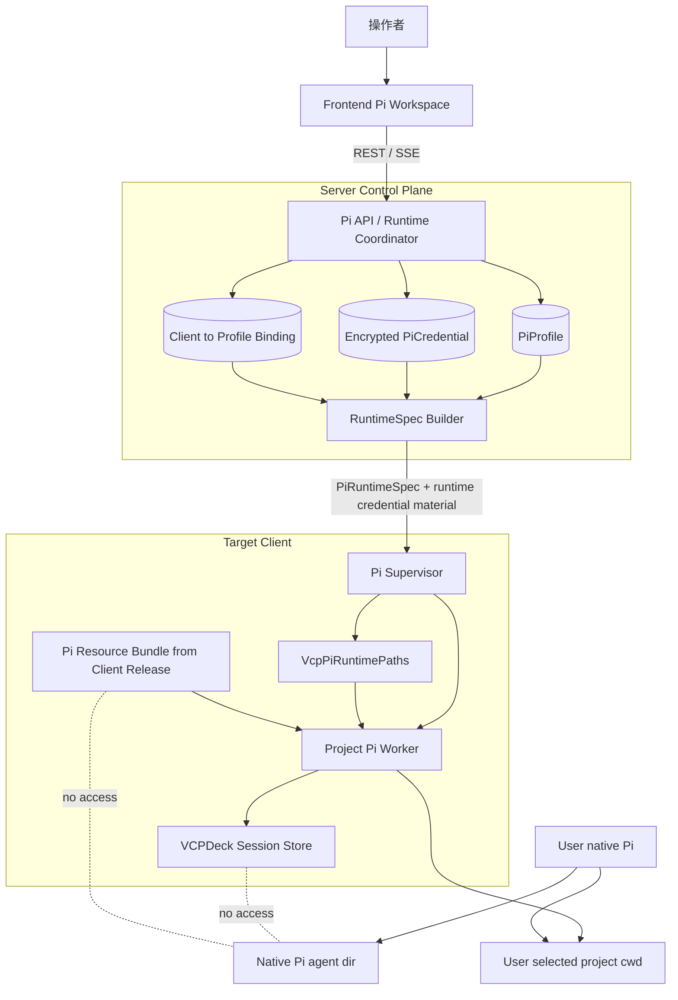

这套设计不把 VCPDeck 变成第二个 Pi 包管理器，也不把 Pi Session 正文搬到 Server。集中的是 **控制面配置**，不是所有数据。

## 2. 当前问题与设计驱动

当前实现的关键事实：

- Client 锁定 `@earendil-works/pi-agent-core@0.84.0` 与 `@earendil-works/pi-coding-agent@0.84.0`（Plan 1 已升级到 `0.86.0`，见 §28.4）；
- Pi Worker 通过 Pi SDK 动态 import 创建 AgentSession；
- capability 当前会检查目标机器 Pi agentDir、settings shellPath 和已认证模型；
- AgentSession 当前调用 SDK `getAgentDir()`、SettingsManager、ModelRuntime、ProjectTrustStore；
- SessionReader 在未传入 `sessionDir` 时由 Pi SDK 使用默认 Session 目录；
- 目标机器上的全局 Pi 设置、凭据、Extensions、Skills 和 trust 会影响 VCPDeck Pi；
- Server 已经拥有 Pi Session Job/Run 状态机、Owner/Observer、REST/SSE 和重连对账；
- Client 已采用项目级 Worker 子进程，适合注入独立 runtime root；
- 仓库已有 `examples/pi-web`（MIT）作为 Pi Web UI 参考，但它默认共享本地 Pi 配置和 Session，不能直接当作 VCPDeck 控制面后端。

因此问题不是重写远程 Pi，而是把当前：

```text
Pi SDK -> machine native Pi agentDir
```

替换为：

```text
Server RuntimeSpec + Client Release Bundle + VCPDeck isolated data root
                         |
                         v
                    Pi SDK Worker
```

现有 Session Job/Run、请求 Broker、SSE、Worker Supervisor 和大部分 Frontend 控制逻辑应尽量保留。

## 3. 目标与非目标

### 3.1 目标

- Server 是 Pi 配置、Provider Credential 和策略唯一持久化权威；
- Client 不持久保存 Profile、模型配置、Credential、工具策略和资源启用状态；
- VCPDeck Pi 不读取、不修改、不创建用户原生 Pi 的任何全局状态；
- 目标机器从未安装用户 Pi 时 VCPDeck Pi 仍能独立运行；
- 用户原生 Pi 的安装、升级、配置和插件变化不能改变 VCPDeck Pi 行为；
- Pi SDK、Extension、Skill、Prompt 的版本与 Client Release 一致；
- Release 回滚能回滚 Pi Runtime/Bundle，而不删除 VCPDeck Session；
- 活跃 Run 的配置语义在一次运行期间稳定；
- Server 明确知道 Client 的 Pi SDK、Bundle、RuntimeSpec 协议是否兼容；
- UI 可复用成熟开源组件，但 VCPDeck Server/协议/Owner/Session Job 仍是控制事实源；
- 新跨边界字段继续由 `@vcpdeck/shared` 严格解析。

### 3.2 非目标

第一阶段不做：

- Server 永久镜像完整 Pi Session 正文；
- 动态 npm/git 安装第三方 Pi Package 到 Client；
- 任意远程 JavaScript/TypeScript Extension 下发；
- 多租户强隔离或硬件级 Secret 保护；
- 容器/VM 沙箱；
- 同一 Session 多并行 Run；
- 自动从用户 `~/.pi` 导入配置、Credential 或全部 Session；
- 默认执行项目目录中的任意 `.pi/extensions`；
- 用 Pi Web 本地后端替换 VCPDeck Server；
- 为 UI 复用而把 Frontend 整体迁到 Next.js/React 19。

## 4. 架构不变量

### 4.1 控制面

1. Profile、Credential、Binding、Policy 持久化权威只能在 Server。
2. Client 重启后不能靠磁盘 RuntimeSpec 恢复配置，必须重新协商。
3. Profile 修改通过 revision 换代，不直接修改运行中 Worker。
4. Client 不允许根据本地 `settings.json`、`models.json`、`auth.json` 补齐 Server 配置。

### 4.2 隔离

1. 生产代码不得把 `~/.pi` 或 Pi SDK 默认 agentDir 作为 VCPDeck fallback。
2. 所有 Session API 显式绑定 VCPDeck session root。
3. resource loader 显式限定来源。
4. 用户原生 Pi 全局 Extension/Skill/Prompt 不被 VCPDeck 扫描。
5. 项目 cwd 是唯一默认共享区域。
6. 双方同时修改项目源码属于共享 cwd 的预期行为，不属于 Pi 状态污染。

### 4.3 发布

1. Extension 可执行代码只能来自受信 Client Release Bundle 或未来另行接受的供应链机制。
2. Server 配置只引用 resource ID，不包含脚本正文。
3. Bundle 与 Pi SDK 版本可审计、可回滚、可能力协商。

### 4.4 隐私

1. Server 不默认持久化 prompt、assistant 正文、thinking、tool result、Session JSONL。
2. Provider Secret 不进入普通日志、Job payload/result、capability 或错误消息。
3. RuntimeSpec 敏感材料与普通配置投影分层，Frontend 永远拿不到 Secret 明文。

## 5. 数据与状态权威

| 数据/状态 | 目标权威位置 | 持久化 | Client 磁盘 | Server DB |
| --- | --- | --- | --- | --- |
| Pi Profile | Server | 是 | 否 | 是 |
| 默认模型/允许模型 | Server Profile | 是 | 否 | 是 |
| thinking 策略 | Server Profile | 是 | 否 | 是 |
| Tool allow/deny/approval | Server Profile | 是 | 否 | 是 |
| Resource 启用项 | Server Profile | 是 | 否 | 是 |
| Provider Credential 密文 | Server | 是 | 否 | 是（密文） |
| Runtime credential 明文 | Worker runtime | 否 | 否 | 否 |
| Client→Profile Binding | Server | 是 | 否 | 是 |
| RuntimeSpec revision | Server + Client 内存 | Server 是 / Client 否 | 否 | 是/可重建 |
| Pi SDK/Extension 代码 | Client Release | 是 | 是，版本目录 | Release 元数据 |
| Skills/Prompts | Client Release | 是 | 是，版本目录 | 选择/版本元数据 |
| 活跃 Worker | Client | 否 | 否 | 否 |
| Session JSONL | Client VCPDeck data root | 是 | 是 | 否 |
| Session Job/Owner/Run | Server | 是 | 运行态摘要 | 是 |
| Project cwd | 目标机器文件系统 | 项目自身 | 是 | 否 |
| 用户原生 Pi `~/.pi` | 用户原生 Pi | 是 | 是 | 否 |

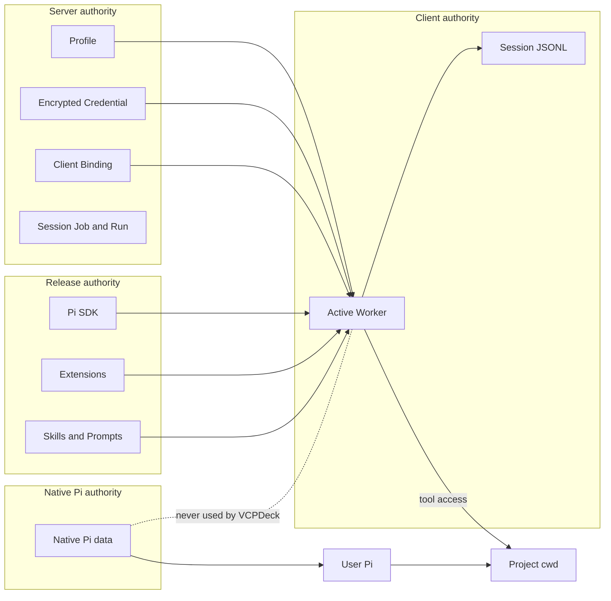

## 6. Server 领域模型

### 6.1 PiProfile

`PiProfile` 表示可绑定多个 Client 的逻辑运行配置。

```ts
interface PiProfile {
  id: string;
  name: string;
  enabled: boolean;

  defaultModel: {
    provider: string;
    modelId: string;
  };

  allowedModels: Array<{
    provider: string;
    modelId: string;
    maxThinkingLevel?: string;
  }>;

  defaultThinkingLevel: string;

  toolPolicy: {
    allow?: string[];
    deny?: string[];
    approval?: Record<string, "allow" | "confirm" | "deny">;
  };

  resources: {
    extensions: string[];
    skills: string[];
    prompts: string[];
    allowProjectResources: false;
  };

  revision: number;
}
```

具体 Prisma 结构以查询、审计和迁移需求决定；长期语义是每次运行行为变化递增 revision。

### 6.2 PiCredential

Credential 与 Profile 分开。建议保存 `id`、`provider`、`name`、`ciphertext`、`encryptionKeyVersion`、安全 fingerprint、时间戳、`lastUsedAt`、`revokedAt`。

加密根密钥必须来自 Server 进程外部安全配置，不与 ciphertext 同库形成等价明文。

### 6.3 PiProfileCredentialBinding

一个 Profile 可引用多个 Provider Credential。RuntimeSpec Builder 只解密当前允许模型真正需要的 Secret。

### 6.4 PiClientBinding

第一阶段保持：

```text
clientId -> profileId
```

不提前引入 global/group/client/project/session 多层覆盖，以免形成复杂优先级。

### 6.5 Resource Catalog

资源代码事实来自 Release Bundle manifest。Server 只关心当前 Bundle 提供哪些 resource ID、Profile 想启用哪些 ID、是否兼容。

## 7. PiRuntimeSpec

`PiRuntimeSpec` 是 Server 对某个 Client 某时刻的不可变运行快照。

```ts
interface PiRuntimeSpecV1 {
  schemaVersion: 1;
  specId: string;
  profileId: string;
  profileRevision: number;

  requiredBundle: {
    protocolVersion: 1;
    bundleVersion: string;
    piSdkVersion: string;
  };

  modelPolicy: {
    defaultModel: { provider: string; modelId: string };
    allowedModels: Array<{
      provider: string;
      modelId: string;
      maxThinkingLevel?: string;
    }>;
    defaultThinkingLevel: string;
  };

  toolPolicy: {
    allow?: string[];
    deny?: string[];
    approval?: Record<string, "allow" | "confirm" | "deny">;
  };

  resources: {
    extensions: string[];
    skills: string[];
    prompts: string[];
    allowProjectResources: false;
  };

  runtimeRevision: string;
}
```

Secret 不放进可日志化的普通 Spec DTO，可使用独立敏感 envelope 或短生命周期 Credential Lease。

`runtimeRevision` 由 Profile revision、Credential rotation、Bundle compatibility、Tool policy、Resource enablement 和 Runtime protocol 等影响 Worker 行为的输入决定。

Client 内存可维护：

```text
desiredRuntimeRevision
activeRuntimeRevision per worker
configState = pending | ready | incompatible | stale
```

但不将完整 Spec/Secret 写盘。

## 8. RuntimeSpec 同步与请求门控

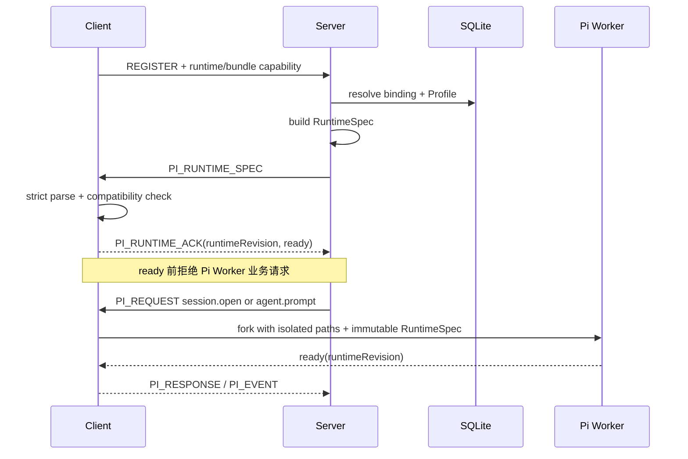

Client capability 至少新增 `configMode`、`runtimeSpecProtocolVersion`、`resourceBundleProtocolVersion`、`resourceBundleVersion`、`piSdkVersion` 和有界 resource summary/hash。

Pi ready 必须同时满足 Node/Bash/Pi SDK、VCPDeck data root、Bundle manifest、RuntimeSpec parser、Profile 模型/资源、Credential 和协议兼容。失败只禁用 Pi。

Socket 重连后必须完成 PI_STATE 与 runtimeRevision 双对账后才接受新 Prompt/mutation。

## 9. Client 数据根与文件隔离

### 9.1 稳定 Client data root

Pi 持久数据必须位于业务版本目录之外。

| 部署 | 建议 data root |
| --- | --- |
| Windows SYSTEM | `C:\ProgramData\VCPDeck\Client\data` |
| Linux A2 | `/var/lib/vcpdeck-client` |
| 通用 Launcher / 开发 | `<VCPDECK_APP_DIR>/data` |

关键要求是稳定、版本目录外、由 VCPDeck 拥有。实现可通过统一 resolver 或未来显式 `VCPDECK_CLIENT_DATA_DIR` 注入。

### 9.2 Pi 目录

```text
<client-data-root>/
└── pi/
    ├── agent/
    ├── sessions/
    │   ├── <project-namespace-a>/
    │   └── <project-namespace-b>/
    ├── cache/
    ├── tmp/
    └── diagnostics/
```

Release：

```text
<current-client-release>/
├── dist/
└── pi-resources/
    ├── manifest.json
    ├── extensions/
    ├── skills/
    └── prompts/
```

用户原生 Pi 继续使用自己的 agentDir，两者不共享。

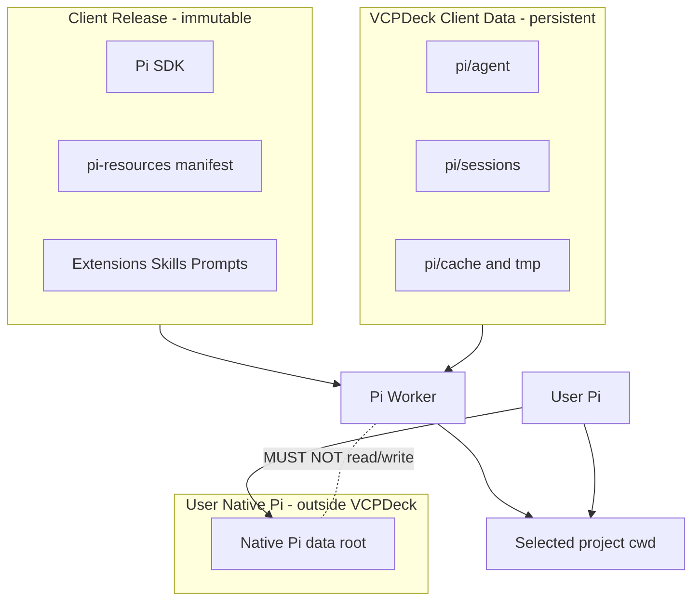

### 9.3 双重隔离

第一层：Worker fork 时设置：

```text
PI_CODING_AGENT_DIR=<client-data-root>/pi/agent
```

第二层：所有 SessionManager API 显式传 VCPDeck `sessionDir`：

```text
SessionManager.create(cwd, explicitSessionDir)
SessionManager.list(cwd, explicitSessionDir)
```

目标实现应把 `createPiSessionReader(cwd, sessionDir?)` 收紧为必须参数。

### 9.4 禁止 fallback

```text
PI_CODING_AGENT_DIR ?? ~/.pi/agent
SessionManager.create(cwd)
SessionManager.list(cwd)
getAgentDir() 作为事实配置来源
读取 ~/.pi/agent/settings.json 决定 VCPDeck shell
读取 ~/.pi/agent/models.json 决定 Server 可用模型
读取用户 ProjectTrustStore 决定是否加载资源
```

以上在 server-managed isolated 模式全部属于错误。

## 10. Session Store

继续使用 Pi SDK JSONL，不重新定义 Session 格式，只改变存放位置和 namespace。

Session root 按项目隔离，同时不向 Server 暴露 canonical cwd。建议 Client 基于 canonical cwd 生成本机稳定 opaque namespace。当前短生命周期 `projectKey` 只用于 Run 锁，不直接作为持久 Session 目录名。

历史 Session 的 model/thinking 记录不能越过当前 Server policy。若历史最后模型已被禁用，Session 仍可读，但新 Prompt 必须先切换到当前允许模型。

## 11. Worker 生命周期与配置换代

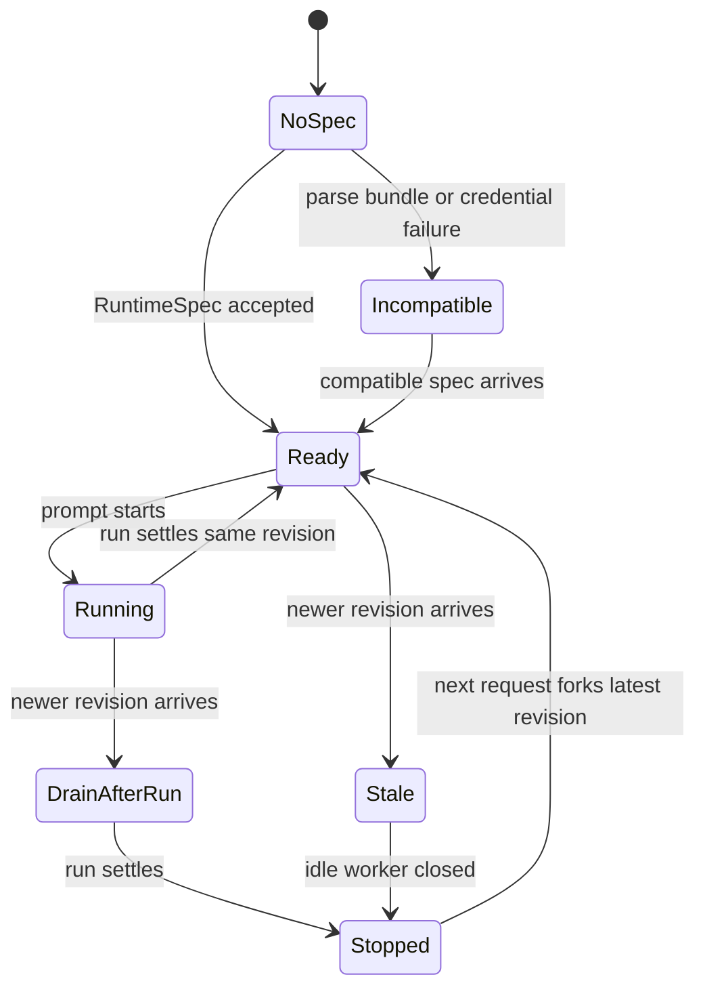

Run 中途不得替换 ModelRuntime、Credential、Extension 集合、Tool policy、Resource loader、System prompt 或 thinking policy。

Credential 泄露等紧急场景可有明确 `runtime.revoke / worker.terminate`，不伪装成普通 Profile 热更新。

## 12. Pi Resource Bundle

Bundle 随 Client Release：

```text
pi-resources/
├── manifest.json
├── extensions/
├── skills/
└── prompts/
```

Extension 推荐构建阶段编译/打包；Skills/Prompts 同样进入 Release 完整性范围。

Manifest 示意：

```json
{
  "protocolVersion": 1,
  "bundleVersion": "0.11.0",
  "piSdkVersion": "0.86.0",
  "extensions": [
    { "id": "vcp.files", "version": "3", "sha256": "..." }
  ],
  "skills": [
    { "id": "vcpdeck", "version": "5", "sha256": "..." }
  ],
  "prompts": [
    { "id": "review", "version": "2", "sha256": "..." }
  ]
}
```

版本仅为示意。

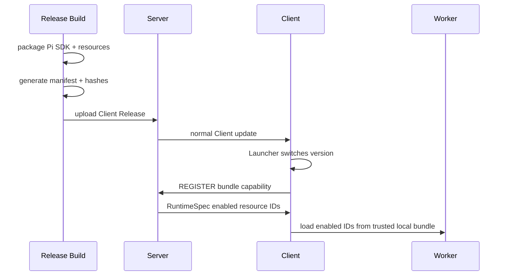

Server 不建立动态 JavaScript 代码分发链。Bundle 放版本目录，Session 放稳定 data root。Profile 引用了旧 Bundle 不存在的资源时 fail closed。

> **落地状态（Plan 2）**：已实现。Bundle 位于 `<app-dir>/apps/<version>/pi-resources/`，Client 从自身模块位置定位、严格解析 manifest 并逐资源校验 sha256（拒绝绝对路径、`..` 与符号链接逃逸），校验结果只驻留内存；Client 在 REGISTER 上报 `capabilityDetails.pi.bundle`（版本事实 + 资源 ID），Server 仅向兼容 Bundle 的 Client 下发带 `requiredBundle` 的 Spec。首发 Bundle 只含 VCPDeck 自有的工具策略扩展（Skills/Prompts 目录已声明支持但为空）。`skills/vcpdeck` 未进 Bundle：那会让远程 Pi 具备 VCPDeck 控制面能力，需要独立的授权设计。

## 13. Credential 与 Secret

Credential 明文只允许短暂存在于 Server 受控输入/解密窗口和 Client Worker 运行内存中。DB 只保存密文与安全元数据。

注入优先级：

1. Pi SDK 可注入 Credential/Model runtime；
2. VCPDeck Provider adapter；
3. 只有上游确实无法支持时才评估受限环境变量。

不应把通用 Provider API key 直接放进整个 Worker 环境并让 bash/tool 子进程继承。

建议稳定错误码：

```text
PI_CONFIG_UNAVAILABLE
PI_CREDENTIAL_UNAVAILABLE
PI_RUNTIME_SPEC_INCOMPATIBLE
PI_RESOURCE_UNAVAILABLE
```

错误不得包含 key、完整 Provider response、agentDir 或整份 RuntimeSpec。

## 14. 模型与 Tool Policy

可见模型必须是：

```text
Server allowed models
    intersection
Client Pi SDK/provider support
    intersection
required Credential available
```

Client 不能因用户本地 `models.json` 扩大模型列表。

Tool Policy 第一阶段建议 `allow / confirm / deny`：

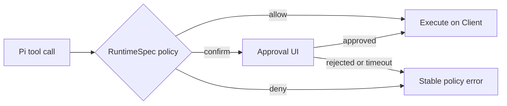

Tool Policy 不是 OS sandbox。

> **落地状态（Plan 2）**：已实现，且策略默认拒绝。`allow ∪ confirm` 作为 SDK 原生 `tools` 白名单下发、`deny` 同时进入 `excludeTools`，**未出现在任何桶的工具不可用**；`confirm` 由 Bundle 资源 `vcp.tool-policy` 拦截 `tool_call`，经既有 Extension UI 链路每次调用审批，拒绝/取消/30 分钟超时一律判定为拒绝并返回 `PI_TOOL_POLICY_REJECTED`（会话继续）。策略经进程内 host bridge 传给扩展：**不落盘、不进环境变量**（`bash` 工具派生的子进程会继承环境变量）；桥接缺失或版本不符时扩展阻塞所有工具调用（`PI_POLICY_UNAVAILABLE`）。本阶段不持久化审批审计。未见 `allow` 项的历史 Profile 因此默认不可用，需在界面套用基线策略。

## 15. Project Resources 与 Trust

第一阶段即使项目存在：

```text
.pi/extensions
.pi/settings.json
.agents/skills
```

也不自动加载可执行/行为资源。未来若开放，需要资源 allowlist、Server policy、Owner 审批、project identity、修改检测与审计；不得直接沿用用户 Pi 的 ProjectTrustStore。

## 16. Capability 与协议版本

建议 capability：

```ts
interface PiCapabilityStatus {
  available: boolean;
  nodeVersion?: string;
  shellKind?: string;
  piSdkVersion?: string;
  sessionJobProtocolVersion?: number;
  runtimeSpecProtocolVersion?: number;
  resourceBundleProtocolVersion?: number;
  resourceBundleVersion?: string;
  configMode?: "server-authoritative";
}
```

新的本地 capability 只检查 Node、Bash、Release 内 Pi SDK、VCPDeck data root 和 Bundle manifest。“至少一个已认证模型”迁移到 RuntimeSpec ready 阶段。

## 17. Server API 与管理界面

建议 namespace：

```text
/api/pi/profiles
/api/pi/profiles/:id
/api/pi/credentials
/api/pi/credentials/:id
/api/pi/client-bindings
/api/clients/:clientId/pi/runtime
```

Profile UI 管理模型、thinking、tool policy 和 resource IDs；Credential UI 只返回 provider/name/status/fingerprint/timestamps；Runtime 页面展示 desired/active revision、Bundle/Pi SDK version、ready/incompatible/stale 和缺失依赖。

## 18. Frontend：复用 Pi Web，但不复用其控制面

仓库已有 `examples/pi-web` 子模块。其 README 明确默认读取 `~/.pi/agent`，Models 页面管理 Pi model/settings/credential；当前子模块使用 Next.js 16、React 19、Pi SDK 0.85.1，而 VCPDeck Frontend 当前是 Vite + React 18、Client 锁定 Pi 0.84.0（Plan 1 起为 0.86.0，见 §28.4）。

所以复用边界：

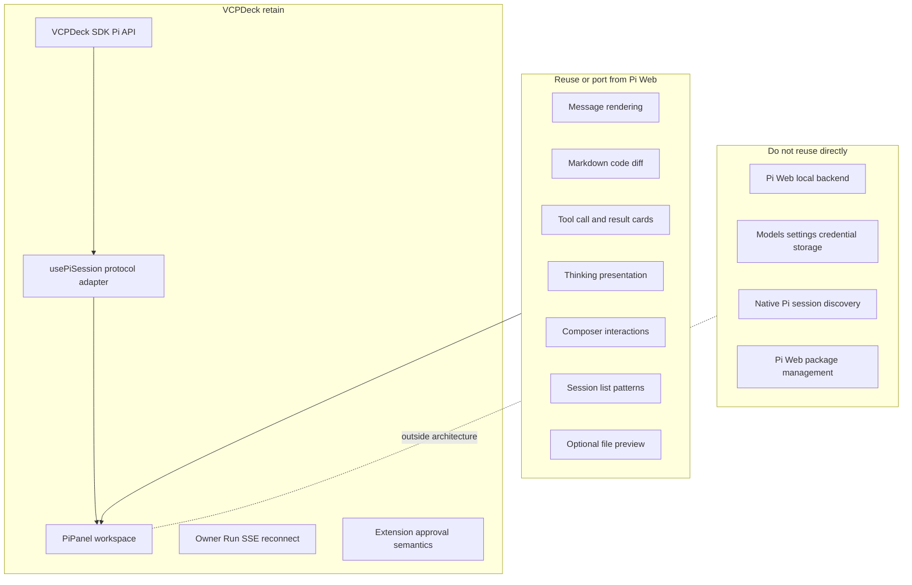

Frontend 应增加内部 Pi UI Adapter，把 Shared DTO 投影为 renderer model。这样移植 Pi Web 组件或未来更换 renderer 都不改变 Server/Client 协议。

不推荐 iframe 或每台 Client 启动 Pi Web Server，因为会增加 HTTP 服务、认证、端口和第二套本地配置/Session 逻辑。

`examples/pi-web` 当前声明 MIT；实际移植前再次核验文件级许可证和第三方依赖，并保留必要 license/NOTICE。

> **落地状态（Plan 3 / 阶段 F）**：已实现，按 [ADR-0032](../adr/0032-pi-web-renderer-vendoring.md) 最大化原样拷入。渲染层闭包（40 文件 + 同名上游 `.test.mjs` + `styles.css` + `LICENSE`）落位于 `packages/frontend/src/pi-web/`，唯一改动是 `@/` 说明符相对化（`scripts/port-pi-web-render.mjs` 可重跑同步上游）；Pi UI Adapter（`src/pi/pi-render-adapter.ts`）是 Shared DTO ↔ 渲染模型的唯一翻译点，移植子树零协议 import（门禁守住）；`pi-chat-window` 的三处消息体替换为移植的 `MessageView`，外包 `PiRenderBoundary` 降级护栏，渲染异常回落原 `pi-message-view` 纯文本，会话不被渲染器缺陷阻断。Composer、会话列表、连接管理保留 VCPDeck 实现（范围 A）。已知限制：Shared DTO 图片占位无字节，退化为标注文本（附件字节通路后续再接 `ImagePreview`）；bundle 因 mermaid/KaTeX/语法高亮显著增大，为既定取舍。浏览器端 `fs`/`crypto` 为抛错桩、`path` 走 `path-browserify`（本地文件功能不接线）。上游测试 222/223，唯一失败为 Windows 符号链接权限（`EPERM`），已在上游原目录复现，属环境限定。

## 19. Profile 更新链路

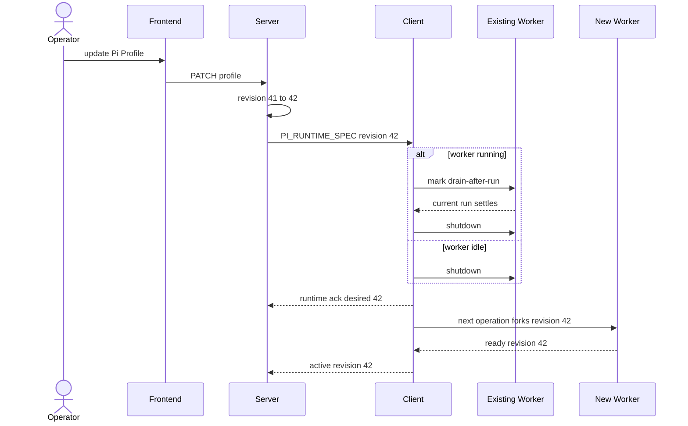

## 20. Release 更新链路

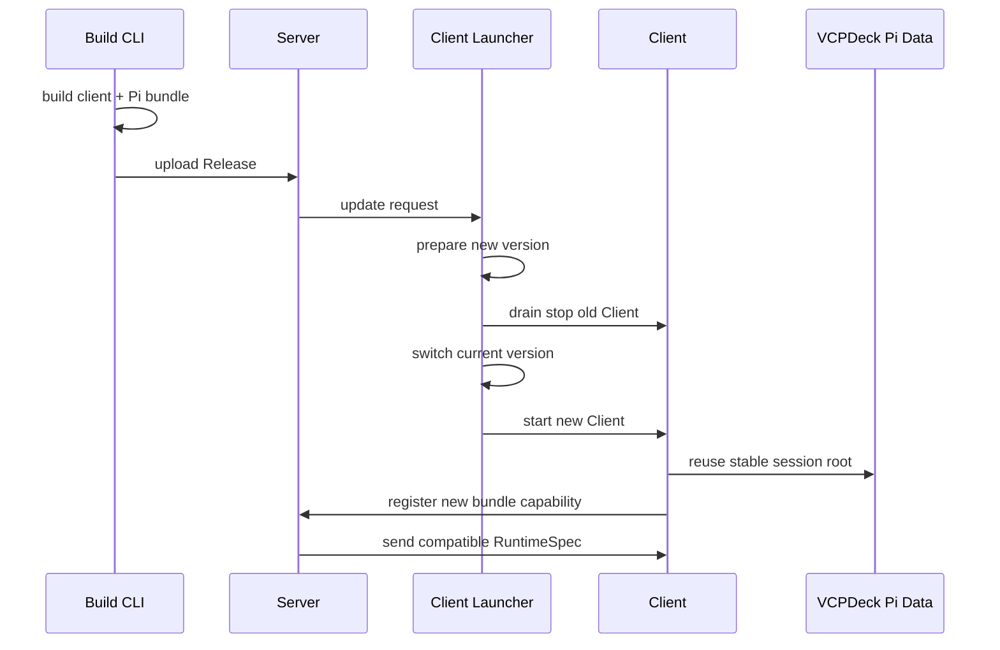

Release 是可替换代码；Data root 是持久 Session。

## 21. 旧数据迁移

### 21.1 不自动搬用户 Pi

当前 VCPDeck 与用户 Pi 共用 agentDir 后，Session 无法可靠区分来源。因此不能整体移动用户 Pi sessions。

### 21.2 新版本默认

- 创建新的空 VCPDeck Pi data root；
- Server Profile 重新配置 Credential/model；
- 不读取用户 settings/models/auth；
- 不自动显示旧 native Pi Session；
- 用户原生 Pi 完全不变。

### 21.3 可选 Session 导入

如需历史，只允许显式导入：

1. 用户主动选择源 Session；
2. Client 只读打开；
3. 校验 cwd；
4. 复制到 VCPDeck Session root；
5. 源文件不删除、不 rename；
6. 导入后只操作副本。

Credential 不自动迁移。

## 22. 兼容与回滚

| Server | Client | Pi 行为 |
| --- | --- | --- |
| 新 | 新，协议兼容 | server-managed isolated Pi |
| 新 | 旧，无隔离 capability | Pi disabled，其他能力继续 |
| 旧 | 新 | 不支持主动部署；遵循 Server-first 更新 |
| 新 | 新但 Bundle 不兼容 | Pi disabled + 明确原因 |

绝不提供新 Server 对旧 Client fallback 到用户 Pi 的路径。

Client Release 回滚时 Bundle 随代码回滚、Session root 保持、Server 重新协商。跨越隔离边界回退旧 Client 会重新带回旧行为，因此不能视为普通无风险回滚；必须先禁用该 Client Pi，并在回退窗口不运行 Pi。

## 23. 故障模型

| 故障 | 目标行为 |
| --- | --- |
| Server 无 Profile binding | Pi unavailable；不读本地 Pi |
| Credential 缺失/撤销 | Pi unavailable 或相关模型不可用；凭据集合不覆盖 Profile 时登记 `PI_CREDENTIAL_UNAVAILABLE` |
| RuntimeSpec parser 失败 | fail closed；其他能力继续 |
| Bundle manifest 损坏 | Pi unavailable |
| Profile resource ID 不在 Bundle | Pi unavailable，显示缺失 ID |
| Client 未上报 Bundle（未按发布布局启动的 dev Client 等） | Pi unavailable，登记 `PI_BUNDLE_UNAVAILABLE`；界面显示缺失原因，不静默停在「等待下发配置」 |
| Client data root 不可写 | Pi unavailable，不 fallback 用户 Pi |
| Session JSONL 损坏 | 单 Session 安全错误，不扫描 native Pi |
| 配置更新时 Run 活跃 | 旧 revision 完成本轮，随后 drain |
| Client Socket 断线 | Worker/Session 保持；重连双对账 |
| 同一 clientId 存在重复连接（残留 Client 进程） | 后注册者接管注册表；其断开时绑定切给存活连接、恢复该连接自身能力并重新下发，同时保持该 Client 在线；只在最后一个连接断开时才置离线并清空登记 |
| Client 进程重启 | RuntimeSpec 重新获取；Session 从 VCPDeck data root 恢复 |
| Server 重启 | Profile/Binding 从 DB 恢复；Client 重新协商 |
| Release 回滚资源缺失 | fail closed，不静默移除策略 |
| 用户修改/删除 native Pi 数据 | VCPDeck Pi 不受影响 |
| 用户更新 native Pi | VCPDeck Pi SDK 不受影响 |
| native Pi Extension 恶意/损坏 | VCPDeck 不加载 |

## 24. 安全边界与可观测性

本方案解决用户 Pi 污染、配置集中治理、扩展供应链和组合可审计问题，但不提供 OS sandbox。Windows SYSTEM / Linux root-equivalent Client 下，允许工具仍拥有很高系统权限；Client/Worker 被完全攻陷时运行期 Credential 仍可能被读取。

允许记录 desired/active `runtimeRevision`、Profile ID、Bundle version/hash、Pi SDK version、config state、Worker count 和稳定错误码。

禁止记录 RuntimeSpec sensitive envelope、Provider key、prompt/assistant/tool result、cwd 绝对路径、native Pi 路径和 Session JSONL 正文。

## 25. 测试与发布门禁

### 25.1 Native Pi 零污染

构造：

```text
fake-user-home/
└── .pi/
    └── agent/
        ├── settings.json
        ├── models.json
        ├── credentials-sentinel
        ├── sessions/native-only.jsonl
        └── extensions/should-never-load.*
```

执行 capability、Session list/new/open、Prompt、model list/set、资源加载、Client restart、Release update 和 Profile update。

前后对整个 native Pi 目录做递归清单 + 内容 hash，必须满足：

```text
0 created
0 modified
0 deleted
native-only session invisible to VCPDeck
native extension never executed
```

### 25.2 其他门禁

- 无 native Pi 的全新机器仍可运行；
- VCPDeck Session 不进入用户 native Pi 列表；
- VCPDeck data/release/log/temp/crash output 无测试 API key 明文；
- Bundle hash、resource missing、duplicate ID、Pi SDK mismatch、corrupted resource、rollback 覆盖；
- idle/running Worker 配置更新、Credential rotation、Server restart、Client reconnect/restart 覆盖；
- UI renderer 接入后继续覆盖 SSE reconnect、history、Tool、thinking、image、Extension UI、Owner/Observer 和 incompatible 状态。

## 26. 验收标准

1. 生产代码没有 VCPDeck Pi → 用户 Pi fallback；
2. SessionManager 创建/列表入口显式使用 VCPDeck Session root；
3. RuntimeSpec 由 Shared 严格 parser 管理；
4. Client 重启后不从磁盘恢复 Profile/Secret；
5. Profile/Secret/Binding 由 Server 持久化；
6. Provider Secret 加密落库且不进入普通 API；
7. Pi Resource Bundle 与 Client Release 同版本发布；
8. Client capability 报告 RuntimeSpec/Bundle 兼容性；
9. Bundle 不匹配 fail closed；
10. 项目本地可执行 Pi 资源默认关闭；
11. Native Pi hash 门禁在 Windows/Linux 支持矩阵通过；
12. VCPDeck Session 在 Client 更新后保持；
13. 新 Server + 旧 Client 不回退 native Pi；
14. UI 复用不引入第二套本地配置/认证/Session 后端；
15. 实现时同步 architecture/security/compatibility/deployment/testing/CHANGELOG。

## 27. 长期落地依赖关系

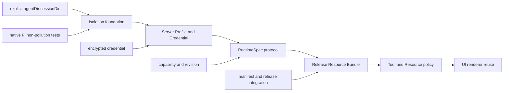

每一阶段都必须 fail closed，不能在中间状态重新 fallback 到 native Pi。

## 28. 实现地图

本章把上文设计映射为可执行的落地顺序、代码触点与既有偏移，供后续临时 Plan 与评审引用。**本章不改变任何设计结论**，章节号沿用上文。

### 28.1 阶段切分与释放边界

> 落地状态：Plan 1（阶段 A+B+C）、Plan 1.1（Provider 接入与模型目录来源）、Plan 2（阶段 D+E：Resource Bundle 与工具策略）、Plan 2.1（§21.3 显式 Session 导入）与 Plan 3（F 展示层复用，按 ADR-0032）均已完成实现与验证 —— **A–F 六阶段全部落地**。各 Task 的执行记录与偏离见 `.tmp/plans/` 下同名 Plan（临时材料，未提交）。
>
> Plan 1/1.1 落地后由端到端试用暴露并已修复的缺陷（两处跨边界 ID 空间混用、前端吞掉服务端精确错误、根密钥配置不可发现）见 §28.9。

已确认的两项落地决策：

1. Pi SDK 目标版本为 `0.86.0`（0.84.0 → 0.86.0，`pi-agent-core` 与 `pi-coding-agent` 同步）；
2. 阶段 A/B/C 合并为同一个 Release 落地，不逐段发布。

第 2 条不是偏好而是约束：隔离一旦对某个 Client 生效，它就不能再读本机 `~/.pi` 凭据（§4.2、§9.4），而 §22 与 ADR-0029 第 8 条禁止回退 native Pi。逐段发布会让中间态 Pi 完全不可用。

| 计划 | 覆盖阶段 | 交付物 | 释放判据 |
| --- | --- | --- | --- |
| Plan 1「最小可用切换」 | A 隔离基础 + B Server Profile/Credential + C RuntimeSpec | Pi SDK 0.86.0；VCPDeck Pi 数据根与 Session 隔离；Server 侧 Profile/Credential/Binding 持久化；RuntimeSpec 下发与 ready 门控；最小管理界面 | 未安装用户 Pi 的全新机器可完成一次对话；用户 `~/.pi` 零变更；Server 未配置 Profile 时 Pi 明确不可用 |
| Plan 1.1「Provider 接入与模型目录来源」 | B 的配置面收敛 + §7 模型条目来源语义 | 一次接入（名称/协议/Base URL/API Key）完成 Provider + 模型 + 凭据原子创建；远程 `/models` 自动拉取；模型元数据来源判别联合 `catalog \| explicit` | 内置目录可解析的模型必须拿到真实上下文窗口与成本（不写占位值）；自定义端点必须显式元数据且标注未确认；无可用模型不注册 Provider |
| Plan 2「受信资源与策略」 | D Bundle + E Tool/Resource policy | `pi-resources/` + manifest + hash 随 Release 发布；allow/confirm/deny（默认拒绝、每次调用审批、超时即拒绝）；项目资源继续默认关闭 | Bundle 缺失或不匹配 fail closed；Project 本地 Extension 永不加载；策略与资源不落盘不进环境变量 |
| Plan 2.1「旧 Session 显式导入」 | §21.3 显式导入（从 Plan 2 拆出） | 用户主动选择源 Session → 只读打开 → 校验 cwd → 复制到 VCPDeck Session root，源文件不动 | 不自动搬运、不迁移凭据；导入后只操作副本 |
| Plan 3「展示层复用」 | F UI renderer | VCPDeck Pi UI Adapter + 从 `examples/pi-web` 移植展示组件 | 替换 renderer 不改变 REST/SSE/Owner/Run 与 Session Job 语义（§18） |

硬约束：Plan 1 不得只发布 Client 侧隔离；Plan 1 完成前，任何 Client Release 都不得引入「没有 RuntimeSpec 也启动 Pi Worker」的路径。

### 28.2 阶段 A–F 完成判据

| 阶段 | 完成判据 | 依赖 | 归属 |
| --- | --- | --- | --- |
| A 隔离基础 | runtime path resolver 生效；`PI_CODING_AGENT_DIR` 注入 Worker；SessionManager 入口 sessionDir 必填；native Pi 零污染 hash 门禁可跑 | 无 | Plan 1 |
| B Server Profile/Credential | Profile/Credential/Binding 可持久化；密文落库；根密钥来自进程外部配置；普通 API 无明文 | 无（可与 A 并行） | Plan 1 |
| C RuntimeSpec | Shared 严格 parser；capability 上报协议版本；ready 前拒绝业务请求；重连双对账 | A + B | Plan 1 |
| D Bundle | **已落地**：manifest（`protocolVersion=1` + `bundleVersion` + `piSdkVersion` + 逐资源 `sha256`）随 Release 发布在版本目录内；Client 按自身路径定位并逐资源校验；Server 只引用 resource ID；缺失/篡改/不兼容即 fail closed（`PI_BUNDLE_UNAVAILABLE`） | C | Plan 2 |
| E Tool/Resource policy | **已落地**：`allow ∪ confirm` 走 SDK 原生工具白名单、`deny` 进排除面；`confirm` 由随 Bundle 发布的策略扩展经既有审批链路执行；未列出工具默认拒绝；项目资源继续默认关闭 | D | Plan 2 |
| F UI renderer | Adapter 隔离 Shared DTO 与展示组件；控制面语义不变 | C（不依赖 D/E） | Plan 3 |

### 28.3 设计章节 → 代码触点

| 设计章节 | 主要触点 | 归属 |
| --- | --- | --- |
| §6 Server 领域模型 | `packages/server/prisma/schema.prisma`（新增模型）、`packages/server/src/pi/`（新 service/controller）、`packages/shared/src/pi.ts` | Plan 1 |
| §7 PiRuntimeSpec | `packages/shared/src/pi.ts`（DTO + 严格 parser）、`packages/server/src/pi/pi-request-broker.ts` | Plan 1 |
| §8 同步与门控 | `packages/client/src/register.ts`（capability）、`packages/client/src/index.ts`（`attachPiBridge`）、`packages/client/src/pi/supervisor.ts` | Plan 1 |
| §9 数据根与文件隔离 | `packages/client/src/pi/`（新 path resolver）、`packages/client/src/index.ts` 的 `forkProjectWorker`、`packages/client/src/pi/session-reader.ts` | Plan 1 |
| §10 Session Store | `packages/client/src/pi/session-reader.ts`、`packages/client/src/pi/project-path.ts` | Plan 1 |
| §11 Worker 生命周期 | `packages/client/src/pi/supervisor.ts`、`packages/client/src/pi/agent-session.ts` | Plan 1 |
| §12 Pi Resource Bundle | `scripts/pack-release.ts`（`buildPiResourceBundle`）、`scripts/bundle-apps.ts`（`bundlePiExtension`）、`packages/client/src/pi/bundle.ts`、`packages/client/src/pi-bundle/`（扩展源码与 manifest）、`packages/client/src/pi/agent-session.ts`（`resourceLoaderOptions`） | Plan 2 |
| §13 Credential 与 Secret | `packages/client/src/pi/agent-session.ts`（ModelRuntime 注入）、`packages/server/src/pi/`（加解密） | Plan 1 |
| §14 模型与 Tool Policy | `packages/client/src/pi/runtime-spec.ts`（`toolSetsFor`）、`packages/client/src/pi/tool-policy-bridge.ts`、`packages/client/src/pi-bundle/tool-policy/index.ts`、`packages/frontend/src/pages/pi-profiles-panel.tsx` | Plan 1（模型）/ Plan 2（策略） |
| §15 Project 资源与 Trust | `packages/client/src/pi/agent-session.ts`（`ProjectTrustStore`）、resourceLoader 选项 | Plan 2 |
| §16 Capability 与协议版本 | `packages/shared/src/pi.ts`、`packages/shared/src/machine-register.ts`、`packages/client/src/pi/capability.ts` | Plan 1 |
| §17 Server API | `packages/server/src/pi/pi.controller.ts` 及新 controller、`packages/sdk/src/pi.ts` | Plan 1 |
| §18 Frontend 复用 | `packages/frontend/src/pi/`（新增 Adapter） | Plan 3 |
| §25 测试与发布门禁 | `packages/client/src/pi/*.test.ts`、新增 native Pi 零污染集成测试 | Plan 1（隔离部分） |

### 28.4 Pi SDK 版本事实（目标 0.86.0）

| 项 | 事实 |
| --- | --- |
| 升级前锁定 | `@earendil-works/pi-agent-core@0.84.0`、`@earendil-works/pi-coding-agent@0.84.0`（已由 Plan 1 升级） |
| 现状 | 两者已同步为 `0.86.0`（`packages/client/package.json` 精确版本，不用 `^`） |
| 引擎要求 | `node >= 22.19.0`，与 `packages/client/src/pi/node-version.ts` 的现有判定一致，无需变更 |
| 打包 | `scripts/pack-release.ts` 的 `EXTERNAL_DEPS.client` 已把两者列为外部保留依赖，版本取源码 `package.json`，升级不改变打包结构 |
| Bundle manifest | §12 示例中的 `piSdkVersion` 事实值应为 `0.86.0` |

已核实的注入点（0.86.0 声明面与 0.84.0 一致，本方案不需要 SDK 提供新能力）：

| 设计目标 | 可用 API |
| --- | --- |
| 显式 agentDir | `createAgentSessionServices({ agentDir })`、`createAgentSession({ agentDir })`、`ENV_AGENT_DIR` |
| 显式 sessionDir | `SessionManager.create(cwd, sessionDir?, options?)`、`open(path, sessionDir?, cwdOverride?)`、`list(cwd, sessionDir?, onProgress?, signal?)`、`ENV_SESSION_DIR` |
| 不读本机 settings | `SettingsManager.inMemory(settings?, options?)`、`SettingsManager.fromStorage(storage, options?)`（0.85.0 起支持恢复外部 Session 条目） |
| 运行期凭据注入 | `ModelRuntime.create({ credentials, authPath, modelsPath: null, refreshOnCreate, signal })`、`setRuntimeApiKey(providerId, apiKey)` |
| 资源来源限定 | `DefaultResourceLoaderOptions` 的 `additionalExtensionPaths` / `additionalSkillPaths` / `additionalPromptTemplatePaths` / `noExtensions` / `noSkills` / `noPromptTemplates` / `noContextFiles` / `*Override`；`resourceLoaderReloadOptions.resolveProjectTrust` |
| Tool allow/deny | `createAgentSessionFromServices({ tools, excludeTools, noTools })` |
| Tool confirm | 无原生实现，需 VCPDeck extension 的 `ToolCallEventResult` 加既有 Extension UI 审批链路 |
| 项目信任 | `ProjectTrustStore`、`projectTrustContext`（VCPDeck 不读写用户 trust store） |

升级带来的行为变化，须在 Plan 1 的第一个任务组内验证：

| 0.85.0 / 0.86.0 变更 | 可能影响 | 验证归属 | 验证结论 |
| --- | --- | --- | --- |
| `ToolCall.arguments`、`ToolResultMessage.details` 收窄为 JSON 兼容值，`ToolResultMessage` 变为条件类型，`JsonValue` 数组只读 | `packages/client/src/pi/event-projector.ts` 与 `@vcpdeck/shared` 的 tool 投影类型可能编译失败或输出变化 | 必跑 `event-projector.test.ts`、`pi-worker.integration.test.ts` | **已通过**：两测试随 Plan 1 落地并保持绿色（全仓 `pnpm -r test` 通过） |
| `user_bash` 改为 fail closed | 仅在注册了 `user_bash` handler 时影响 | 检索确认 VCPDeck 未注册 | **已核实**：`packages/client/src`、`packages/shared/src` 无 `user_bash` 匹配，不受影响 |
| provider stream 输入由 `Context` 改为 `TranscriptContext` | 仅影响自定义 provider | 检索确认 VCPDeck 未注册 provider | **已核实**：客户端不提供 stream 实现，只调用 `runtime.registerProvider(providerId, config)` 覆盖 `api`/`baseUrl`/`headers`/`models`，不受影响 |
| 新增 `createPowerShellTool` 导出 | Tool policy 的 tool ID 集合需覆盖平台工具 | Plan 2（阶段 E） | 未处理：归 Plan 2 E，allow/deny 的 tool ID 集合需含平台工具 |
| `defaultTools` 设置参与初始内置工具选择 | Tool policy 必须显式给出 allow/deny，不能依赖 SDK 缺省 | Plan 2（阶段 E） | 未处理：归 Plan 2 E，策略不得依赖 SDK 缺省 |

### 28.5 模型条目来源语义（Plan 1.1 落地事实）

Provider 的模型条目是判别联合，`metadataSource` 决定元数据权威：

| 来源 | Server 持久化 | 客户端行为 | 适用 |
| --- | --- | --- | --- |
| `catalog` | 只存 `modelId` + 展示名，`metadata` 列为 NULL | 用自身 Pi SDK 内置目录按 `providerId + modelId` 解析完整定义（保留 `baseUrl`/`compat`/`thinkingLevelMap`/`promptCache` 与真实成本），仅按 Server 配置覆盖 `baseUrl` | Provider 的 `runtimeProviderId` 命中 Pi 内置目录 |
| `explicit` | 存完整元数据 JSON；必须有可用 `baseUrl` | 直接使用 Server 元数据 | 内置目录没有的自定义端点 |

两条不可回退的约束：

1. **客户端注册永不下发空 `models`。** Pi 的 `registerProvider` 在未提供 `models` 时会保留该 Provider 的**全量内置目录**，把可用面扩大到 `modelPolicy.allowedModels` 之外；因此解析结果为空时**不注册该 Provider**，并把其模型记入 `unavailableModels`。
2. **不得写占位元数据。** 历史上 `/models` 发现结果被填成 `128000/8192/0`，会直接篡改 Pi 的上下文压缩阈值、成本统计与思考等级映射。`catalog` 模型不做本地元数据，`explicit` 模型在 UI 中必须标注「未确认」。

发现接口有两条路径：`POST /api/pi/providers/discover-models`（未持久化的目标 + 单次使用的 `apiKey`，不落库）与 `POST /api/pi/providers/:id/discover-models`（复用已保存 Provider 的加密凭据）。两者都返回 `{ models, recommendedMetadataSource, catalogSdkVersion }`；建议来源依据 Client 在 REGISTER 上报的内置 Provider ID 列表（仅数十个字符串，不传模型元数据）。

### 28.6 与当前实现的偏移（必须先改的既有事实）

| # | 现状 | 为什么是偏移 | Plan 1 处置 |
| --- | --- | --- | --- |
| 1 | `probe-worker.ts` 硬编码 `sdkVersion: "0.84.0"` | 版本事实错误，升级后会谎报版本 | 改用 SDK `VERSION` 导出 |
| 2 | `capability.ts` 的 `createProbeEnv().readAgentDir()` 检查 `PI_CODING_AGENT_DIR ?? ~/.pi/agent` 是否存在 | §9.4 禁止 fallback | 改为检查 VCPDeck data root 可写性 |
| 3 | `capability.ts` 的 `readSettingsShellPath()` 读 `~/.pi/agent/settings.json` 的 `shellPath` | §9.4 禁止读用户 Pi 设置 | 删除该来源，shell 探测只留 Git Bash 与 PATH |
| 4 | `capability.ts` 的 `probePiCapability()` 以本机已认证模型判定可用（`modelCount === 0` 返回 `PI_AUTH_UNAVAILABLE`） | §16 该判定迁移到 RuntimeSpec ready | 移出本地 capability |
| 5 | `agent-session.ts` 的 `startPiAgentSession()` 用 `getAgentDir()`，并用 `new ProjectTrustStore(agentDir)` | §4.2.1、§9.4；trust 决策会写入用户 Pi | 显式 runtime path resolver；trust 不落盘 |
| 6 | `agent-session.ts` 的 `SessionManager.open(file, undefined)` 与 `SessionManager.create(cwd, undefined)` | §9.3 要求显式 sessionDir | 传 VCPDeck session root |
| 7 | `agent-session.ts` 的模型 scope 来自 `settingsManager.getEnabledModels()` 与 `resolveModelScopeWithDiagnostics` | §14 可见模型 = Server allowed ∩ SDK 支持 ∩ 凭据可用 | 由 RuntimeSpec 构造 |
| 8 | `worker.ts` 调用 `createPiSessionReader(cwd)`；`session-reader.ts` 多处 `SessionManager.open(path)` 不带 sessionDir | §9.3 第二层隔离；否则可越界打开用户 Session | `sessionDir` 收紧为必填并逐处传入 |
| 9 | `project-path.ts` 的 `projectKeyFor()` 为进程级随机 HMAC | §10 该 key 重启即变，不能作持久 Session namespace | **已落地**：新增 `install-secret.ts` 把两种 key 分开 —— Run 锁沿用进程级随机 secret（只用于 Server 内存锁与 state 对账）；Session namespace 改用安装级持久 secret（`dataRoot/pi/install-secret`，0600，内容非法即 fail closed 且不静默重建），`worker.ts` 据此派生 `sessions/<namespace>`，重启与 Release 更新后稳定 |
| 10 | `shared/src/machine-register.ts` 中 `capabilityDetails.pi` 为宽松透传 | 验收标准 3 要求严格 parser | 新字段严格解析；旧 Client 缺字段按未报告 |
| 11 | `index.ts` 的 `forkProjectWorker()` 未注入 Worker 环境 | §9.3 第一层隔离依赖 Worker 环境 | 注入 `PI_CODING_AGENT_DIR` 与 `PI_SESSION_DIR` |
| 12 | ~~`docs/design/remote-pi.md`、`docs/tech-stack.md` 记录 SDK `0.84.0`~~ | 升级后事实过期 | **已处理**：`remote-pi.md`、`tech-stack.md` 已同步为 0.86.0 与隔离运行时事实 |

上表 1–12 均已随 Plan 1 落地；其中 #9 的实际实现方式见该行说明。

### 28.7 文档与门禁同步

| 文档 | Plan 1 需要的变化 |
| --- | --- |
| `docs/design/remote-pi.md` | Current 事实改写为隔离运行时；本方案落地前继续保持现状描述 |
| `docs/design/remote-pi-control-plane.md` | 已落地章节转为 Current 语义，未落地章节保持 Proposal |
| `docs/adr/0029-server-managed-isolated-pi-runtime.md` | 状态由 Proposed 转为 Accepted（实现落地后由维护者确认） |
| `docs/index.md`、`docs/design/README.md` | 条目从「候选提案」移出 |
| `docs/roadmap.md` | 移除 Plan 1 已落地条目 |
| `docs/compatibility.md` | RuntimeSpec 协议版本与「新 Server + 旧 Client 禁用 Pi」矩阵 |
| `docs/security.md` | 集中凭据、Tool Policy、项目资源默认关闭 |
| `docs/deployment.md` | VCPDeck data root 的路径、权限、备份与回滚 |
| `docs/testing.md` | native Pi 零污染 hash 门禁纳入必跑 |
| `docs/tech-stack.md` | Pi SDK 升到 `0.86.0` |
| `CHANGELOG.md` | 破坏性变更：Pi 配置来源迁到 Server，Client 不再读本机 Pi；Plan 1.1 追加 Provider 接入与模型元数据来源变化 |

### 28.8 Plan 边界外

以下不属于 Plan 1–3，仍按 §3.2 非目标处理：Server 永久保存 Session 正文、动态下发 Extension 代码、任意 Pi Package 安装、多租户或硬件级 Secret 隔离、容器或 VM 沙箱、同 Session 并行 Run、自动导入用户 Pi 配置与凭据。

### 28.9 Plan 1/1.1 落地后的缺陷修正（已修复）

阶段判据达成后，端到端试用暴露了以下缺陷，均已修复。本节记录修复事实与覆盖测试，供 Plan 2 设计参考：跨边界的 ID 语义（表行 id vs `runtimeProviderId`）在同一批落地中混用两次，说明此类约束必须由契约与测试显式固定，而不能依赖调用方自觉。

| # | 缺陷 | 影响 | 修复位置 | 覆盖测试 |
| --- | --- | --- | --- | --- |
| 1 | `getRuntimeSnapshot()` 按表行 id 解析 `runtimeProviderId` | Client 绑定 Profile 后下发必失败（`Provider "…" 不存在`）；绑定已落库但界面报「绑定更新失败」 | `packages/server/src/pi/pi-provider.service.ts`：按 `runtimeProviderId` 单次 `findMany` + `toInfo`；缺 Provider / 未就绪仍 fail closed | `pi-provider.service.test.ts`（按运行时 id 解析、不存在、未就绪）；`pi-runtime.service.test.ts` 断言 `pushTo` 传运行时 id |
| 2 | Profile 面板凭据覆盖校验用 `providerConfigId`（表行 id）比 `allowedModels.provider`（`runtimeProviderId`） | 正常填写也会报「Provider X 缺少关联凭据」 | `packages/frontend/src/pages/pi-profiles-panel.tsx`：新增同 ID 空间的 `selectedRuntimeProviders` 做双向覆盖校验 | `pi-profiles-panel.test.tsx` |
| 3 | Provider / Profile / Client 运行时三处把服务端精确错误替换为通用文案 | 用户看不到真实原因（如 `PI_CONFIG_UNAVAILABLE: Pi 凭据密钥未配置或非法`），被引导去查无关项 | 新增 `packages/frontend/src/api/error-message.ts`：带稳定 `code` 的服务端脱敏 `message` 直显，网络错误才回退中文兜底；运行时面板失败后刷新真实绑定状态 | `pi-providers-panel.test.tsx`、`pi-profiles-panel.test.tsx`、`pi-runtime-panel.test.tsx` |
| 4 | Profile 面板静默丢弃不在 Provider 目录的模型行；Provider 表单失败时也清空 API Key | 用户填的内容无声消失；错误提示与空字段矛盾，无法就地重试 | `pi-profiles-panel.tsx`：原样提交、由 Server 判定并展示原因；`pi-providers-panel.tsx`：保存成功才清空明文 | 同上两个测试文件 |
| 5 | `.env.example` 未记录 `VCPDECK_PI_CREDENTIAL_KEY_FILE` | 新环境无法发现该配置，保存 Provider 直接以 `PI_CONFIG_UNAVAILABLE` fail closed | `.env.example`、`packages/server/.env.example` 补变量说明与密钥生成命令（示例不含真实密钥） | 无（文档） |

尚未处理但与本节相关的既有测试卫生问题：`packages/frontend/src/pages/storage-page.tsx` 的 `showNotice()` 未清理 `window.setTimeout`，在全仓并行测试负载下偶发 teardown 后触发 `window is not defined`（单独运行与全量前端连跑均通过）。与 Plan 1/2 语义无关，需独立修复。

## 29. 与现有文档的关系

- [`remote-pi.md`](./remote-pi.md)：当前远程 Pi 行为事实；本方案落地前继续保持 Current。
- [ADR-0007](../adr/0007-client-owned-interactive-runtime.md)：继续有效；Session JSONL 和 Worker 仍在 Client。
- [ADR-0008](../adr/0008-pi-session-job-and-run-lifecycle.md)：继续有效；Session Job/Run 模型不改变。
- [ADR-0029](../adr/0029-server-managed-isolated-pi-runtime.md)：本方案长期决策提案。
- [`release-and-update.md`](./release-and-update.md)：Resource Bundle 实现后同步当前 Release 事实。
- [`security.md`](../security.md)：集中 Credential、Tool Policy 和 trust 边界实现后同步。
- [`compatibility.md`](../compatibility.md)：RuntimeSpec/Bundle 协议进入实现时同步。
- [`deployment.md`](../deployment.md)：稳定 Client data root 实现时同步路径、权限、备份和回滚。
- [`testing.md`](../testing.md)：Native Pi 零污染测试实现后成为门禁。
- [`roadmap.md`](../roadmap.md)：实现前仍属于候选方向，不得写成已有能力。

