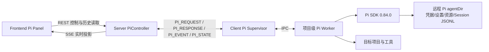
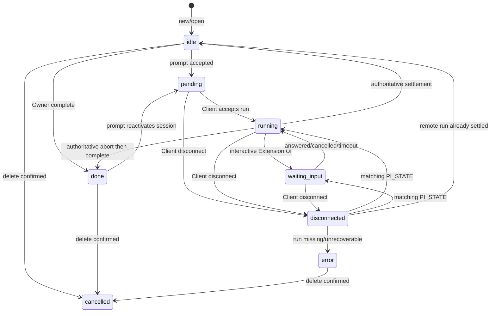
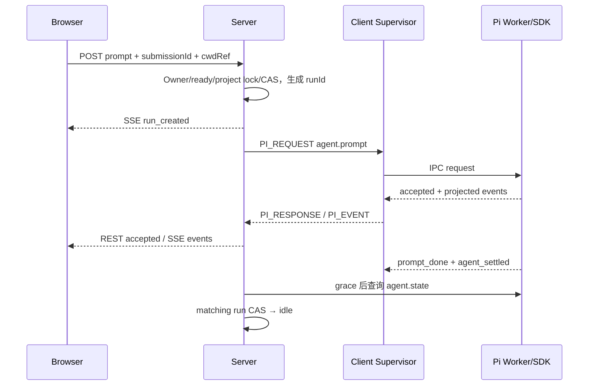

# 远程 Pi 会话设计

> 状态：Current｜维护责任：Pi/Client 维护者｜最后核验：2026-08-15｜适用版本：当前 `main`，Pi SDK `0.84.0`

本文描述当前已经实现的人机交互式远程 Pi Session：Browser 通过 Server 控制目标机器上的 Pi SDK Worker，实时查看回答并管理持续 Session。运行态和正文归属见 [ADR-0007](../adr/0007-client-owned-interactive-runtime.md)，Session Job 与 Run 身份见 [ADR-0008](../adr/0008-pi-session-job-and-run-lifecycle.md)。协议字段和 parser 以 `packages/shared/src/pi.ts` 为准。

## 1. 范围与非目标

当前能力包括：

- 从 Files roots 选择受控项目目录；
- 新建、打开、重命名、删除、fork、clone 和树内导航 Session；
- Prompt、Steer、Follow-up、中止、Compact 和中止 Compact；
- 查看历史、分支和工具调用投影；
- 查询并切换当前 Session 的模型和 thinking level；
- 处理受支持的 Extension UI 对话；
- 上传图片作为单次 Prompt 的临时附件；
- Browser 刷新、Socket 重连和 Server 状态恢复后的重新附着与对账。

当前不包括：

- 无人值守的自主 Agent 任务；
- 多机器任务编排、定时巡检或结果聚合；
- 由 Server 下发 Pi settings、工具权限策略或审批规则；
- Skills、Extensions、Prompt 模板或 Pi Package 的集中分发；
- 机群级 Pi 用量、资源版本或独立审计控制台；
- 不可信代码沙箱或容器隔离；
- Server 端对 Session 正文的永久镜像、全文检索或跨 Client 迁移。

这些候选只能进入 [`roadmap.md`](../roadmap.md)。开始实施时必须依据届时锁定的 Pi SDK 重新调研，并完成安全、协议、数据和 ADR 评审；不能把已删除的阶段性 Pi 调研或“完全管控”草案当作已接受方案。

## 2. 运行组件与职责



| 组件 | 当前职责 | 不负责 |
| --- | --- | --- |
| Frontend Pi Panel | 项目/Session 选择、三栏对话界面、SSE 消费、Owner 控件和 Extension 对话 | 保存权威 Session、直接连接 Client |
| SDK `pi` API | 封装 Pi REST；提供 session 级 SSE path | 管理 EventSource 重连和 Server 状态机 |
| Server `PiController` | 认证后的 REST、Owner 校验、项目锁编排、请求/响应映射 | 运行 Pi SDK、保存完整正文 |
| `PiRunService` | `agent.session` Job、runId CAS、连接 generation、项目锁和重连对账 | 解析 Session JSONL |
| Request/Event Broker | 关联请求 ack、投影事件、SSE 扇出和结算检查 | 作为持久消息队列 |
| Client Pi Supervisor | canonical cwd 校验、每项目 Worker、活动 Run、请求超时和 PI_STATE | 用户身份和持久业务状态 |
| Pi Worker | 动态加载 Pi SDK、读取/修改 Session、运行 Agent、投影 SDK 事件 | 向 Server 暴露本地路径或凭据 |
| Pi Session JSONL | 对话、分支、模型、thinking 和工具结果的正文事实来源 | 表达 Server Owner 和控制面生命周期 |

VCPDeck 直接嵌入 `@earendil-works/pi-coding-agent` SDK，并通过 `child_process.fork()` 隔离项目 Worker；当前不调用全局 `pi`、`pi.cmd` 或 `pi --mode rpc`。Client 构建为 CJS，而 Pi SDK 为 ESM-only，因此 Worker 相关模块在运行时动态 import SDK。

## 3. 运行要求与能力探测

Client 注册时安全上报 `agent.pi` capabilityDetails。探测顺序为：

1. Node.js 至少 `22.19.0`；
2. Bash 可用；Windows 按配置 `shellPath`、Git Bash、PATH 顺序探测，其他平台从 PATH 探测；
3. Pi agentDir 可读；
4. SDK probe Worker 可以启动；
5. 至少存在一个已认证可用模型；
6. 上报 `sdkVersion`、`nodeVersion`、安全 `shellKind` 和 `sessionJobProtocolVersion`。

任一项失败只禁用 Pi，不应影响 exec、Files、Terminal 或 FRP。能力摘要不能包含 Bash 路径、agentDir、API key、模型凭据或环境变量。

当前 Client 锁定：

```text
@earendil-works/pi-agent-core@0.84.0
@earendil-works/pi-coding-agent@0.84.0
```

目标机器复用其运行账户的 Pi agentDir、模型凭据、全局设置和受信资源。Pi SDK 升级不是普通依赖刷新，必须按第 12 节执行兼容验证。

## 4. 项目目录与 Worker

Browser 只提交 Files roots 产生的：

```ts
{ rootDir, relativePath }
```

Client 执行以下检查：

- root 与目标目录都经过 `realpath()`；
- root 必须属于当前允许 roots；
- 目标必须仍位于 canonical root 内，拒绝 traversal 和 symlink 越界；
- 目标必须是可访问目录；
- Windows canonical 比较大小写不敏感。

Client 使用进程级随机 secret 计算 `HMAC-SHA-256(canonical cwd)` 作为 `projectKey`。它只用于本次 Client 进程内的项目互斥和 Server 内存对账，不包含 cwd，不写 Job/日志/数据库；Client 重启后会变化。

Supervisor 按 canonical 项目维护 Worker。相同项目复用同一 Worker，不同项目可以并行；同一项目同一时刻只允许一个活动 Run。Worker 和 AgentSession 空闲约 10 分钟后会优雅关闭，Session JSONL 保留，后续请求可重新创建 Worker 并打开 Session。

## 5. Session、Job 与 Run

### 5.1 身份模型

- 一个远程 Pi Session 对应一条 `type=agent.session` Job；
- `jobId === sessionId`；
- Session Job 保存固定 Owner、生命周期和最小安全元数据；
- 每次 Prompt 生成独立 UUID `runId`；
- `runId` 隔离连续 Prompt、迟到事件、计时器、控制请求和项目锁；
- 历史 `agent.run` 仅作为旧记录存在，不是当前 Prompt 模型。

新建 Session 的操作者成为 Owner。打开远程已有但数据库尚无对应 Job 的 Session 时，当前操作者经远端校验后幂等补建同 ID Job 并成为 Owner。其他有效身份可作为只读 Observer 查看当前可访问的 Session 历史和事件，但不能执行控制动作。

Owner 才能 Prompt、Steer、Follow-up、Abort、Compact、回答 Extension UI、切换模型/thinking、修改 Session、手动完成和删除。当前系统仍是 ADR-0009 的单信任域；Owner 是会话控制约束，不是资源级保密或多租户隔离。

### 5.2 状态机



语义：

- `idle`：Session 可继续，无活动 Prompt；正常回答结束回到这里；
- `pending`：Server 已持久化 runId，正在派发或等待 Client 接受；
- `running`：当前 Run 正在生成、调用工具或压缩；
- `waiting_input`：受支持的 Extension UI 正阻塞当前 Run；
- `done`：Owner 人工标记工作完成，不是模型自然结束；可再次 Prompt 重新激活；
- `disconnected`：连接状态不确定，不是终态；
- `error`：Worker/协议/重启导致当前上下文不可恢复；
- `cancelled`：删除已保留或确认，不能继续使用。

活动转换以 `jobId + runId + 允许源状态` 做数据库 CAS。旧 Run 的事件、settlement timer 或重连报告不能覆盖新 Run。Session Job 使用专门状态机，不占普通 Job 的三项并发槽。

## 6. 请求与事件链路

一次 Prompt：



规则：

- REST 承担有明确结果的控制和历史读取；
- `/client` Socket.IO 承担 Server ↔ Client 的 `PI_REQUEST/PI_RESPONSE/PI_EVENT/PI_STATE`；
- SSE 是 session 级实时投影，每 30 秒发送心跳，不是持久队列；
- Server 先发布 `run_created(submissionId, runId)` 再派发，避免首个 Agent 事件早于 Browser 建立 run 关联；
- `prompt_done` 或 `agent_settled` 触发 30 秒可取消 grace，之后重新查询权威 `agent.state`，只有确实空闲才结算为 `idle`；
- 网络超时不代表 Prompt 未执行。Server 会尽量查询 state，调用方不能自动盲重试创建新 Run；
- SSE 断线后应重新读取 Session detail/context、Job snapshot 和 Agent state，不能期待事件补传。

Shared 当前定义的动作组包括：

- capability/models/project；
- Session list/get/context/entryContent/new/rename/delete/fork/clone/navigate；
- Agent state/prompt/steer/followUp/abort/compact/abortCompact；
- model/thinking 切换；
- Extension response。

Shared 和 Worker 还定义/实现了 `agent.commands`、`agent.stats`，但当前 Server Controller、SDK 和 Frontend 没有对应外部入口，不能将其声明为当前用户能力。

所有 Socket payload 必须经过 Shared 的 `parsePiRequest()`、`parsePiResponse()`、`parsePiEvent()` 或 `parsePiStateReport()`。未知 action、event、额外字段、错误码或不匹配的 `sessionId/jobId/runId` 必须拒绝。

## 7. Session 内容与 Pi SDK

Session JSONL 位于目标运行账户的 Pi Session 目录，由 Pi SDK `SessionManager` 管理。其树结构通过 `id/parentId` 表达分支，VCPDeck 不自行定义另一种正文格式。

当前行为：

- Session 列表和历史由 Client 读取并投影；
- context 使用 cursor 分页，不一次加载无限历史；
- tree 投影压缩单链并限制深度；
- fork 从指定历史消息创建新 Session；
- clone 复制当前活动分支；
- navigate 在当前 Session 树内切换 leaf；
- 模型和 thinking 切换由 Pi SDK写入 Session 历史；
- Compact 由 Pi SDK完成，Server 只控制生命周期和事件；
- Worker 创建/替换 Session 后重新绑定该 Session 的事件与 Extension UI。

Server 不应直接解析远程 JSONL 或依赖上游未稳定的内部字段。Pi SDK 升级若改变 Session 迁移、Runtime API、事件或资源加载语义，必须先在 Client 兼容层中吸收。

## 8. Extension UI 与 Project Trust

当前端到端协议只接受四类交互式 UI：

```text
select / confirm / input / editor
```

它们会进入 `waiting_input`。Client 同时展示一个阻塞请求，其余在 Worker 内存排队；回答、取消或超时后依次激活。未显式指定时，阻塞对话默认 30 分钟超时。

Client 的 Pi UI 适配器还会生成 `notify/setStatus/setWidget/setTitle/set_editor_text` 等非阻塞 `extension_request`，但当前 Server 边界的 `parsePiEvent()` 使用交互式 allowlist，会拒绝并丢弃这些事件；它们不属于当前端到端保证。`custom` UI 返回 `undefined`，其本地“不支持”通知同样不保证抵达 Browser。这是协议投影偏移，修复时必须同步 Shared parser、Frontend 语义和测试，不能仅放宽一端。

Project Trust 的当前边界：

- Worker 使用 Pi SDK 的 ProjectTrustStore；
- 未作决定时先创建不加载受保护项目资源的受限 Session；
- 项目存在需要信任的本地资源时，通过 confirm 对话交给 Owner；
- 决定按 canonical cwd 保存于目标机器 Pi trust store；
- 信任允许加载项目 settings、extensions、skills 等资源；
- Project Trust 不是工具权限策略，更不是沙箱。

VCPDeck 当前没有平台级 Pi tools allowlist、bash 审批策略或集中资源签名/分发。目标机器已有的全局和受信项目资源会按 Pi SDK 规则加载，并以 Client 运行账户权限执行。

## 9. 图片与实时投影

Prompt 图片使用临时 Storage 对象：

- 每次最多 10 张；
- 单张最多 10 MiB；
- 总量最多 100 MiB；
- 允许 PNG、JPEG、GIF、WebP；
- 上传引用 TTL 为 15 分钟；
- Client 下载后校验 SHA-256、MIME 和文件魔数，再转换给 SDK；
- 拒绝、失败或过期时按临时附件生命周期清理。

Pi 原生事件先在 Client 裁剪：

- 丢弃不需要的 turn 和工具流式更新；
- message update 只投影受限文本，而不是完整 partial 对象；
- thinking 单次文本最多 16 KiB；
- 单个投影事件 JSON 最大 256 KiB，超过时退化为 `history_changed`；
- 未识别事件不会透传原始对象，只提示历史变化。

SSE 实时内容只供当前订阅者使用。Browser 重新打开 Session 时从远程 JSONL 的安全投影恢复历史，不把短暂 thinking 流当作永久记录。

## 10. 断线、重启与删除

### Browser/SSE 断线

只取消订阅，不停止 Worker 或 Run。重连后重新 open、读取 context/state 并建立新 SSE；期间实时增量可能丢失，但远程已持久化的 Session 历史仍可读取。

### Client Socket 重连

每个新 Socket generation 注册后必须重新发送 `PI_STATE`。Server 完成数据库状态、项目锁和活动 Run 对账前，该 Client 的 Pi 请求返回 `PI_STATE_PENDING`。匹配的 Run 恢复 `running/waiting_input`；Server 已关闭的 Run 返回 `closedRunIds`，Client 必须中止并再次报告。

### Client/Worker 重启

Worker 异常退出会以安全错误收敛当前 Run。Client 重启后如果数据库活动 Run 不在权威报告中，Server 将其置为 `error / PI_CLIENT_RESTARTED` 并释放锁；不能伪装恢复。Session JSONL 仍在磁盘时，Owner 可在处理错误状态后重新打开和继续。

### Server 重启

SQLite 中的 Session Job 保留，但 Broker、SSE 和项目锁是内存态。Client 重新连接并报告状态后重建运行态；在完成 generation 对账前不接受远程 Pi 控制。

### 删除

只有 Owner 可在 `idle/done/error` 删除。Server 先以 CAS 将 Job 写入带 delete token 的 reservation，再请求 Client 删除远程 Session；确认不存在后清空 reservation。明确失败且远程 Session 仍存在时可精确回滚；timeout/断线表示结果不确定，reservation 保留并允许幂等重试，不能直接宣称删除成功。

## 11. 数据、安全与运维

### 数据权威

| 数据 | 权威位置 | Server 持久化 |
| --- | --- | --- |
| Session 对话、工具结果、分支、模型和 thinking 历史 | 目标机器 Pi Session JSONL | 否 |
| Pi 凭据、settings、trust 和资源 | 目标机器 Pi agentDir | 否 |
| Worker、活动 Agent、Extension 队列 | Client 内存 | 否 |
| Owner、Session Job 状态、当前 runId 和稳定错误 | Server SQLite | 是 |
| projectKey、cwdRef 和真实 cwd | Client/Server 临时内存 | 不写数据库 |
| 实时投影和 SSE subscriber | Client/Server/Browser 内存 | 否 |
| 临时图片 | Storage Provider + File 元数据 | TTL 内保存 |

禁止将 prompt、回答、thinking、Tool 参数/结果、Extension 输入、图片正文、真实 cwd、projectKey、签名 URL、Provider 原始错误或凭据写入 Job、普通日志或遥测。Server 只持久化 allowlist 中的稳定错误码和安全消息。

### 权限边界

Pi 工具、Extensions、Skills、项目构建和 shell 都继承 Client OS 运行账户权限。Project Trust 只控制是否加载项目资源，不限制已启动 Agent 的工具行为。高风险、非完全可信或无人值守任务必须在 OS、容器、VM 或其他真实隔离边界中运行；当前远程 Pi 不提供这种隔离。

### 备份与容量

- SQLite 备份不包含 Session 正文；
- 需要恢复 Pi 历史时，必须在每台目标机器备份对应 Pi agentDir/Session 目录，并按敏感数据加密；
- 删除、清理或迁移 Pi Session 前应确认目标机器备份和 Pi SDK 版本；
- Server 无法仅凭 Job 重建丢失的 JSONL；
- 长历史通过分页读取，但模型上下文、工具输出和 Session 文件容量仍由目标机器及 Pi SDK管理。

## 12. 兼容、变更与测试门禁

`PI_SESSION_JOB_PROTOCOL_VERSION` 当前为 `1`，Server 与 Client 必须精确相等；不匹配时只禁用 Pi，不能猜测兼容。Frontend 应与 Server 同版本部署，Pi SDK 两个包保持同一锁定版本。

升级 Pi SDK 或修改本专题涉及的协议时至少验证：

- capability 探测、Node/Bash/agentDir/认证失败降级；
- Shared request/response/event/state parser 对未知和超限输入的拒绝；
- `jobId === sessionId`、连续 Prompt 的不同 runId 和所有 CAS 竞态；
- Prompt 接受、同步失败、异步失败、Steer、Follow-up、Abort、Compact；
- Session list/open/new/rename/delete/fork/clone/navigate 和 JSONL 迁移；
- Owner/Observer、完成后重激活、项目锁和 symlink 越界；
- 四类交互式 Extension 队列、超时和 Project Trust，以及非阻塞 UI 当前被边界拒绝的兼容行为；
- 图片数量、大小、MIME、SHA、魔数、TTL 和清理；
- Event 投影大小、thinking 裁剪、SSE 刷新和历史恢复；
- Browser 断线、Socket 重连、Server 重启、Worker 崩溃和 Client 重启；
- 模型认证、enabledModels、模型/thinking 恢复；
- Windows/Linux 真实目标机器和至少一个真实模型 smoke；
- SQLite、日志和错误中没有 Pi 正文、路径、凭据或签名 URL。

任何新增自主任务、工具策略、资源分发、Server 正文镜像、并行 Run、Owner 转移或沙箱边界都超出当前专题，必须先评估新的领域模型、协议版本、安全授权和 ADR。
