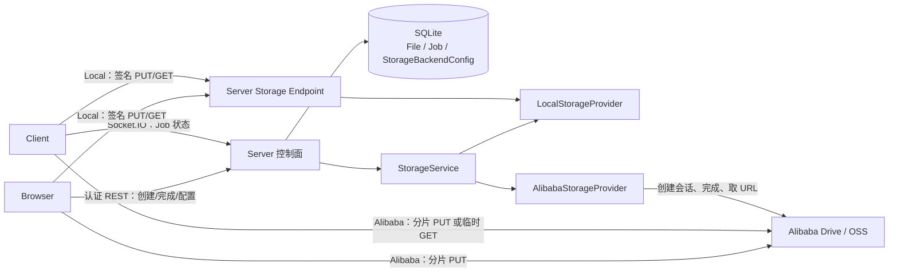
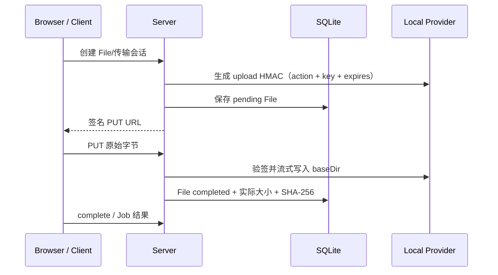
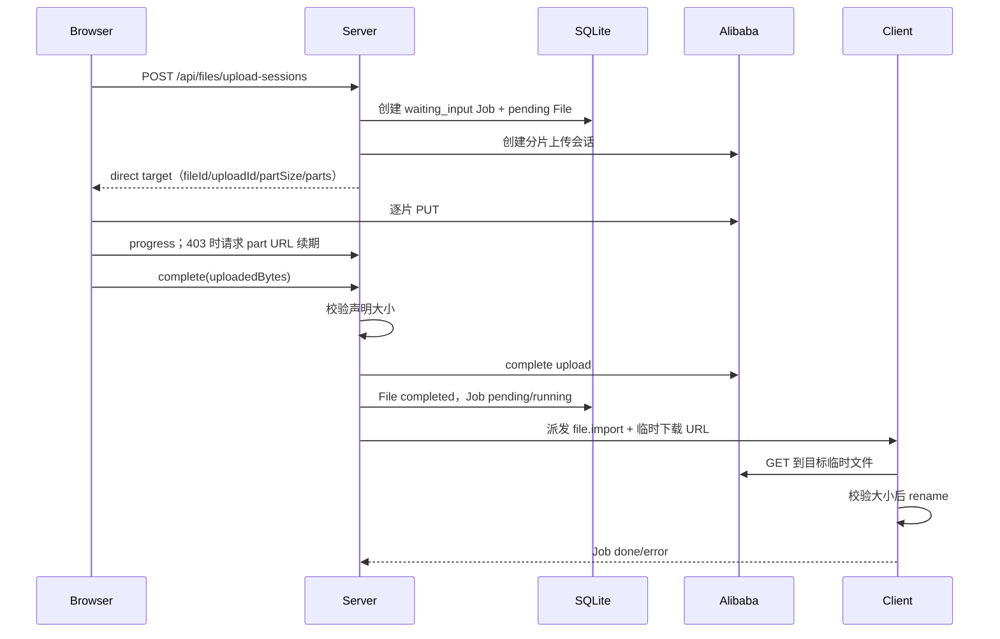
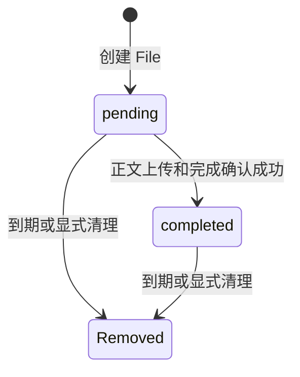

# VCPDeck Storage 子系统设计

> 状态：Current｜维护责任：Server/Storage 维护者｜最后核验：2026-08-15｜适用版本：当前 `main`
>
> 事实来源：`packages/server/src/storage/`、`packages/server/src/file/`、`packages/server/src/job/`、`packages/shared/src/`、`packages/sdk/src/storage.ts`、`packages/sdk/src/aliyundrive.ts`

本文说明 Storage 子系统的长期设计、数据权威、Local/Alibaba 数据路径、失败边界和扩展约束。字段级 API 以 Shared、SDK 和 Server Controller 为准；控制面与数据面分离的决策理由见 [`ADR-0006`](../adr/0006-file-control-and-data-plane-separation.md)。

## 1. 目标与非目标

### 目标

- 为远程文件导入、导出和 Pi 临时附件提供统一 Storage 能力；Pi 附件当前使用 Local 风格的 Server 上传/下载 URL，不走 Alibaba 直传会话；
- 由 Server 统一管理 File 元数据、传输会话、短期能力和完成状态；
- 根据 Provider 能力选择 Server 中转或外部直传；
- 避免把 import/export 对象正文放进 SQLite、Job JSON 或 Socket.IO 消息；轻量 `readText/writeText` 文本不属于 Storage 数据面，当前仍进入 Job；
- 在 Provider 差异存在时维持统一的上层 File/Job 生命周期；
- 限制签名 URL、OAuth Token 和外部直传 URL 的暴露范围。

### 非目标

- 不提供通用对象存储产品或公开永久链接；
- 不在 Provider 切换时自动迁移、复制或删除旧对象；
- 不把 Storage 作为远程路径权限边界，最终路径安全仍由 Client 校验；
- 不承诺 Server 重启后恢复尚未完成的外部直传会话；
- 不在本文复制全部 DTO、Controller 字段或外部 OpenAPI。

## 2. 架构与职责

职责边界：

| 组件 | 职责 |
| --- | --- |
| `StorageController` | 签发上传/下载能力、Local 数据端点、稳定下载重定向、后端摘要和切换 |
| `AliyunDriveController` | 阿里云配置、OAuth PKCE、授权状态、远端验证和撤销 |
| `StorageService` | 读取后端配置、实例化 Provider、传输会话、完成确认、进度和安全摘要 |
| `FileService` | File 元数据、pending/completed 生命周期、下载能力和对象清理 |
| `JobService` | 文件导入/导出 Job、操作者审计、派发和状态机 |
| `StorageProvider` | 对象上传、下载、删除及 Local 风格签名能力 |
| `AlibabaStorageProvider` | StorageProvider 基础能力，以及分片直传、URL 续期、完成和外部下载 URL |
| Client `transfer-handler` | 当前路径解析、流式传输、临时文件、进度和 Job 结果；路径与取消缺口见 [`remote-files.md`](./remote-files.md) |
| Frontend upload API | Local 单请求上传或 Alibaba 分片上传、续期和进度聚合 |

## 3. 数据权威

| 数据 | 权威位置 | 持久性 |
| --- | --- | --- |
| 当前激活 Provider 和配置 | SQLite `StorageBackendConfig` | 持久化 |
| File 标识、key、名称、大小、状态、Provider | SQLite `File` | 持久化 |
| 远程操作生命周期 | SQLite `Job` | 持久化 |
| Local 文件正文 | Server `baseDir` | 文件系统持久化 |
| Alibaba 文件正文 | 阿里云盘对象 | 外部持久化 |
| Local HMAC `signSecret` | `StorageBackendConfig.config` | 首次缺失时生成并持久化 |
| Alibaba OAuth Token | `StorageBackendConfig.config` | 刷新后写回数据库 |
| OAuth PKCE 会话 | Server 内存 | Server 重启后丢失 |
| Pending upload 快速缓存 | Server 内存；可回退读取 `File` | 重启后缓存丢失 |
| Alibaba 直传 `fileId/uploadId` 会话映射 | Server 内存 | 重启后丢失，未完成传输需重试 |
| 签名 URL/外部 URL | 调用方临时持有 | 到期后重新申请 |

`File.storageKind` 表示对象创建时的 Provider。切换当前 Provider 只影响新操作；历史对象不会自动迁移，因此读取和清理历史对象时必须考虑原 Provider 归属。当前实现仍通过活动 Provider 执行对象操作，这是后续跨 Provider 历史对象管理需要重点评估的边界。

## 4. Provider 模型

基础 `StorageProvider` 提供：

- `upload` / `uploadToKey`；
- `download`；
- `delete`；
- 上传和下载签名的生成与验证。

注册表当前包含：

- `local`：Server 本地目录；
- `alibaba`：阿里云盘。

基础接口表达 Local 风格的 Server 中转能力。Alibaba 还提供可选的直传能力：

- 创建分片上传会话；
- 续期指定分片 URL；
- 完成上传；
- 获取外部临时下载 URL。

因此新增只支持 Server 中转的 Provider，可以实现基础接口并注册；新增外部直传 Provider 还必须设计其会话、凭据、完成确认、完整性、续期、SDK/Frontend/Client 协议和测试，不能只增加注册表条目。

## 5. Local Provider 数据流

### 5.1 上传到 Storage

上传正文经过 Server，但不进入 JSON body、Socket.IO 或数据库。Server 流式计算实际大小和 SHA-256，并在适用的 `file.import` 阶段更新 Job 进度。

`signSecret` 由 `StorageService.loadProvider()` 在缺失时生成并写回 `StorageBackendConfig.config`。正常数据库持久化和配置不被覆盖时，Server 重启不会自动使已有 Local 签名 URL失效；URL 仍会因自身到期、密钥被替换或配置被覆盖而失效。

### 5.2 下载

- `POST /api/storage/download-token` 生成短期签名 GET URL；
- `GET /api/storage/download-redirect/:key` 是需要身份认证的稳定入口，每次请求实时生成下载能力并返回 302；
- `GET /api/storage/download/:key` 验证签名后流式返回正文；
- 响应文件名优先从 File 元数据解析，而不是从 Storage key 推断。

稳定入口用于 Browser 下载，避免页面长期缓存已经过期的临时 URL；它不是永久公开链接。

## 6. Alibaba Provider 数据流

### 6.1 配置和 OAuth

1. 保存 `clientId`、可选 `clientSecret`、OpenAPI 地址和中转目录；
2. Server 创建内存 PKCE 会话并返回授权 URL；
3. Browser 提交 `state + code`；
4. Server 交换并持久化 access/refresh token；
5. Provider 在 Token 临近过期时刷新，并通过持久化回调写回数据库；
6. `verify` 使用远端 API 判断授权是否有效，但网络错误不会自动清空已保存配置。

配置和状态 API 只返回安全摘要，不返回 access token、refresh token、clientSecret 或完整配置 JSON。PKCE 会话只在内存中，Server 重启后必须重新开始 OAuth。

### 6.2 Browser 上传后导入远程机器

阿里云盘返回的 `dl1-v6.aliyundrive.cloud` 下载域名当前存在证书过期兼容问题，Provider 会将该精确域名替换为 `cn-beijing-data.aliyundrive.net`，保留路径和全部签名查询参数；不关闭 TLS 校验，也不改写其他域名。

创建上传会话不代表上传完成。只有 complete 成功后，Server 才激活远程导入 Job。

### 6.3 Client 导出到 Storage

1. Server 创建 `file.export` Job 和 pending File；
2. Client stat 远程文件得到真实大小；
3. Client 调用 `POST /api/files/client-export-sessions`（携带 `x-vcpdeck-psk`），Server 在 Alibaba 创建分片任务；
4. Client 最多三个 worker 并发上传分片并上报 Job 进度；分片 URL 返回 403 时通过 `POST /api/files/client-export-sessions/:jobId/part-urls` 续期后重试；
5. Client 调用 `POST /api/files/client-export-sessions/:jobId/complete`，Server 校验字节数、合并对象并将 File 标记 completed；
6. Client 上报 Job 结果；Browser 后续通过稳定下载入口取得临时外部 URL。

Alibaba 直传以声明大小和 Provider 完成响应收敛，`File.sha256` 由 Client 在上传完成后顺序读源文件计算并随结果上报、Server 回填；Server 不读取正文，因此是 Client 端哈希，不提供与 Local 路径相同的 Server 端字节哈希保证。Client 导出控制端点以共享 PSK（`x-vcpdeck-psk`）认证，PSK 不发送到 Provider 分片 URL；既有 `/api/files/export-sessions*` 保留给携带用户 Cookie/Bearer 的 SDK 调用。

## 7. File 与传输状态

File 当前只有约定式的 `pending/completed` 状态；没有独立 `failed` 或 `expired` 状态。失败主要通过关联 Job 和未完成 File 表达，到期清理直接删除对象和记录。维护代码时必须保持以下不变量：

- pending File 不能签发正常业务下载；
- complete 必须幂等地识别已经进入活动/终态的 Job；
- 网络超时不证明 complete 未执行，应重新查询 Job/File；
- `File.key` 是 Provider 对象标识，Alibaba 使用 `fileId`，不能假设总是路径；
- import/export 对象正文不进入 Job payload/result，Job 只引用 FileRef、对象 key、大小、摘要等元数据；轻量 `readText/writeText` 的文本留痕由远程文件协议单独治理；
- 过期清理必须同时处理对象和 File 元数据，避免只删一侧。

## 8. API 与协议边界

长期协议语义统一维护在 [`../protocols.md`](../protocols.md)。字段级事实以以下位置为准：

- Shared：FileRef、UploadTarget、上传/导出会话类型；
- SDK：`files`、`storage`、`aliyundrive`；
- Server：Storage、AliyunDrive、Events Controller；
- Client：`transfer-handler.ts`。

Storage API 分为三类：

1. **认证控制端点**：配置、Token、传输会话、complete、进度和 URL 续期；Client 导出控制使用 `/api/files/client-export-sessions*`，以 `x-vcpdeck-psk` 认证（Public 路由绕过用户 AuthGuard 后在 Controller 内校验）；Browser/SDK 继续使用用户 Cookie/Bearer，包括既有 `/api/files/export-sessions*`；
2. **短期能力端点**：Local 签名 PUT/GET；
3. **Provider 外部 URL**：Alibaba 分片 PUT 和临时 GET。

调用方不应解析错误 message、长期缓存 URL，或根据 HTTP 超时创建重复资源。

## 9. 安全边界

- Local 签名绑定动作、key 和过期时间；上传签名不能用于下载；
- 签名和外部 URL 都是临时凭据，不进入日志、Agent 回复、Job 正文或遥测；
- Alibaba 主凭据只保存在 Server 配置中；Browser/Client 只取得最小范围的临时 URL；
- Provider 外部 URL 仅在 Shared `direct=true` 时允许 Client 跨 Server origin 访问；其他绝对 URL必须与 Server 同源；
- Client 写目标文件前当前会执行 lexical root 前缀、overwrite 和临时文件处理，但 rootDir 未绑定认证 root，symlink/不存在目标父链校验仍有缺口；不能把它视为完整路径授权，详见 [`remote-files.md`](./remote-files.md)；
- 上传内容由 Browser 下载时使用附件响应和安全文件名，不作为可执行页面直接托管；
- Provider 配置 API 不返回原始配置和凭据。

## 10. 故障与恢复

| 故障 | 当前行为 | 恢复方式 |
| --- | --- | --- |
| Local URL 到期/签名变化 | PUT/GET 拒绝 | 重新申请 Token 或使用稳定下载入口 |
| Server 在 Local 上传中重启 | 连接中断；可通过 File 记录恢复最小元数据 | 调用方重新上传并查询 Job/File |
| Server 在 Alibaba 直传中重启 | 内存 `uploadId` 映射丢失 | 当前需要重新创建传输会话 |
| Alibaba 导出分片 URL 过期 | Client 收到 403 后通过 `client-export-sessions/:jobId/part-urls` 续期指定分片并重试；续期失败则导出失败 | 确认 PSK 一致和 Provider 授权后重新创建导出会话 |
| OAuth 过程中重启 | PKCE state/verifier 丢失 | 重新 start OAuth |
| Alibaba Token 临近过期 | Provider 尝试刷新并写回 DB | 刷新失败时重新授权 |
| Provider 切换 | 新操作使用新 Provider；旧对象不迁移，当前活动 Provider 也可能无法直接读取旧对象 | 切回原 Provider 或执行受控迁移 |
| Client 下载中断 | 异常路径会尽力删除临时文件，但取消、崩溃或强制停止可能留下残留；overwrite 已 unlink 旧目标后 rename 失败还可能丢失原目标 | 先核对目标和临时文件，再决定是否重试 Job |
| File 元数据与对象不一致 | 下载、删除或 complete 失败 | 运维核对 DB、Provider 和 Job，禁止盲删 |

## 11. 扩展与变更规则

新增或修改 Provider 时必须：

1. 判断是 Server 中转还是外部直传模型；
2. 定义对象 key、完整性、凭据、URL 有效期和完成语义；
3. 评估历史对象在 Provider 切换后的可访问性；
4. 更新 Shared、Server、SDK、Frontend 和 Client 的相关协议；
5. 覆盖到期、篡改、断流、重试、Server 重启、Provider 故障和孤儿清理；
6. 同步 `domain-model.md`、`protocols.md`、`security.md`、`deployment.md` 和 `operations.md`；
7. 改变控制面/数据面、数据权威或长期凭据模型时创建新 ADR。

## 12. 相关文档

- [`ADR-0006`](../adr/0006-file-control-and-data-plane-separation.md) — 控制面与数据面分离的决策理由；
- [`../architecture.md`](../architecture.md) — Storage 在系统中的位置；
- [`../domain-model.md`](../domain-model.md) — File 和 StorageBackendConfig 不变量；
- [`../protocols.md`](../protocols.md) — REST、签名 URL、直传和完成语义；
- [`../security.md`](../security.md) — 凭据、文件内容和临时能力安全；
- [`../deployment.md`](../deployment.md) — Storage 配置和持久化目录；
- [`../operations.md`](../operations.md) — 备份、恢复和故障处置；
- [`remote-files.md`](./remote-files.md) — Client 远程文件操作、路径、导入/导出和失败边界。
