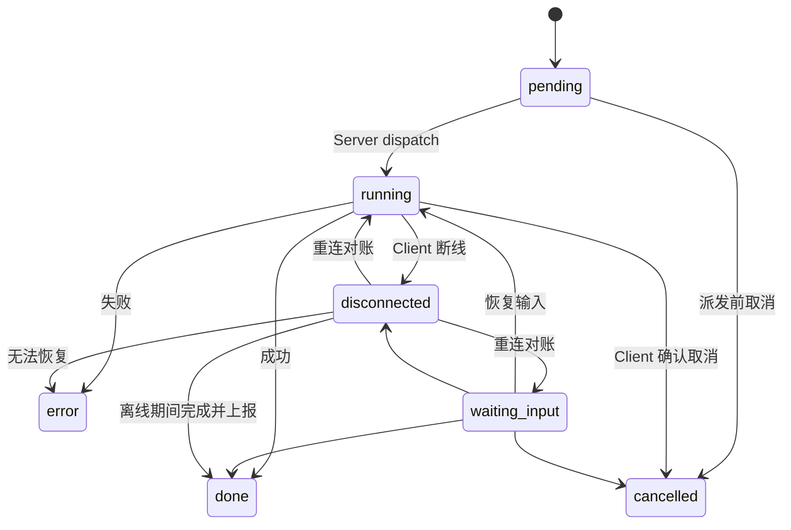
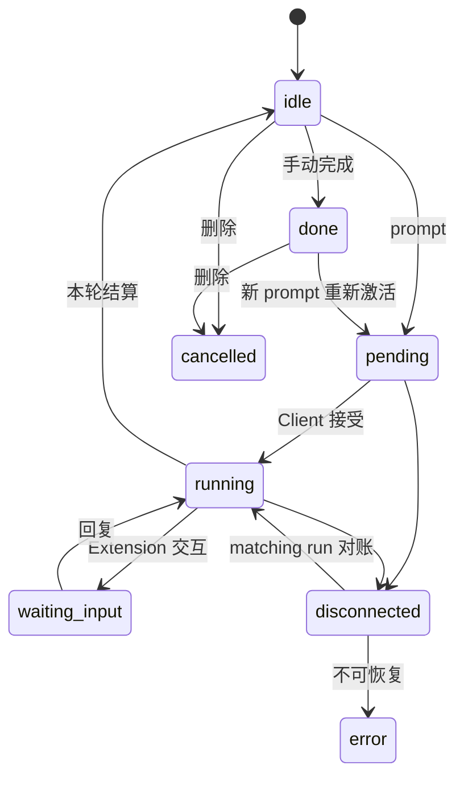

# VCPDeck 领域与数据模型

> 状态：Current｜维护责任：Server/Shared 维护者｜最后核验：2026-09-05｜适用版本：`0.6.26` / 当前 `main`｜事实来源：`packages/shared/src/`、`packages/server/prisma/schema.prisma`

本文解释核心领域概念、状态和数据权威；字段级定义以 Shared 类型和 Prisma schema 为准。

## 1. 领域边界

VCPDeck 当前领域围绕“可信操作者通过控制面管理远程机器”展开：

```text
Identity ─创建/操作→ Job ─调度到→ Client
                         ├─产生/消费→ File
                         ├─管理→ FrpMapping ─使用→ FrpsInstance
                         ├─承载→ Pi Session（agent.session Job）
                         └─协作→ TerminalSession
Release ─编排更新→ Server / Client ─由→ Launcher 守护
```

TODO、工作流、聊天和 VCPToolBox 桥接目前没有落地数据模型，不属于当前领域事实。

## 2. 聚合与权威位置

| 概念 | 标识 | 权威位置 | 说明 |
| --- | --- | --- | --- |
| Identity | `id` | SQLite | 操作者身份；admin 只额外管理身份 |
| Credential | `id` | SQLite | Bearer Token 摘要和生命周期 |
| AuthSession | `id` | SQLite | 浏览器会话摘要和过期时间 |
| Client | `id` / `clientId` | SQLite + 在线 Socket | 持久属性在 DB；在线 lease 由当前 socket 决定 |
| Job | `id` / `jobId` | SQLite | 远程操作的统一调度和审计信封 |
| File | `id` | SQLite；正文在 Storage | 文件元数据和生命周期 |
| StorageShare | `id` / `tokenHash` | SQLite；正文仍在 Storage | 长期公开只读分享、撤销审计和 File 保留关系；只保存 Token 哈希 |
| StorageBackendConfig | 单行配置 | SQLite | 当前 Storage Provider 及配置 JSON |
| FrpsInstance | `id` | SQLite | FRPS 连接、Dashboard 和端口范围配置 |
| FrpMapping | `id` | SQLite；实际进程在 Client | 目标服务到 FRPS 的映射 |
| TerminalSession | `id` | SQLite；PTY 在 Client | 只持久化元数据，不保存正文 |
| TerminalAuditEvent | `id` | SQLite | 终端生命周期最小审计 |
| Pi Session | `jobId === sessionId` | Job + 远程 Pi JSONL | Server 保存生命周期元数据；正文由远程 Pi 管理 |
| Release | `version` | SQLite + Storage Provider/发布文件目录 | 全局更新状态、平台构件元数据和各 Client 结果 |
| ReleaseUploadSession | `id`；`version + platform` 唯一 | SQLite；正文直传外部 Provider | Alibaba 分片会话控制面：声明 SHA/大小、Provider file/upload id、分片大小、操作者、状态和有效期；不保存 URL |
| ClientInstallerConfig | `default` | SQLite | Client 一键安装开关及最后变更者摘要；默认关闭 |
| Launcher VersionStore | 版本号 | 主机文件系统 | 当前/历史构件和回退点 |

## 3. Identity、Credential 与 AuthSession

- Identity 不物理删除，通过 `disabledAt` 禁用；密码使用 bcrypt 哈希；
- Credential 和 AuthSession 的明文只在调用方持有，数据库保存 SHA-256 摘要；
- Credential 创建时只返回一次 `vcp_` 明文；当前不设置 expiresAt、不更新 lastUsedAt；
- 禁用 Identity 会撤销 AuthSession 并阻止 Session/Credential 认证，但不写 Credential.revokedAt；再次启用后未撤销 Credential 会恢复有效；
- 修改密码不撤销既有 Session、Credential 或 `/app` Socket；
- admin 与普通身份拥有相同业务权限，admin 只增加身份管理能力；当前最后 admin 可被禁用且没有业务 API 创建另一个 admin；
- Job 和终端审计保存部分操作者名称快照，身份改名不改写历史，但 Actor 审计尚未覆盖所有写操作；
- 完整认证和撤销语义见 [`design/identity-and-authentication.md`](./design/identity-and-authentication.md)。

## 4. Client

Client 表示一台已注册的目标机器。

### 4.1 身份与名称

- `clientId` 首次启动时生成并保存在 `~/.vcpdeck/client-id`；
- 可以通过 `VCPDECK_CLIENT_ID` 显式覆盖；
- `name` 是全局唯一别名，首次注册默认取 hostname，重名时追加后缀；
- 已修改的别名不会被重连注册覆盖。

### 4.2 在线状态

- 注册成功时绑定 `socketId` 并置 `online=true`；
- Socket 断开时清除绑定并置离线；
- 连续超过 30 秒未收到心跳时，Server 按当前 socket lease 原子清除绑定并置离线；
- 心跳更新 CPU、内存、磁盘、运行中 Job 和时间戳；
- `GET /api/clients` 当前只返回在线 Client，数据库仍保留离线记录。

### 4.3 Capability

Capability 是能力声明，不是用户权限：

- `exec`
- `file.read`
- `file.write`
- `frp`（`capabilityDetails` 可含 `available` 与 `reconcileProtocolVersion=1` 恢复对账协商）
- `agent.pi`
- `terminal.pty`

Pi 和终端还通过 `capabilityDetails` 上报协议及运行环境摘要。Server 必须在使用相应能力前校验声明和详细状态。

## 5. Job

Job 是一次具有目标 Client、类型、输入、生命周期、结果和操作者审计的远程操作。

### 5.1 类型

当前 Shared 枚举包括：

- `exec`；
- `file.roots/list/stat/readText/writeText/mkdir/delete/move/export/import`；
- `frp.create/delete/list` 与内部 `frp.reconcile`（Client 重连后由 Server 自动派发，恢复期望映射；不向调用方暴露）；
- `agent.run`、`agent.session`。

`agent.session` 使用专门状态机，不占通用 Job 调度槽。新类型必须同时更新 Shared 类型/校验、Server 能力映射、Client dispatcher、SDK 和测试。远程文件的当前 payload、路径和失败边界见 [`design/remote-files.md`](./design/remote-files.md)。

`exec` 当前包含互斥的 command/script 模式：command 由系统 Shell 执行；script 当前允许外部提交 `executable + args` 并通过 stdin 发送源码。脚本源码、executable、args 和 cwd 保存在 Job payload；最终 stdout/stderr 当前保存在 Job result。ADR-0010 已决定迁移到 Client 受控 runtime ID，但尚未落地，详见 [`design/remote-execution.md`](./design/remote-execution.md)。

### 5.2 通用状态机



不变量：

- `done`、`error`、`cancelled` 是终态；
- `disconnected` 不是终态，不能当作执行失败；
- 创建 Job 先持久化，再尝试派发；
- 每个 Client 最多同时运行 3 个非 Agent 通用 Job；
- Server drain 时不派发新 Job；
- 错误必须使用稳定 code 和安全 message，不能持久化 stack、密钥或文件正文；
- exec 的过程 stdout/stderr 不单独持久化，但 Client 会聚合最终输出并写入 Job result；
- exec 正常退出保存真实 exit code；超时和其他信号终止分别以 `EXEC_TIMEOUT`、`EXEC_SIGNALLED` 表达，不伪造成 exit code 1；
- exec 断线期间中间输出可能丢失；当前无终局事件 spool，进程在断线期间结束时也可能无法在重连后补报；Client 重启后不能假定原子进程仍可对账；
- 文件 handler/transfer 当前未完整进入 Executor 活动集合和重连状态报告，running 文件 Job 的取消、timeout 和断线终局补报不能视为可靠。

## 6. File 与 Storage

File 记录只保存 Storage 对象元数据；import/export 正文由当前 Storage Provider 保存。轻量文件 Job 是另一条数据路径：`file.writeText` 的完整 content 进入 Job payload，`file.readText` 的完整 content 进入 Job result，并随 SQLite 一起持久化和备份。

典型 File 状态为 `pending` → `completed`，删除时短暂进入 `deleting`，Provider 删除失败恢复原状态；并可通过 `expiresAt` 进入清理范围。`purpose` 区分普通 Job 文件、Pi 临时附件等用途。Storage Share 状态不单独存储：撤销优先，其次是底层对象已确认失效或 File 已删除，否则为 active。

不变量：

- 未完成的文件不能签发正常下载；
- 上传/下载能力通过有限时效签名 URL 表达；
- Local 代理传输计算 SHA-256 和实际大小；Alibaba 直传当前只按声明字节数与 Provider 完成响应收敛，`sha256` 为空；
- Client import 当前只验证读取字节数，不计算或比较 SHA-256；Shared 的 `SHA256_MISMATCH` 尚未在该路径使用；
- Shared `FileTransferResult.sha256` 是必填，但 Alibaba export 和当前 import 的实际结果不总是提供该字段，属于类型与运行行为偏移；
- `rootDir` 当前由调用方提交，未绑定 Client 发现的 root；现有 symlink/不存在目标父链检查也不完整；
- 切换 Storage Provider 不自动迁移旧对象；Storage Share 创建和公开读取都要求当前 Provider 与 File.storageKind 匹配，不匹配仅暂时不可用，不会自动失效；
- active Storage Share 是 File 保留锁，显式删除和到期清理必须跳过/拒绝受保护 File；撤销后才允许删除，File 删除后分享审计保留并因 fileId 为空失效；
- Local Provider 的签名 secret 在配置缺失时生成并持久化到 `StorageBackendConfig.config`；正常重启不会自动轮换，密钥丢失或被替换时旧签名 URL 失效。

远程文件操作与路径不变量见 [`design/remote-files.md`](./design/remote-files.md)，Provider 和 File 生命周期见 [`design/storage.md`](./design/storage.md)。

## 7. FRP

- FrpsInstance 保存 FRPS 连接地址、明文 Token、Dashboard 凭据和端口范围；只能有一个逻辑默认实例，但该约束当前没有数据库唯一性或事务保证；
- FrpMapping 归属一个 Client，并关联创建时选择的 FrpsInstance；同一实例内 proxy name 由数据库唯一约束保护；
- 映射状态为 `provisioning/active/inactive/reconciling/deleting/error`：创建先持久化为 `provisioning`，Client 完成本地 frpc 动作且 FRPS Dashboard 确认 proxy 出现后才进入 `active`；这仍不保证本地服务或公网可达；`reconciling` 表示恢复对账周期进行中，Client 重连后自动收敛回 active/inactive，5s/30s 有限重试耗尽回 `inactive + FRP_RECONCILE_FAILED`；
- Server 可保存多个实例，但 Client 只有一个 `proxies[] + lastFrpsInfo + frpc` runtime；Server 当前拒绝同一 Client 跨 FrpsInstance 创建映射；
- Client 断线时原 `active` 映射标记为 `inactive`，但独立 frpc 连接可能仍工作；Client 重连后 Server 按 SQLite 期望集合自动 reconcile 恢复映射（依赖 `frp.reconcileProtocolVersion=1` capability 与 FRPS Dashboard 可达）；frpc 崩溃由 Client 侧有限自愈覆盖；
- 删除先进入 `deleting` 并保留控制面记录；Client 清理且 Dashboard 确认 proxy 消失后才删除记录，失败保留 `error` 供重试；
- FRPS Token 还会进入 Job payload 和 Client TOML，相关数据都按秘密处理；
- 完整运行态和已知偏移见 [`design/frp.md`](./design/frp.md)。

## 8. TerminalSession

终端会话状态：

```text
starting → detached/active → exited | interrupted | expired | closed | error
```

- Server 生成 sessionId 并保存创建者、Shell、尺寸和终态等元数据；
- Client 持有真实 PTY、输出序号、scrollback、快照和 30 分钟 detached timer，是活跃资源权威；
- SQLite status 不是 PTY 的完整实时镜像：当前 attach/detach/state report 没有持续维护 `active/detached/lastAttachedAt/detachedAt/expiresAt`；
- 浏览器 attachment、operator/viewer、30 秒保护和 reconnect token hash 是 Server 内存态，不是数据库实体；
- reconnect token 明文只在 Browser sessionStorage，Server 重启后原 lease/hash 丢失；
- 首个有效 attachment 获得 operator，其他为 viewer；每个 Client 最多 5 个非终态终端会话；
- Client 状态报告缺少 DB 非终态 Session 时，Server 当前标记为 `interrupted`；虽然协议携带 generationId，Server 尚未以 generation 变化作为对账分支；
- TerminalAuditEvent 只记录 created/attached/takeover/closed 等生命周期，不记录输入输出；
- 当前 Client 本地 expired 不上报 Server，从未 attach 的新 Session 也可能未启动 TTL，详见 [`design/remote-terminal.md`](./design/remote-terminal.md)。

## 9. Pi Session

Pi Session 复用 Job：`type=agent.session` 且 `jobId === sessionId`。



不变量：

- 每次 prompt 使用新的 `runId`，迟到事件不能结算其他 run；
- 同一 Client/projectKey 同时只允许一个活跃项目锁；
- Server 持久化所有权和状态，不保存 prompt、正文、thinking、真实 cwd；
- Session JSONL 和 Pi 配置保存在远程用户的 Pi 目录；
- `projectKey` 是 Client 进程级随机 secret 对 canonical cwd 的 HMAC，只用于内存互斥/对账，Client 重启后变化且不持久化；
- Server 与 Client 的 `PI_SESSION_JOB_PROTOCOL_VERSION` 必须精确相等；
- 完整 Worker、Extension、断线、隐私和兼容边界见 [`design/remote-pi.md`](./design/remote-pi.md)。

## 10. Release 与 Launcher

Release 状态：

```text
uploaded → updating_server → updating_clients → done
    └──────────── 任一编排错误 ───────────→ failed
```

单 Client 状态为 `pending | updating | done | failed`。全局 `done` 可以包含个别 Client 的 failed 明细。

不变量：

- version 唯一且格式为 `x.y.z`；
- Local 上传由 Server 复核 SHA-256；Alibaba 创建任务固定大小、CLI 对实际发送字节复核声明 SHA，Launcher 下载后统一复核权威 SHA；
- Server 先更新，恢复编排后再逐个更新 Client；
- Launcher 管理本机 current 指针、健康探测和回退；
- 离线或 Client 阶段中途上线的旧版本 Client 由注册事件触发去重补更，Client 更新阶段结束前执行补偿扫描；已标记为 `failed` 的 Client 不自动重试；
- Alibaba Release 上传会话按 `version + platform` 唯一；相同 SHA/大小可恢复或幂等跳过，不同构件拒绝覆盖；预签名 URL 不持久化；
- Launcher 自身当前不参与自动更新；
- Client 一键安装只选择 `version === Server VERSION`、`status=done` 且含目标平台 archive 的 Release；
- 一键安装开关只控制安装入口，不撤销既有 Client 或轮换共享 PSK。

## 11. 模型变更规则

1. 先更新领域不变量和 ADR（若为重大取舍）；
2. 修改 Shared 协议和 Prisma schema；
3. 为生产数据编写可审查迁移，不用 `db push --accept-data-loss` 代替发布迁移评审；
4. 同步 SDK、Frontend、Client 和兼容策略；
5. 为状态流转、重连和失败路径增加测试；
6. 更新本文、`protocols.md`、`compatibility.md` 和 CHANGELOG。
