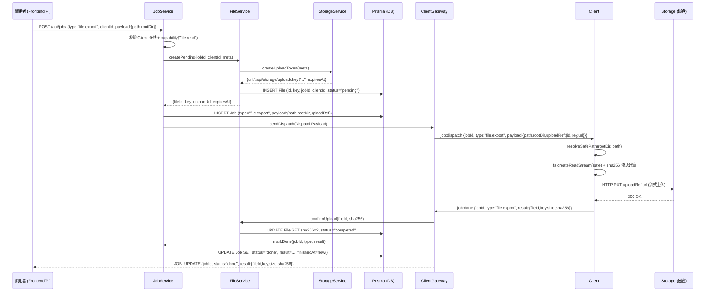
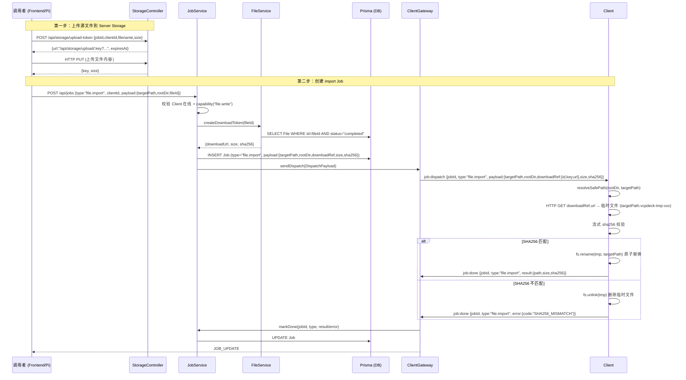
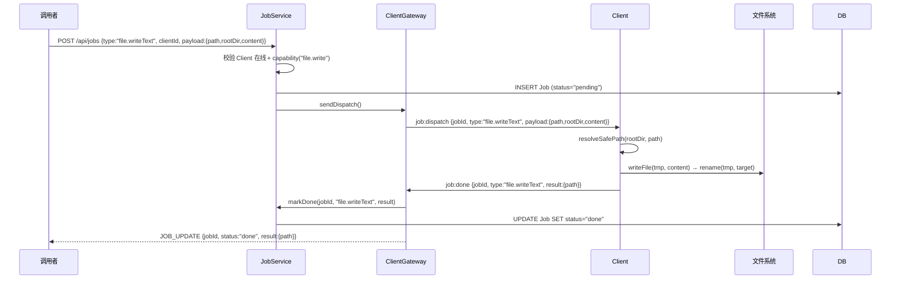
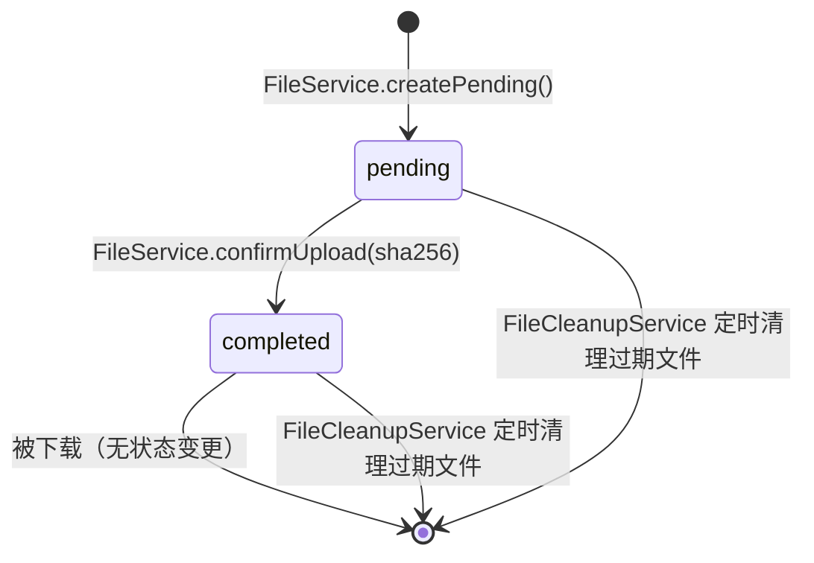

# VCPDeck 远程文件管理 — 实现文档

> 版本：1.0
> 状态：✅ 已实现，集成测试 75/75 通过
> 相关设计：[Server管理Client文件体系设计](./superpowers/specs/2026-08-04-server-client-file-management-design.md)
> 相关建议：[Job模型兼容Client文件管理建议](./job-file-management-recommendations.md)

## 1. 架构总览

```
┌─────────────────────────────────────────────────────────────────┐
│                         VCPDeck Server                          │
│                                                                 │
│  ┌─────────────┐   ┌──────────────┐   ┌─────────────────────┐ │
│  │ JobService   │──►│ FileService  │──►│ StorageService      │ │
│  │ (调度/编排)  │   │ (元数据/审计) │   │ (Local Storage)     │ │
│  └──────┬──────┘   └──────┬───────┘   └──────────┬──────────┘ │
│         │                 │                       │            │
│         │         ┌───────┴───────┐               │            │
│         │         │  Prisma (DB)  │               │            │
│         │         │ File + Job 表 │               │            │
│         │         └───────────────┘               │            │
│         │                                         │            │
│  ┌──────┴──────────────────────────────────────────┴───────┐  │
│  │                 ClientGateway                           │  │
│  │   WebSocket: job:dispatch, job:stdout/stderr, job:done   │  │
│  └──────────────────────┬──────────────────────────────────┘  │
│                         │                                      │
└─────────────────────────┼──────────────────────────────────────┘
                          │ WebSocket (指令 + 元数据)
                          │ HTTP (文件字节，Client 主动发起)
┌─────────────────────────┼──────────────────────────────────────┐
│                         │         VCPDeck Client                │
│  ┌──────────────────────┴───────────────────────────────────┐  │
│  │                    dispatcher.ts                          │  │
│  │  ┌────────────┐  ┌──────────────────┐  ┌───────────────┐ │  │
│  │  │ executor.ts │  │ file-handler.ts  │  │transfer-handler│ │  │
│  │  │ (shell/cmd) │  │ (fs 操作/路径安全) │  │ (HTTP 流式传输) │ │  │
│  │  └────────────┘  └──────────────────┘  └───────┬───────┘ │  │
│  └─────────────────────────────────────────────────┼────────┘  │
│                                                     │          │
│                                       HTTP PUT/GET  │          │
│                                       到 Server Storage        │
└──────────────────────────────────────────────────────────────────┘
```

**核心原则：**

- **Job = 控制面**（WebSocket）：调度、状态、结构化结果、审计
- **Storage/FileRef = 数据面**（HTTP）：文件字节流，Client 主动发起
- **File 表 = 审计轨迹**：每次传输可追溯 fileId / key / sha256 / jobId
- **文件内容不进入 WebSocket 和数据库 `output` 字段**

---

## 2. 操作类型总览

### 2.1 轻量 fs 操作（纯 WebSocket）

这些操作只通过 WebSocket 传递指令和结果，不涉及 HTTP：

| 操作 | Capability | 说明 | 危险度 |
|------|-----------|------|--------|
| `file.list` | `file.read` | 列目录 | 低（可重试） |
| `file.stat` | `file.read` | 获取文件/目录元数据 | 低（可重试） |
| `file.readText` | `file.read` | 读文本（≤256KB） | 低（可重试） |
| `file.writeText` | `file.write` | 写文本（原子替换） | 中（临时文件+rename） |
| `file.mkdir` | `file.write` | 递归创建目录 | 低（幂等） |
| `file.delete` | `file.write` | 删除（recursive 必须显式） | 高（破坏性） |
| `file.move` | `file.write` | 移动/重命名 | 中（需 overwrite 参数） |

### 2.2 流式传输操作（WebSocket + HTTP）

这些操作通过 WebSocket 下发控制指令和 FileRef，Client 通过 HTTP 流式传输文件：

| 操作 | Capability | 方向 | 说明 |
|------|-----------|------|------|
| `file.export` | `file.read` | Client → Server Storage | 从 Client 拉出文件（Client HTTP PUT） |
| `file.import` | `file.write` | Server Storage → Client | 往 Client 推入文件（Client HTTP GET） |

---

## 3. 数据流详解

### 3.1 file.export（Client → Server Storage）



### 3.2 file.import（Server Storage → Client）



### 3.3 轻量 fs 操作（以 file.writeText 为例）



---

## 4. 路径安全

### 4.1 resolveSafePath 安全校验流程

```mermaid
flowchart TD
    A[收到 path + rootDir] --> B[resolve(rootDir) → normalizedRoot]
    B --> C[resolve(normalizedRoot, userPath) → resolved]
    C --> D{resolved 是否以 rootDir 开头?}
    D -- 否 --> E[拒绝: PATH_NOT_ALLOWED]
    D -- 是 --> F{文件是否存在?}
    F -- 存在 --> G[realpath(resolved) → real]
    F -- 不存在 --> H[通过: 返回 resolved]
    G --> I{real 是否以 rootDir 开头?}
    I -- 否 --> J[拒绝: Symlink escapes rootDir]
    I -- 是 --> H
```

**Windows 兼容：** 所有路径比较先转小写 + 正斜杠，避免盘符大小写和反斜杠差异。

### 4.2 防护清单

| 威胁 | 防护 |
|------|------|
| `../` 逃逸 | `resolve()` 规范化后前缀检查 |
| symlink/junction 逃逸 | `realpath()` 解析后再次检查 |
| 绝对路径绕过 | `resolve(rootDir, userPath)` 确保始终相对 rootDir |
| Windows 盘符 | 统一 `toLowerCase()` + 正斜杠 |

### 4.3 破坏性操作限制

| 操作 | 限制 |
|------|------|
| `file.delete` | `recursive` 必须显式为 `true`；非空目录且未传 recursive 则拒绝 |
| `file.move` | 目标存在时需 `overwrite=true`，否则拒绝 |
| `file.writeText` | 临时文件 + rename 原子替换，失败不破坏原文件 |
| `file.readText` | 默认最大 256KB，超限返回 `SIZE_EXCEEDED` |

---

## 5. 错误码

| 错误码 | 含义 | 可重试 |
|--------|------|--------|
| `PATH_NOT_FOUND` | 路径不存在 | ✅ |
| `PATH_NOT_ALLOWED` | 路径逃逸 rootDir | ❌ |
| `PATH_CONFLICT` | 目标已存在/目录非空 | ❌（除非改参数） |
| `IO_ERROR` | IO 异常（含 HTTP 传输失败） | ✅ |
| `SIZE_EXCEEDED` | readText 超过 256KB 限制 | ❌ |
| `SHA256_MISMATCH` | 导入文件 SHA256 不匹配 | ✅（整次重试） |

---

## 6. 数据库模型

### 6.1 File 表

```prisma
model File {
  id          String    @id           // File 主键（UUID）
  key         String    @unique       // Storage 对象路径（uuid/filename）
  jobId       String                   // 关联的 Job
  clientId    String                   // 关联的 Client
  filename    String                   // 原始文件名
  mimeType    String?                  // MIME 类型
  size        Int                      // 文件大小（bytes）
  sha256      String                   // SHA-256 摘要
  status      String    @default("pending")  // pending | completed
  storageKind String    @default("local")    // local (后续 S3)
  expiresAt   DateTime?                // 过期时间（定时清理）
  createdAt   DateTime  @default(now())
}
```

### 6.2 File 记录生命周期



---

## 7. 文件结构

```
packages/
├── shared/src/index.ts       # FileRef, FileJobPayload, FileJobResult, FileErrorCode, JobType
├── server/
│   ├── prisma/schema.prisma  # File 表
│   ├── src/file/
│   │   ├── file.service.ts       # createPending / confirmUpload / createDownloadToken / 清理
│   │   ├── file-cleanup.service.ts # 定时清理过期文件
│   │   └── file.module.ts
│   ├── src/job/job.service.ts    # Capability 校验 + export/import 编排
│   ├── src/job/job.module.ts
│   ├── src/events/client.gateway.ts # handleJobDone → confirmUpload
│   └── src/events/events.module.ts
└── client/
    ├── src/register.ts           # capabilities: ["exec","file.read","file.write"]
    ├── src/dispatcher.ts         # switch → handleFileOp / handleTransfer
    ├── src/file-handler.ts       # resolveSafePath + 7种 fs 操作
    └── src/transfer-handler.ts   # HTTP 流式 export/import + SHA256
```

---

## 8. 存储扩展点

`StorageProvider` 接口定义了统一的后端抽象：

```ts
interface StorageProvider {
  upload(stream, meta) → FileEntry;
  uploadToKey(stream, meta, key) → FileEntry;
  download(key) → { stream, meta };
  delete(key) → void;
  signDownloadUrl(key, ttl) → queryString;
  signUploadUrl(key, ttl) → queryString;
  verifyDownloadSignature(key, expires, sig) → boolean;
  verifyUploadSignature(key, expires, sig) → boolean;
}
```

当前实现：`LocalStorageProvider`（`packages/server/src/storage/providers/local-storage.provider.ts`）。

新增存储后端（S3/OSS/minio）时只需：

1. 实现 `StorageProvider` 接口
2. 在 `providers.registry.ts` 注册
3. 更新 `StorageBackendConfig` 表的 `kind` 字段

FileService / StorageService 都不需要改动。

---

## 9. 集成测试覆盖

测试文件：`scripts/test.cjs`

**文件操作测试覆盖 (12 个用例)：**

| # | 测试用例 | 验证点 |
|---|---------|--------|
| 1 | `file.mkdir` | 递归创建目录 |
| 2 | `file.list` | 空目录返回 0 entries |
| 3 | `file.stat` | 目录 kind=dir |
| 4 | `file.writeText` | 写文本文件 |
| 5 | `file.readText` | 读取内容完全匹配 |
| 6 | `file.move` | 重命名文件 |
| 7 | `file.stat` (moved) | 移动后文件存在 |
| 8 | `file.delete` (recursive) | 递归删除目录 |
| 9 | `file path escape` | `../../../etc/passwd` → `PATH_NOT_ALLOWED` |
| 10 | `file capability rejection` | 仅有 `["exec"]` 的 Client → 400 |
| 11 | `file.export` | **全链路**: writeText → export → Storage PUT → 下载验证 |
| 12 | `file.import` | **全链路**: export fileId → import → readText 验证 |

**运行方式：**

```bash
pnpm build && node scripts/test.cjs
```

---

## 10. REST API 参考

### 创建文件 Job

```http
POST /api/jobs
Content-Type: application/json

{
  "clientId": "<client-id>",
  "type": "file.list",            // 或 file.stat / file.readText / file.writeText / ...
  "payload": {
    "path": "subdir/file.txt",     // 相对 rootDir 的路径
    "rootDir": "/home/user/work",  // Server 每 Job 指定的根目录
    "content": "text content"      // 仅 file.writeText
  },
  "timeout": 10000
}
```

### 文件导出（Client → Server）

```http
POST /api/jobs
Content-Type: application/json

{
  "clientId": "<client-id>",
  "type": "file.export",
  "payload": {
    "path": "logs/app.log",
    "rootDir": "/var/app"
  }
}
```

Server 自动创建 File 记录 + 签发上传 URL，Client 收到后 HTTP PUT 到 Storage。

### 文件导入（Server → Client）

```http
# 第一步：上传源文件
POST /api/storage/upload-token
{ "jobId": "...", "clientId": "...", "filename": "data.json", "size": 1024 }

# 获得 url 后 HTTP PUT 上传文件

# 第二步：创建 import Job（需要 fileId）
POST /api/jobs
{
  "clientId": "<client-id>",
  "type": "file.import",
  "payload": {
    "targetPath": "data/imported.json",
    "rootDir": "/var/app",
    "fileId": "<file-id-from-upload>"
  }
}
```
