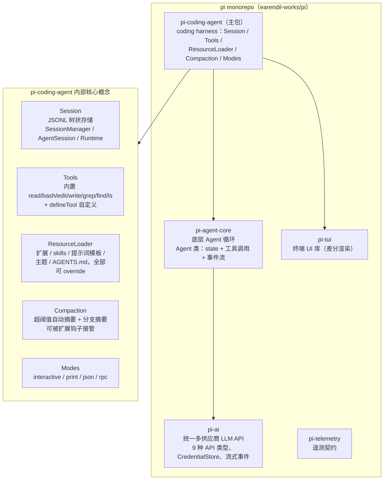
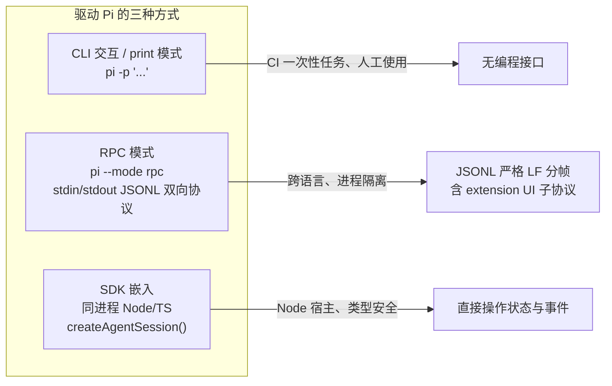
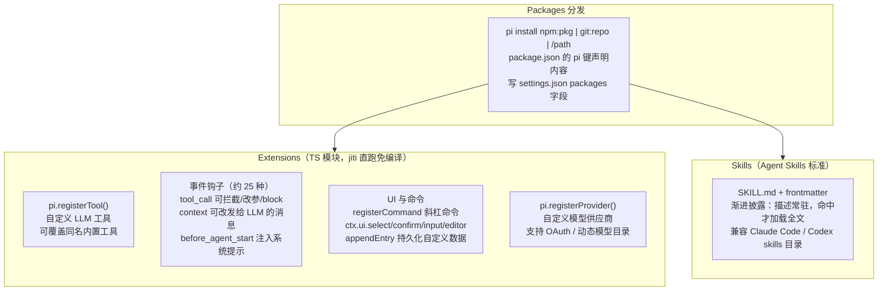

# Pi Agent 能力调研：组成、配置与扩展

> 本文是 `pi-integration-status.md` 的配套调研，回答三个问题：**Pi agent 由哪些部分组成、怎么调整、怎么扩展**，为 VCPDeck 下一步（尤其是「Agent 自主代理」）决策提供依据。
>
> 来源：本地依赖包 `@earendil-works/pi-coding-agent@0.84.0` 自带官方文档（`node_modules/.../pi-coding-agent/docs/`，与项目锁定版本一致，权威）+ 官方仓库 README。

## 一、组成部分全景

Pi 是一个分层 monorepo，VCPDeck 只需引入 `pi-coding-agent` 一个包即可拿到全部 SDK 能力：

关键概念速览：

- **Session**：JSONL 文件，id/parentId 构成树，支持原地分支。`SessionManager`（create/open/continueRecent/inMemory/forkFrom）管存储，`AgentSession` 是会话级 API（prompt/steer/followUp/compact/abort/navigateTree/subscribe），`AgentSessionRuntime` 管"换会话"（newSession/switchSession/fork）。
- **Tools**：默认启用 read/bash/edit/write 四个，可用 `tools` 白名单、`excludeTools` 排除、`noTools` 全关；自定义工具用 `defineTool` 或扩展注册；工具工厂可注入远程 operations（天然支持 SSH/沙箱执行）。
- **ResourceLoader**：统一加载扩展、skills、prompt 模板、主题、AGENTS.md，且每类都有 override 钩子（`systemPromptOverride`、`skillsOverride` 等）——宿主可完全接管资源来源。
- **事件流**：`agent_start/end`、`turn_start/end`、`message_update`（text_delta/thinking_delta/toolcall_*）、`tool_execution_*`、`compaction_start/end`、`agent_settled`（彻底空闲信号）。

## 二、三种驱动/对接方式对比

| 维度 | CLI / print | RPC 模式 | SDK 嵌入 |
|---|---|---|---|
| 进程模型 | 一次性子进程 | 长驻子进程，JSONL 双向 | 同进程（或 fork Worker） |
| 交互能力 | 单发 | prompt/steer/follow_up/abort/set_model/compact/switch_session/fork 等全量命令 | 全量 API + 完整事件订阅 |
| Extension UI | 终端 | JSON 子协议转发对话框 | `ctx.ui.*` 回调 |
| 适用 | 脚本、CI | 非 Node 宿主 | **VCPDeck 当前方案**（fork Worker + SDK） |

VCPDeck 的选择（Client fork Worker 加载 SDK）是对的：既有进程隔离（Worker 崩溃不拖垮 Client），又有 SDK 的完整 API 面。Pi 官方文档明确不建议用全局 `pi --mode rpc` 替代 SDK——项目现状（SDK 随 Client 打包锁定 0.84.0）与之一致。

## 三、配置调整手段

| 手段 | 位置 / 用法 | 能调什么 |
|---|---|---|
| settings.json | 全局 `~/.pi/agent/settings.json` + 项目 `.pi/settings.json`（嵌套合并，项目覆盖） | `defaultProvider/defaultModel/defaultThinkingLevel`、`compaction.{enabled,reserveTokens,keepRecentTokens}`、`retry.*`、`steeringMode/followUpMode`、`enabledModels`（白名单 minimatch）、`sessionDir`、`packages/extensions/skills/prompts/themes`（资源路径）、`defaultProjectTrust`（ask/always/never）、`httpProxy` |
| 环境变量 | `PI_CODING_AGENT_DIR`、`PI_CODING_AGENT_SESSION_DIR`、`PI_OFFLINE`、`PI_CACHE_RETENTION=long`、各 provider `*_API_KEY` | 配置目录隔离、离线模式、凭据注入 |
| models.json | `~/.pi/agent/models.json` | 自定义 provider（baseUrl/api/apiKey/models）、`modelOverrides` 改内置模型参数（contextWindow、samplingParams、compat 兼容开关） |
| 凭据优先级 | 运行时覆盖 > auth.json > 环境变量 > models.json | apiKey 支持 `$ENV`、`!command` 动态获取 |
| SDK 侧 | `SettingsManager.create()/inMemory()` + `applyOverrides()`；`ModelRuntime.create({authPath, modelsPath, credentials})`、`setRuntimeApiKey()` | 编程式全量控制，可完全脱离用户主目录 |

对 VCPDeck 的含义：「自主代理」可以用 `SessionManager.inMemory()` + `SettingsManager.inMemory()` + 独立 `agentDir/authPath` 做**与用户 pi 安装完全隔离**的无头实例，也可以像现在 Pi Tab 一样复用用户已有凭据——两种模式可以按任务类型选择。

## 四、扩展手段

要点：

- **Extensions**：放 `~/.pi/agent/extensions/` 或项目 `.pi/extensions/` 自动发现；`pi -e ./x.ts` 临时加载；`/reload` 热重载。`tool_call` 钩子可做**权限闸门**（拦截/bash 命令审批），`setActiveTools()` 支持动态按需加载工具。
- **Skills**：`~/.pi/agent/skills/`、`~/.agents/skills/`、`.pi/skills/` 等位置；`/skill:name` 可强制调用。意味着 VCPDeck 可以把「机器运维 SOP」写成 skills 分发给各机器上的 Pi。
- **Packages**：npm/git/本地三种来源，是扩展和 skills 的统一分发通道——VCPDeck 未来可以做自己的内部扩展包仓库。

## 五、对 VCPDeck 下一步的启示

| 下一步方向 | Pi 提供的现成能力 | 结论 |
|---|---|---|
| **Agent 自主代理**（网关下发子任务 → Client 自主执行） | SDK 无头嵌入（inMemory Session/Settings + 独立 agentDir）；`agent_settled` 作完成信号；steer/followUp 天然支持运行中追加指令；`--mode json` 可作备选 | 可行性高，现有 Worker 体系可直接复用，主要新增「任务定义 → 无头 session → 结果回收」编排层 |
| 权限与安全收敛 | `tools` 白名单 / `excludeTools` / `noTools`；`tool_call` 钩子拦截；容器化三模式（Gondolin micro-VM / Docker / OpenShell） | 自主代理应先出权限模型设计：哪些任务允许 bash、哪些只读 |
| 任务结果结构化回收 | `appendEntry()` 持久化自定义数据；JSONL session 编程可读（`getEntries/getTree`）；`SessionManager.list/open` | Server 可以不镜像正文、只回收摘要，延续现有隐私设计 |
| 多代理编排 | `examples/extensions/subagent/` 演示扩展 spawn 子 pi 进程（单发/并行/链式） | 多机器并行任务可直接参考该蓝本 |
| 能力分发到各机器 | Skills + Packages 机制 | 运维 SOP、项目约定可做成内部 skill 包统一下发 |
| 参考代码 | 包内 `examples/sdk/01~13`（01 最小嵌入 → 12 完全自控 → 13 session runtime） | 实现自主代理前建议先通读 12/13 两个示例 |

**核心判断**：Pi 本身就是按「可自扩展 agent harness」设计的，VCPDeck 目前已用到了它的交互式会话面；「自主代理」方向不需要自研 agent 循环，缺的是**任务模型、权限闸门、结果回收**这三层编排——这正是 VCPDeck Server/Client 架构擅长补位的部分。
