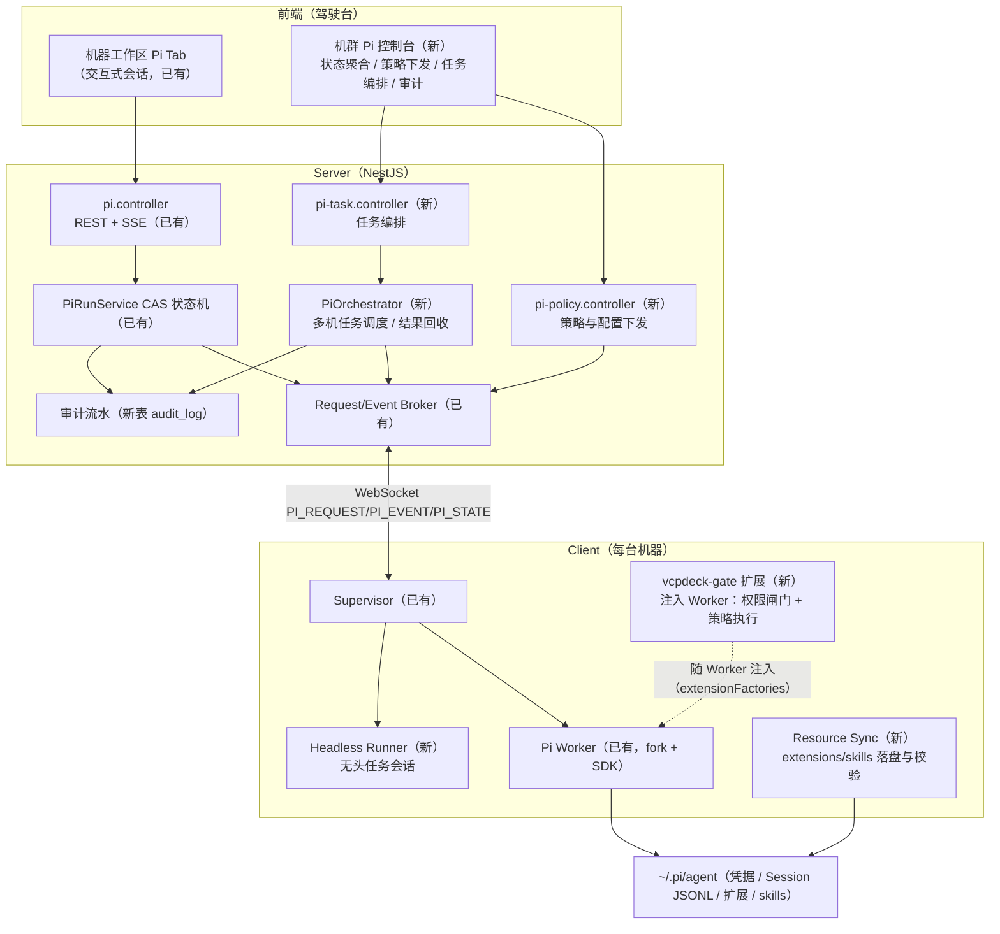
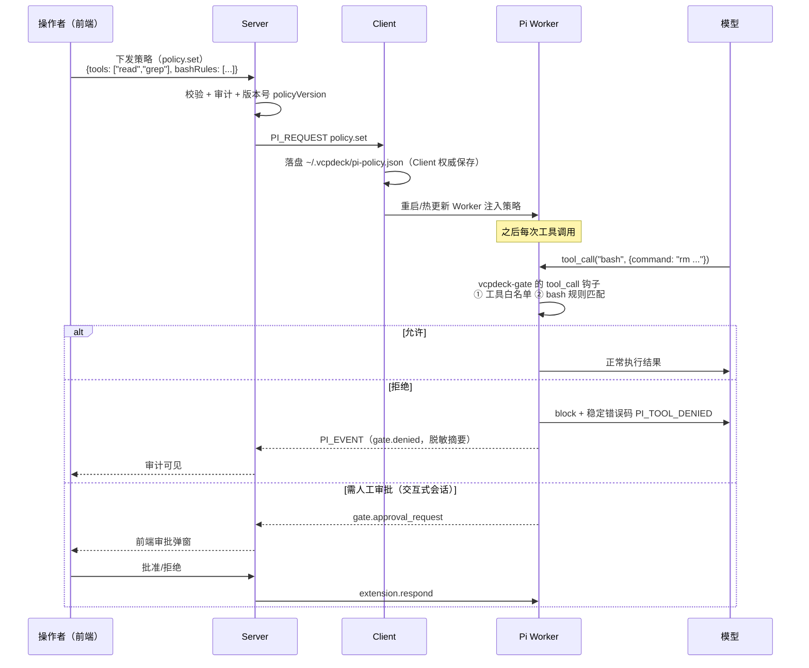
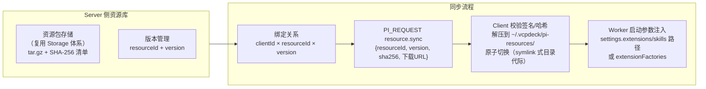
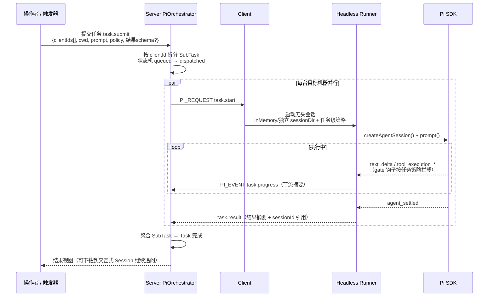
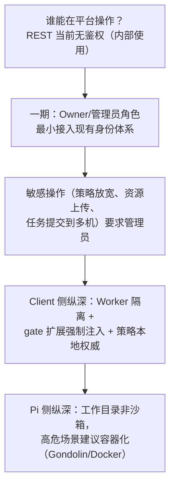
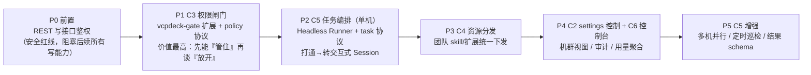

# Pi 完全管控方案设计

> 目标：通过 VCPDeck 架构（Browser → Server → Client → Pi Worker），**完全控制任何一台已接入机器上的 Pi agent**——不只是对话，还包括配置、权限、资源分发、任务编排与审计。
>
> 前置阅读：`docs/pi-integration-status.md`（现状）、`docs/pi-agent-capabilities.md`（Pi 能力调研）、`docs/remote-pi-tab.md`（现有详细设计）。

## 一、「完全控制」的能力矩阵

先把"完全控制"拆成六个控制面，并标注现状：

| # | 控制面 | 含义 | 现状 |
|---|---|---|---|
| C1 | 会话控制 | 新建/打开/fork/clone/删除/导航 Session，prompt/steer/followUp/abort/compact | ✅ 已实现（21 个 PiAction） |
| C2 | 运行配置控制 | 模型、思考深度、重试、压缩策略、steer 模式的远程读写 | 🟡 部分（model.set / thinking.set 已有；settings 读写无） |
| C3 | 工具权限控制 | 决定每台机器的 Pi 能用哪些工具、bash 命令审批闸门 | ❌ 缺失 |
| C4 | 资源分发 | 向任意机器统一下发/更新 extensions、skills、prompt 模板 | ❌ 缺失 |
| C5 | 任务编排 | 无头任务下发（无需人守在前端）、批量/并行多机执行、结果回收 | ❌ 缺失（README 规划的「客户端 Pi Agent 代理」） |
| C6 | 观测与审计 | 全机群 Agent 状态聚合、操作审计、用量统计 | 🟡 部分（agent.stats 已有单机查询；无聚合视图与审计流水） |

方案设计原则（继承现有架构约束）：

1. **Session JSONL 仍是正文唯一事实来源**，Server 不镜像正文；新增能力同样遵守。
2. **协议先行**：所有控制面都落成 `packages/shared/src/pi.ts` 里有校验器的稳定协议，不走 ad-hoc 通道。
3. **复用现有机制**：Worker 体系、CAS 状态机、Broker、分页规范、稳定错误码全部沿用，不另起炉灶。
4. **能力探测驱动 UI**：每台机器能力不同（Node 版本、bash、认证），控制面板按 `capability` 上报动态可用/禁用。

## 二、总体架构



关键决策：**C3/C4/C5 不新建进程体系**，全部复用现有 Worker——策略闸门和资源以「VCPDeck 自研 Pi 扩展」形式注入 Worker（Pi 的 `extensionFactories` 机制原生支持），无头任务用 `SessionManager.inMemory()` 或独立 `sessionDir` 跑在同类 Worker 里。

## 三、C2 运行配置控制

**现状差距**：只能切当前 Session 的模型/thinking；无法远程查看和修改机器的 `settings.json`（重试、压缩、enabledModels 白名单等）。

**方案**：

- 新增 PiAction：`settings.get` / `settings.set`（patch 语义，字段级校验）。
- Client 侧用 `SettingsManager` 读写 `~/.pi/agent/settings.json`；写操作触发 Worker 内 `applyOverrides()` 热生效，不能热生效的字段（如 `sessionDir`）返回 `restartRequired: true` 标记。
- 安全约束：`settings.set` 走字段白名单（只允许 `compaction.*`、`retry.*`、`enabledModels`、`defaultModel` 等），**禁止远程修改** `packages/extensions/skills/prompts` 路径字段——资源分发必须走 C4 的带校验通道，防止路径注入。
- Server 不落库 settings 全文，只在审计流水记录「谁改了哪台机器的哪个字段、旧值→新值哈希」。

## 四、C3 工具权限控制（权限闸门）

这是"控制"的核心：**平台决定每台机器的 Pi 能做什么**。



策略模型（写入 `packages/shared/src/pi-policy.ts`）：

```ts
interface PiPolicy {
  version: number;                    // 单调递增，Client 拒绝回退
  tools: {
    mode: "allowlist" | "denylist";
    allow?: string[];                 // 如 ["read","grep","find","ls"] = 只读代理
    deny?: string[];                  // 如 ["bash","edit","write"]
  };
  bash: {
    mode: "unrestricted" | "approval" | "rules";
    allowPatterns?: string[];         // 正则白名单，如 "^git (status|diff)"
    denyPatterns?: string[];          // 正则黑名单优先生效，如 "rm\\s+-rf"
  };
  paths: {
    writableRoots?: string[];         // edit/write 允许的根目录
  };
  network: { mode: "unrestricted" | "offline" };  // 映射 PI_OFFLINE
  updatedBy: string; updatedAt: string;
}
```

实现要点：

- **闸门本体是一个 Pi 扩展**（`vcpdeck-gate`），用 `tool_call` 钩子拦截 + `setActiveTools()` 收窄工具面 + bash 规则匹配；Client 在 fork Worker 时通过 `extensionFactories` 强制注入，**用户侧无法绕过**（Worker 是 Client 控制的进程）。
- 策略存储：Client 本地落盘为权威（断网也能执行最近一次策略），Server 存副本用于展示和审计；Worker 启动和每次 `PI_STATE` 上报时携带 `policyVersion`，Server 发现版本落后自动重推。
- 三档预设：`readonly`（只读诊断）、`standard`（读写 + bash 审批）、`unrestricted`（现状），前端一键切换 + 自定义展开。
- 错误码新增：`PI_TOOL_DENIED`、`PI_POLICY_INVALID`、`PI_POLICY_STALE`。

## 五、C4 资源分发（extensions / skills / prompts）

**目标**：把「运维 SOP skill」「团队扩展」统一下发到任意机器并生效。



要点：

- 分发格式直接采用 **Pi Packages 规范**（包内 `pi` 键声明 extensions/skills/prompts），未来可平滑迁移到 `pi install git:...`；当前由 VCPDeck 通道推送，避免依赖各机器能访问外网 npm/git。
- **不落 ~/.pi/agent 官方目录**，统一放 `~/.vcpdeck/pi-resources/`，与用户手工安装的扩展隔离，删除/回滚干净。
- 生效方式：Worker 下次启动时把资源路径并入 `DefaultResourceLoader` 的 `extensions/skills` 路径数组；已在跑的会话下次 Prompt 前重载（`/reload` 等价的 SDK 调用）。
- 信任边界：扩展可执行任意代码，**资源包上传需要管理员角色**，Client 侧展示来源与哈希；`defaultProjectTrust` 不被本通道修改。
- 审计：谁上传、谁绑定、哪台机器、哪个版本、何时生效。

## 六、C5 任务编排（Agent 自主代理）

README 规划的核心能力，也是"完全控制"的最高形态：**人不盯着，平台直接让某台（或多台）机器的 Pi 干活**。



任务模型（新 Prisma 表，不复用 Job——Job 是 exec/agent.session 语义，任务是编排语义）：

```ts
model PiTask {
  id          String   @id @default(cuid())
  title       String
  prompt      String   // 注意：落库前脱敏评估，或仅存引用
  policy      Json     // 任务级策略快照（不得宽于机器策略，取交集）
  status      String   // queued/running/succeeded/failed/cancelled/timeout
  createdBy   String
  subtasks    PiSubTask[]
  createdAt   DateTime @default(now())
}

model PiSubTask {
  id         String @id @default(cuid())
  taskId     String
  clientId   String
  cwd        String
  sessionId  String?  // 远程 session 引用，正文仍在远程
  status     String
  resultSummary String? // allowlist 过滤后的摘要
  error      String?    // 稳定错误码
}
```

关键设计决策：

1. **正文与结果的边界**：SubTask 只回收**结果摘要**（最后一条 assistant 消息，经 event-projector 同款裁剪 + 长度上限）；完整过程保留在远程 Session JSONL，前端可一键"转为交互式 Session"（复用 `/open` + 幂等补建 Job 的现有机制）继续追问——这打通了 C5 与 C1。
2. **任务策略 = 机器策略 ∩ 任务声明**：提交时可声明更严的策略（如本次只读），不得放宽机器级策略；闸门在 Worker 内双重生效。
3. **并发与互斥**：无头任务与交互式会话**共享 canonical cwd 项目锁**（复用 `PI_PROJECT_BUSY`），避免人机互踩；同机多任务排队由 Supervisor 调度。
4. **超时与取消**：任务级 timeout；取消 = 权威 abort + session 标记；Client 断线走现有 `disconnected` 对账，重连后 Runner 重新上报。
5. **触发方式**：一期 REST 手动触发；二期接自动化（cron 表达式定时巡检，对应 README「主动监控巡检」）。
6. **SDK 参考**：实现前通读包内 `examples/sdk/12-full-control`、`13-session-runtime`；多机并行编排参考 `examples/extensions/subagent/`。

## 七、C6 观测与审计

- **机群状态聚合**：前端新「机群 Pi 控制台」首页 = 所有 Client 的 Pi 能力（Node/bash/认证/policyVersion/资源版本/活动会话数）表格，数据源 = 现有 `capability` 上报 + `PI_STATE` 聚合缓存（内存 TTL + 懒刷新，不落库）。
- **用量统计**：`agent.stats` 已有单机 token/成本查询；Server 增加 `pi.stats` 聚合接口（按机器/时间段汇总，分页遵守 `PaginatedResult` 规范）。
- **审计流水**（新表 `pi_audit_log`）：`(actor, clientId, action, target, detailHash, createdAt)`——覆盖 settings 修改、策略变更、资源绑定、任务提交/取消、闸门拒绝事件。审计只记哈希与元数据，不记 prompt/正文（延续隐私约束）。

## 八、协议与错误码增量

新增 PiAction（全部进 `packages/shared/src/pi.ts` 并配运行时校验器）：

| 分组 | Action | 说明 |
|---|---|---|
| C2 | `settings.get` / `settings.set` | 字段白名单 patch |
| C3 | `policy.get` / `policy.set` | 含 policyVersion 对账 |
| C4 | `resource.list` / `resource.sync` / `resource.remove` | 哈希校验 + 原子切换 |
| C5 | `task.start` / `task.cancel` / `task.status` | 无头任务生命周期 |
| C6 | `stats.query` | 时间段聚合查询 |

新增稳定错误码：`PI_TOOL_DENIED`、`PI_POLICY_INVALID`、`PI_POLICY_STALE`、`PI_RESOURCE_INVALID`（哈希/签名不符）、`PI_TASK_NOT_FOUND`、`PI_TASK_CONFLICT`（项目锁冲突，复用 `PI_PROJECT_BUSY` 亦可）。

## 九、安全模型



必须写进文档的红线：

1. Pi 继承远程机器用户权限，**不是沙箱**；策略闸门是「防误操作/防越权」不是「防恶意模型」，高危机器走容器化。
2. Server REST 当前无鉴权，**C2–C5 上线前必须先给这些写接口加管理员校验**，否则等于把全网机器的 shell 暴露给内网任何人。
3. prompt、结果正文、bash 命令细节不进 Server 数据库与日志；审计只存哈希与稳定码。

## 十、实施路线



排期逻辑说明：

- **P0 是硬前置**：没有鉴权，任何写控制面都是安全事故。
- **P1 先于 P2**：先有能力约束 Agent 能做什么，再放开自主执行——顺序反了等于给全网机器开无人值守 shell。
- **P2 先做单机**验证任务生命周期与结果回收，多机并行（P5）只是 Orchestrator 的 fan-out，技术风险低。
- 每期结束对应一份 `docs/verification/` 验收文档（顺便补上现状缺失的 Pi 专项验收）。

## 十一、工作量预估（按现有代码密度类比）

| 阶段 | 涉及包 | 新增/改动量估算 |
|---|---|---|
| P0 | server | 小：守卫 + 角色字段 |
| P1 | shared / client / server / frontend | 中：协议 ~200 行、gate 扩展 ~300 行、策略 UI |
| P2 | shared / client / server / frontend | 大：Runner + Orchestrator + 任务 UI，参考 pi-run.service 规模 ×2 |
| P3 | server / client / shared | 中：复用 Storage，主要是校验与原子切换 |
| P4 | server / frontend | 中：聚合接口 + 控制台页面 |
