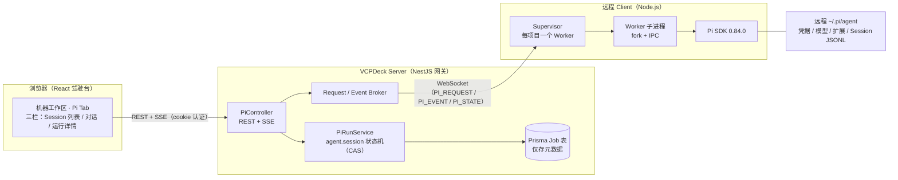
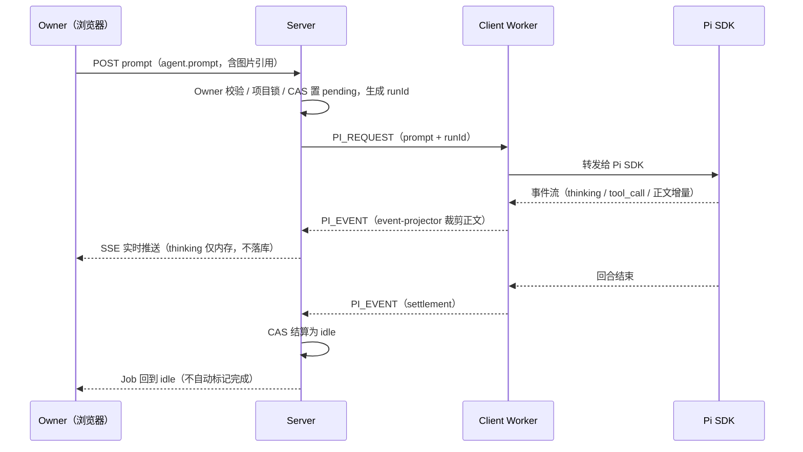
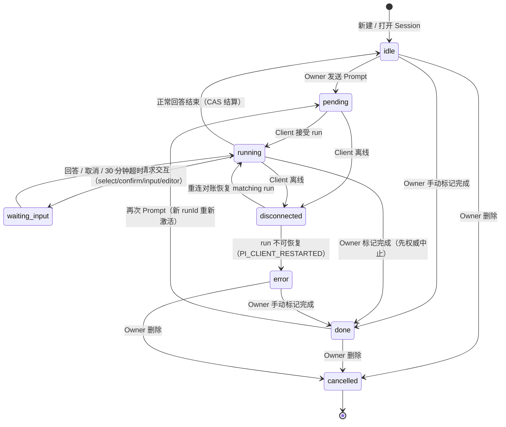
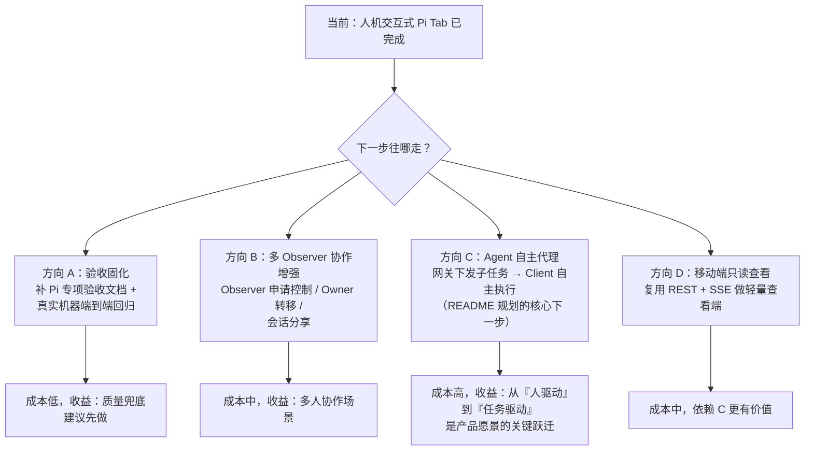

# Pi 对接现状梳理

> 本文梳理 VCPDeck 当前「远程 Pi Tab」对接的实现方案与完成程度，并给出下一步决策建议。详细设计见 `docs/remote-pi-tab.md`；Pi agent 自身的组成、配置与扩展机制调研见 `docs/pi-agent-capabilities.md`；「完全控制任意机器 Pi」的完整方案见 `docs/pi-full-control-design.md`。
>
> 这里的 **Pi** 指 Pi coding agent（`pi-coding-agent`，SDK `@earendil-works/pi-agent-core` 锁定 0.84.0），即部署在远程机器上的编码 Agent；不是树莓派。

## 一句话结论

Pi 对接已走完「人机交互式远程 Agent 会话」的完整闭环：**协议、Server、Client、前端四层全部落地且有测试**，可正常使用；README 规划的「客户端 Pi Agent 代理」（Agent 自主执行子任务）尚未开始。

## 整体架构

核心设计原则：

- **Session JSONL 是正文唯一事实来源**，保存在远程机器 `~/.pi/agent/sessions`；Server 不镜像正文，只持久化脱敏后的 `agent.session` Job 元数据。
- 每个 Pi Session 唯一对应一条 `agent.session` Job，`jobId === sessionId`；每次 Prompt 生成新 `runId` 隔离本次执行与迟到事件。
- 浏览器/Server 断线不会终止远程 Worker；重连后经权威状态上报（`PI_STATE`）对账恢复。
- Pi 继承远程机器用户权限，工作目录不是沙箱（Project Trust 需 Owner 确认）。

## 一次 Prompt 的数据流

## Session 生命周期状态机

## 各层实现清单

| 层 | 位置 | 内容 | 状态 |
|---|---|---|---|
| 协议 | `packages/shared/src/pi.ts` | 18 个稳定错误码、24 个 `PiAction`、`PiRequest/PiResponse/PiEvent/PiStateReport` 及运行时校验器 | ✅ 完成，有单测 |
| Server | `packages/server/src/pi/` | `pi.controller`（REST/SSE）、`pi-run.service`（CAS 状态机）、request/event broker、`pi-attachment.service`（图片 TTL 15min，SHA-256/MIME 校验） | ✅ 完成，含集成测试 `pi-flow.integration.test.ts` |
| Client | `packages/client/src/pi/` | `supervisor`（每 canonical cwd 一 Worker）、`worker`（fork 加载 SDK）、`capability`（Node≥22.19.0 / Windows bash / 模型认证探测）、`event-projector`（正文裁剪）、`session-reader`、`images`、`project-path`（HMAC projectKey） | ✅ 完成，单测 + `pi-worker.integration.test.ts` |
| 前端 | `packages/frontend/src/pi/` | Session 侧栏、聊天窗、运行详情（模型/thinking 切换、标记完成）、Extension 对话框、图片附件、SSE 流与断线重连 | ✅ 完成，挂载于机器工作区 Pi Tab，单测 + 重连集成测试 |
| 持久化 | Prisma `Job` 模型 | 复用现有表，`type = "agent.session"`；无独立 Pi 表 | ✅ 完成 |
| 参考蓝本 | `examples/pi-web/` | `@agegr/pi-web` 本地 Web UI，仅作对接参考 | — |

已支持的功能面：项目选择、Session 新建/打开/fork/clone/导航、多轮对话、Steer / Follow-up / 中止 / Compact、工具调用监督（Process Details 折叠）、Extension 交互、模型与思考深度切换、图片附件（≤10 张、单张 ≤10MiB）、固定 Owner + 只读 Observer、手动标记完成、断线重连对账、隐私隔离（prompt/正文/thinking/路径不落库）。

## 尚未实现 / 规划中

| 项 | 来源 | 说明 |
|---|---|---|
| 客户端 Pi Agent 代理 | README「后续扩展方向」 | 网关下发子任务，Client 上 Agent **自主执行**并返回结果；当前 Pi Tab 是纯人机交互，无自主代理 |
| 主动监控巡检 | README「后续扩展方向」 | Agent 自主巡视机器状态，异常自动建 TODO |
| 移动端 | README「后续扩展方向」 | 手机端查看 TODO、与 Agent 对话 |
| Pi 专项验收文档 | — | `docs/verification/` 下暂无 Pi 专项验收记录 |

## 下一步决策建议

个人建议的优先级：

1. **方向 A（验收固化）**——成本最低，先把已有能力用专项验收文档和真实环境回归钉死，避免后续改动破坏已有闭环。
2. **方向 C（Agent 自主代理）**——README 规划的核心下一步，可复用现有 `agent.session` 状态机、协议校验器与 Worker 体系，主要新增「任务下发 → 无头执行 → 结果回收」链路；建议先出设计文档（对齐 `remote-pi-tab.md` 的事实来源与隐私约束），再实现。
3. 方向 B / D 视实际使用反馈排期。
