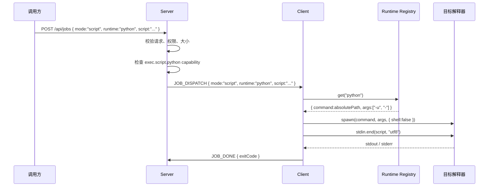

# 远程脚本执行设计：受控运行时 + stdin

> 状态：方案 A 已确认 | 2026-07-24
>
> 适用范围：Server ↔ Client 协议、Client capability、Executor 层
>
> 依据：现有 `exec` Job 流程、`server-client-interaction-design.md`

## 1. 目标

当前 `exec` Job 将 `payload.command` 交给 `spawn(command, { shell: true })`。短命令可以正常使用，但用命令字符串承载长脚本会遇到：

1. Windows `cmd.exe` 和系统 `argv` 的长度限制
2. 多层引号、反斜杠和模板字符串的 shell 转义问题
3. 调用方可以把解释器、参数和源码拼成任意命令字符串，难以校验

本设计采用通用的 **受控脚本运行时 + stdin**：调用方只选择 Client 已注册的运行时 ID，Client 直接启动对应解释器并通过 stdin 发送源码。

本次解决脚本传输与执行，不解决结构化结果。最终结果仍是 stdout、stderr 和 exitCode。

## 2. 核心原则

### 2.1 外部协议不接受可执行文件

脚本调用方只能提交：

- `runtime`：受控运行时 ID，例如 `node`、`python`、`powershell`、`bash`
- `script`：UTF-8 脚本源码
- `timeout`：可选超时

调用方不能提交：

- executable 路径
- `command`
- 解释器参数
- `shell` 开关

解释器路径和固定参数只存在于 Client 内部运行时注册表中。

### 2.2 直接启动目标运行时

所有脚本运行时统一使用：

```ts
spawn(definition.command, definition.args, {
  shell: false,
  timeout: job.timeout,
});
```

这里的 PowerShell 或 Bash 是需要执行对应语言源码的**目标解释器**，不是包裹其他解释器的外层 shell。

禁止以下包装方式：

```ts
spawn("cmd.exe", ["/c", "node", "-"], { shell: false });
spawn("sh", ["-c", "python -"], { shell: false });
spawn("bash", ["-c", "node -"], { shell: false });
spawn(`node -e "${script}"`, { shell: true });
```

允许直接启动目标解释器：

```ts
spawn(process.execPath, ["-"], { shell: false });
spawn(pythonPath, ["-u", "-"], { shell: false });
spawn(powershellPath, ["-NoProfile", "-NonInteractive", "-Command", "-"], {
  shell: false,
});
spawn(bashPath, ["-s", "--"], { shell: false });
```

### 2.3 普通命令与脚本模式分离

`exec` 保留两个互斥模式：

- `command`：兼容现有短命令，继续使用系统 shell
- `script`：从受控注册表选择运行时，禁止外层 shell

脚本模式不能回退到 command 模式。运行时不存在时必须失败，而不是改用 `cmd.exe`、PowerShell、`sh` 或 Bash 尝试执行。

## 3. 协议

### 3.1 REST 创建请求

普通命令：

```json
{
  "clientId": "client-id",
  "type": "exec",
  "payload": {
    "mode": "command",
    "command": "echo hello"
  },
  "timeout": 30000
}
```

脚本执行：

```json
{
  "clientId": "client-id",
  "type": "exec",
  "payload": {
    "mode": "script",
    "runtime": "python",
    "script": "print('hello from stdin')"
  },
  "timeout": 30000
}
```

### 3.2 Shared 类型

```ts
export type ExecJobDispatch =
  | {
      jobId: string;
      type: "exec";
      mode: "command";
      command: string;
      timeout?: number;
    }
  | {
      jobId: string;
      type: "exec";
      mode: "script";
      runtime: string;
      script: string;
      timeout?: number;
    };
```

`runtime` 使用字符串 ID，而不是把 executable 暴露到协议中。Server 只允许目标 Client 已声明的运行时，因此增加 Ruby、PHP、Deno 等运行时不需要扩展 Job 类型或新增 Socket.IO 事件。

运行时 ID 必须匹配：

```text
^[a-z][a-z0-9.-]{0,31}$
```

### 3.3 兼容策略

为兼容尚未增加 `mode` 的调用方，Server 可以在过渡期将下面的旧 payload 解释为 `mode: "command"`：

```json
{
  "command": "echo hello"
}
```

脚本 payload 不提供兼容推断，必须显式包含：

```json
{
  "mode": "script",
  "runtime": "node",
  "script": "..."
}
```

## 4. Client 运行时注册表

### 4.1 注册表接口

注册表是 Client 内部数据，不是外部可修改的协议接口：

```ts
interface ScriptRuntimeDefinition {
  command: string;
  args: readonly string[];
}

const scriptRuntimes = new Map<string, ScriptRuntimeDefinition>();
```

注册表隐藏以下实现细节：

- 可执行文件绝对路径
- 从 stdin 执行源码所需的固定参数
- 平台差异
- 运行时是否实际可用

Executor 只需要一个运行时 ID：

```ts
const definition = scriptRuntimes.get(job.runtime);
if (!definition) {
  throw new ExecError("SCRIPT_RUNTIME_UNAVAILABLE", "Script runtime is unavailable");
}

const child = spawn(definition.command, definition.args, {
  shell: false,
  timeout: job.timeout,
});

child.stdin?.end(job.script, "utf8");
```

### 4.2 内置运行时

| Runtime ID | Client 内部 command | 固定 args | 说明 |
|---|---|---|---|
| `node` | `process.execPath` | `["-"]` | 始终使用运行当前 Client 的 Node |
| `python` | 配置的 Python 绝对路径 | `["-u", "-"]` | `-u` 便于实时转发输出 |
| `powershell` | 配置的 `pwsh` 或 `powershell.exe` 绝对路径 | `["-NoProfile", "-NonInteractive", "-Command", "-"]` | 不加载 profile，不允许交互提示 |
| `bash` | 配置的 Bash 绝对路径 | `["-s", "--"]` | Bash 直接从 stdin 读取脚本 |

Node 运行时直接使用 `process.execPath`，不依赖 PATH。

Python、PowerShell 和 Bash 只在配置了绝对路径且启动检查成功时注册。首版使用简单环境变量配置：

```text
VCPDECK_PYTHON_PATH
VCPDECK_POWERSHELL_PATH
VCPDECK_BASH_PATH
```

未配置或不可执行时不注册对应运行时，也不声明对应 capability。Client 不猜测 `python`、`python3`、`py`、`pwsh` 或不同 Bash 发行版之间的优先级。

### 4.3 扩展新运行时

增加新运行时只需要在 Client 启动阶段加入一个定义：

```ts
scriptRuntimes.set("ruby", {
  command: configuredRubyPath,
  args: ["-"],
});
```

并声明：

```text
exec.script.ruby
```

不需要：

- 新增 Job 类型
- 新增 WebSocket 事件
- 修改 Server dispatcher 分支
- 允许调用方提交任意 executable
- 为一个运行时新增 handler 类或 factory

如果新运行时不能可靠地从 stdin 执行完整脚本，则不应加入此注册表，应改走临时文件或 FileRef 方案。

## 5. Capability

Client 注册时根据实际注册表生成 capability：

```ts
const capabilities = [
  "exec",
  ...[...scriptRuntimes.keys()].map((id) => `exec.script.${id}`),
];
```

示例：

```json
[
  "exec",
  "exec.script.node",
  "exec.script.python",
  "exec.script.powershell"
]
```

创建 `runtime: "python"` 的脚本 Job 前，Server 必须检查目标 Client 是否具有：

```text
exec.script.python
```

缺少 capability 时返回稳定错误：

```text
SCRIPT_RUNTIME_UNAVAILABLE
```

Server 不根据操作系统名称猜测运行时，也不在下发失败后自动选择其他运行时。

## 6. 执行流程



创建、队列续派和重连恢复都必须透传相同的 `mode`、`runtime` 和 `script`，不得在任一路径重新构造 command 字符串。

## 7. 输入校验

Server 在 REST 边界执行运行时校验，不能只依赖 TypeScript 类型。

共同字段：

- `clientId`：非空字符串
- `type`：必须是 `exec`
- `payload`：普通对象
- `timeout`：范围受限的正整数

command 模式：

- `mode === "command"`，或过渡期旧 payload 仅含 `command`
- `command` 必须是非空字符串
- 不得包含 `runtime` 或 `script`

script 模式：

- `mode === "script"`
- `runtime` 必须符合运行时 ID 格式
- `script` 必须是字符串；空字符串也是合法脚本
- 不得包含 `command`、executable、args 或 shell
- 目标 Client 必须声明 `exec.script.<runtime>`
- `script` 最大为 **64 KiB UTF-8 字节**

大小使用以下方式计算：

```ts
Buffer.byteLength(script, "utf8")
```

超过上限时在 REST 边界返回稳定的 4xx 错误，不允许等到 Socket.IO 下发时才失败。

## 8. 错误与终态

### 8.1 稳定错误码

| Code | 含义 |
|---|---|
| `INVALID_JOB_PAYLOAD` | mode 或字段组合不合法 |
| `SCRIPT_TOO_LARGE` | 脚本超过应用层上限 |
| `SCRIPT_RUNTIME_UNAVAILABLE` | Client 未声明或未注册运行时 |
| `EXEC_SPAWN_FAILED` | 目标解释器启动失败 |
| `EXEC_STDIN_FAILED` | 脚本未能完整写入 stdin |
| `EXEC_TIMEOUT` | 执行超时 |

错误 message 不回显脚本源码、凭证、环境变量或完整本地路径。

### 8.2 stdin 错误

必须监听 `child.stdin` 的 `error`，处理：

- `EPIPE`
- `EOF`
- `ERR_STREAM_DESTROYED`

如果不能确认脚本完整送达，Job 以 `EXEC_STDIN_FAILED` 结束，不能仅等待进程退出后误报成功。

### 8.3 幂等终态

spawn error、stdin error、close、timeout 和 cancel 必须经过同一个幂等终态函数，确保每个 Job 只上报一次最终事件：

```ts
let settled = false;

function settle(action: () => void) {
  if (settled) return;
  settled = true;
  activeJobs.delete(job.jobId);
  action();
}
```

当前 executor 的正常 close、spawn error 和取消监听可能产生重复终态；实现脚本模式时必须一并收敛。

## 9. 安全边界

`shell: false` 只表示没有额外的 shell 命令字符串解析层。脚本仍然是任意代码，会在 Client OS 账号权限内访问文件、网络、环境变量和子进程。

首版约束：

- `exec` Job 至少只允许管理员创建，直到细粒度授权落地
- Client 使用低权限 OS 账号运行
- 调用方只能选择已声明的 runtime ID
- executable 路径和固定参数由 Client 管理
- 日志不得输出脚本源码
- 脚本不得内嵌长期凭证
- 未知运行时不得自动回退到 command 或其他运行时

运行时注册表是选择约束，不是沙箱。新增独立 `script` Job 类型也不会自动构成安全隔离。

## 10. 容量与留痕

stdin 避开了命令行和 `argv` 长度限制，但仍受以下限制：

- REST JSON body 上限
- Socket.IO 单消息上限
- Server/Client 序列化内存
- SQLite payload 大小和数据库增长
- 目标解释器的 stdin 行为

首版应用层上限为 64 KiB UTF-8，不调整框架默认传输上限。更大的脚本应走 Storage/FileRef 或临时文件方案，而不是继续扩大单条消息。

脚本不会作为文件写入目标机器，但会随 Job payload 明文保存在 Server SQLite 中，并可能通过 Job 查询接口返回：

| 位置 | 留痕情况 |
|---|---|
| Client 本地脚本文件 | 不留存 |
| Server SQLite Job payload | 完整留存 |
| 数据库备份 | 完整留存 |
| Job 查询接口 | 当前可能返回完整 payload |
| stdout / stderr | 当前不持久化 |

后续应限制脚本 payload 查询权限，并定义 Job 保留和清理周期。

## 11. 运行时限制

### Node

- 使用 Client 自身的 Node 版本
- stdin 脚本没有真实文件路径
- 依赖 `__filename`、`__dirname` 或相对脚本目录的逻辑不适用
- 如后续需要 ESM，应增加独立 runtime ID，例如 `node-esm`，固定参数为 `["--input-type=module", "-"]`，不要允许调用方传 args

### Python

- 使用 `-u -` 从 stdin 执行并实时输出
- `sys.argv[0]` 为 `-`
- 没有普通脚本文件的 `__file__` 和脚本目录语义
- 需要特定虚拟环境时，应注册不同 ID，例如 `python-project-a`，映射到对应环境的绝对路径

### PowerShell

- PowerShell 是目标解释器，不是外层包装
- 使用 `-NoProfile` 和 `-NonInteractive`
- 默认退出码通常为 0 或 1；需要明确退出码时脚本应显式 `exit`
- Windows PowerShell 与 PowerShell 7 可以配置为同一个 `powershell` ID，也可以在确有版本区分需求时注册不同 ID

### Bash

- Bash 是目标解释器，不是 `bash -c` 包装层
- Windows 上 Git Bash、Cygwin、MSYS2、WSL 的路径和文件系统语义不同
- Client 只注册管理员明确配置并验证过的 Bash，不自动选择发行版
- 建议脚本自行使用 `set -euo pipefail`

## 12. 实施范围

| 文件 | 改动 |
|---|---|
| `packages/shared/src/index.ts` | exec dispatch 增加互斥的 command/script 模式 |
| `packages/server/src/events/events.controller.ts` | 校验 mode、runtime、字段组合、权限和 64 KiB 上限 |
| `packages/server/src/job/job.service.ts` | 校验目标 Client 的 `exec.script.<runtime>` capability |
| `packages/server/src/events/client.gateway.ts` | 完整透传 mode、runtime 和 script |
| `packages/client/src/register.ts` | 根据已注册运行时生成 capability |
| `packages/client/src/dispatcher.ts` | 按 mode 分发，不接收脚本 executable |
| `packages/client/src/executor.ts` | 运行时注册表、`shell:false`、stdin 和幂等终态 |
| `scripts/test.cjs` 或 Client 测试文件 | 增加真实运行时、容量和失败路径测试 |

GitNexus 影响分析显示，`ClientGateway.sendDispatch` 为 HIGH 风险 seam，因为创建 Job、完成后的续派、取消后的续派和重连恢复都会经过它。实现时必须覆盖全部下发路径。

## 13. 最小验收清单

1. Node 使用 `process.execPath`，不经过 shell
2. Python、PowerShell、Bash 直接启动配置的绝对路径，统一 `shell:false`
3. 不启动额外的 `cmd.exe`、PowerShell、`sh` 或 `bash` 包装层
4. 调用方不能提交 executable、args 或 shell 开关
5. Client capability 与运行时注册表完全一致
6. 未注册运行时在 Server 创建阶段被拒绝
7. `script: ""` 仍进入 script 模式
8. 多行、单双引号、反斜杠、模板字符串和 Unicode 脚本可完整执行
9. 64 KiB 边界内成功，超限请求在 REST 边界被拒绝
10. spawn 和 stdin 失败时 Client 不崩溃，且只产生一个终态
11. timeout/cancel 后 `activeJobs` 被清理
12. 创建、队列续派和重连恢复都能完整透传 mode、runtime 和 script
13. 普通旧 exec command 在过渡期保持兼容

## 14. 已知限制与升级信号

当前 timeout/cancel 主要终止直接解释器；脚本创建的后代进程可能残留。需要严格取消时，应实现跨平台进程树终止。

出现以下需求时升级到临时文件或 FileRef，而不是继续扩展 stdin 注册表：

- 脚本超过单消息上限
- 需要真实文件名、扩展名或脚本目录
- 需要相对 import/module 路径
- 需要脚本 artifact、版本、复用或缓存
- 目标运行时不能可靠地从 stdin 执行

出现独立授权、审计、结构化结果或 artifact 生命周期需求时，再考虑新增独立 `script` Job 类型。
