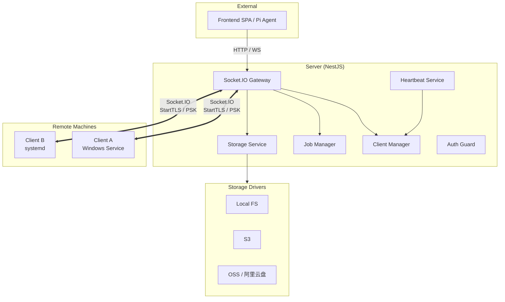
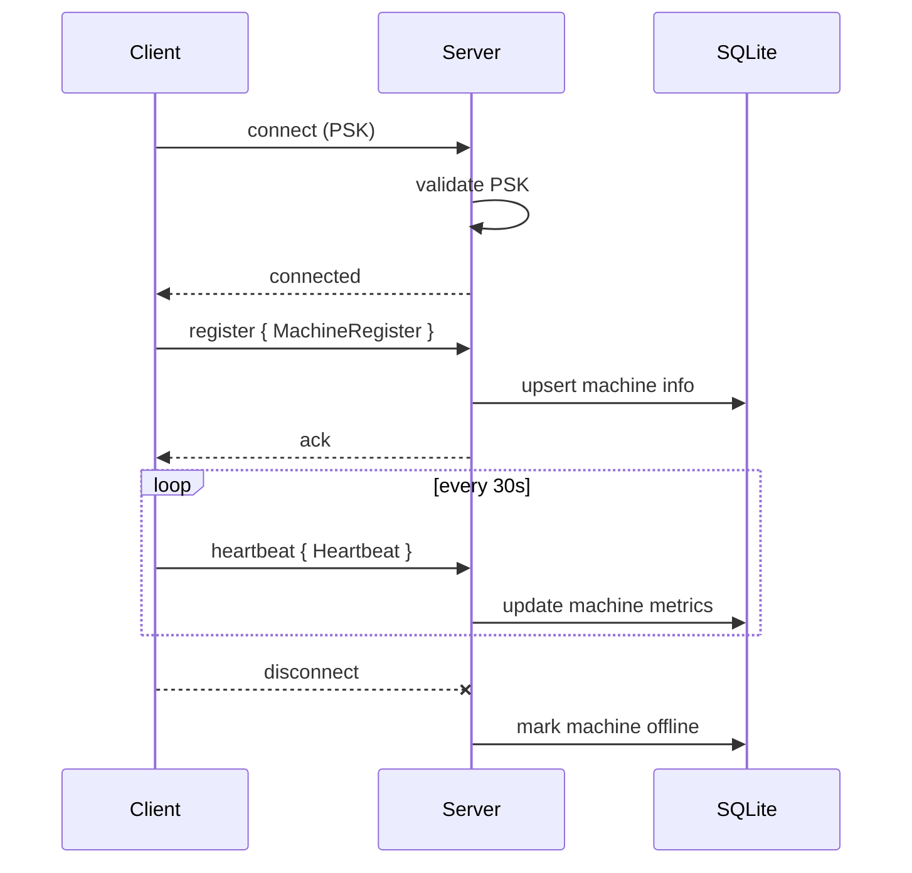
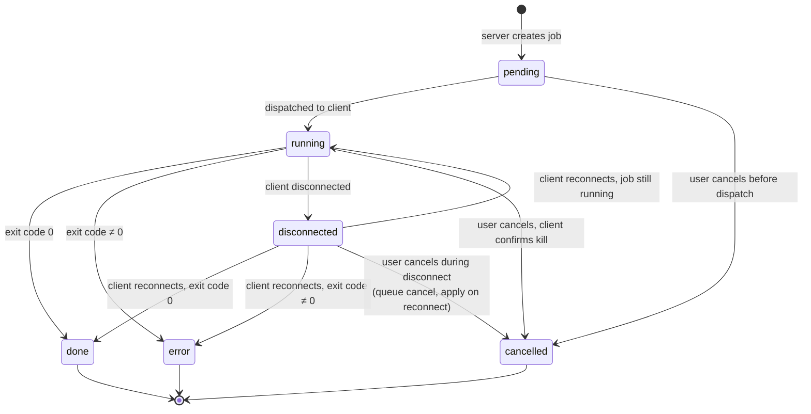
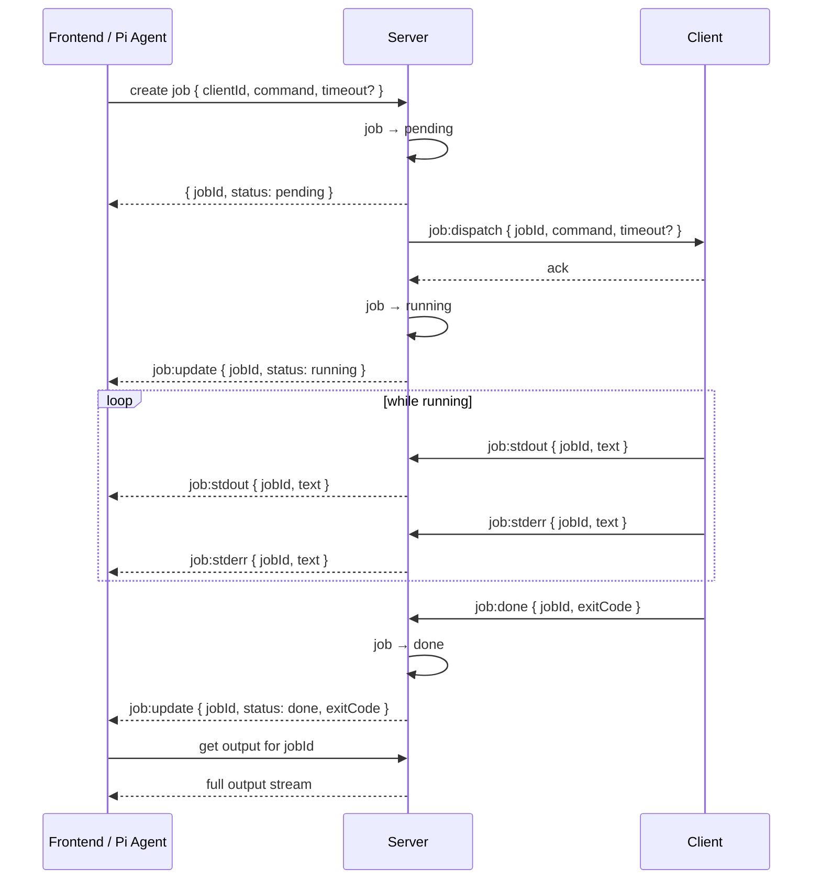
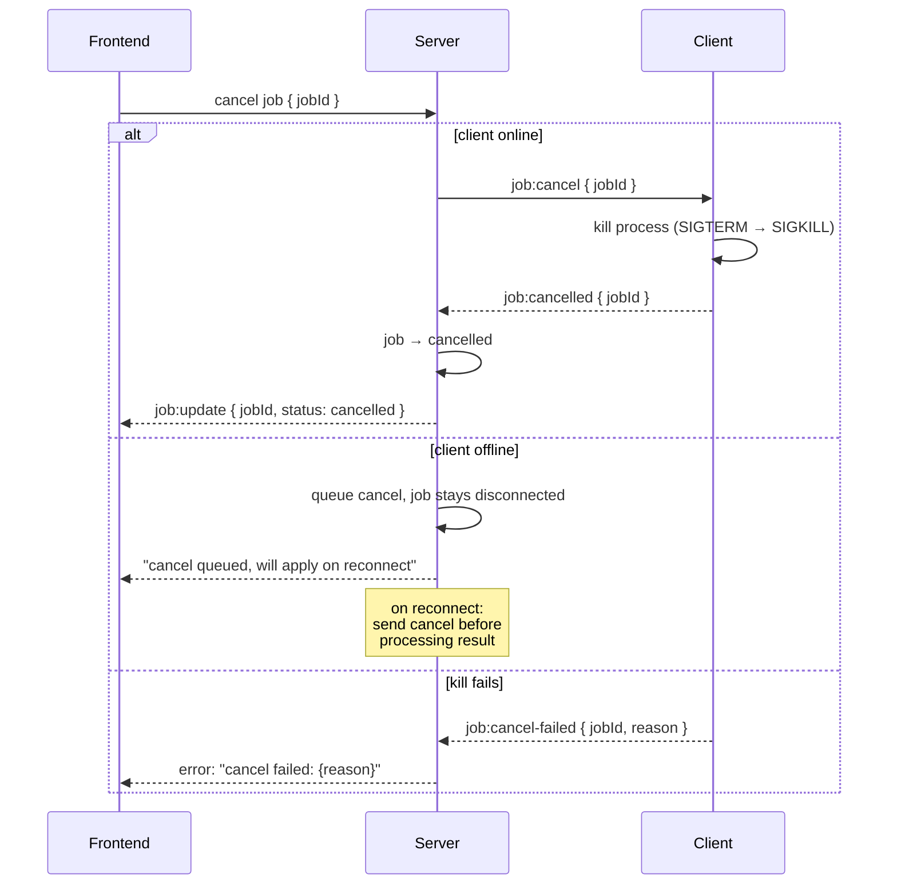
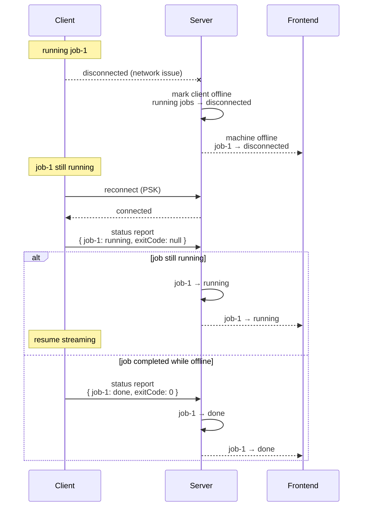
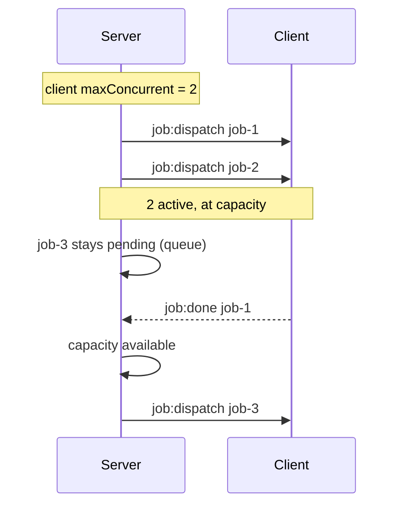
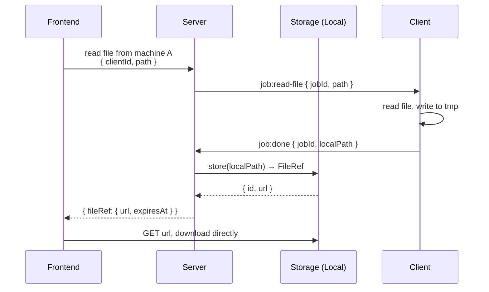

# Server ↔ Client 交互模型设计

> 状态：已确认 | 2026-07-22

## 1. 架构总览



**分层**:

| 层 | 职责 |
|---|---|
| **Server** | 认证、客户端管理、Job 调度、存储代理、心跳收集 |
| **Client** | 命令执行、文件操作、心跳上报、FRP 映射 |
| **Shared** | 事件类型定义、FileRef、Job 状态等共享类型 |

---

## 2. 通信通道

Socket.IO 是唯一的交互通道。

**原则**：Socket.IO 只传指令和数据，不传文件本体。文件通过 Storage 抽象获取 URL，client / frontend 直接下载。

| 通道 | 方向 | 用途 |
|---|---|---|
| `connection` | client → server | 建立连接，带 PSK 握手 |
| `job:*` 事件 | 双向 | Job 生命周期（下发、输出流、完成） |
| `heartbeat` | client → server | 定期上报指标 |
| `tunnel:*` 事件 | 双向 | FRP 端口映射管理 |
| `disconnect` | client → server | 断线，触发状态更新 |

---

## 3. 注册与心跳

客户端启动时一次性发送注册信息，之后通过心跳周期性上报动态指标。

### 注册信息 (一次性)

```ts
interface MachineRegister {
  clientId: string;       // 唯一标识，client 首次启动时生成并持久化
  hostname: string;
  os: string;             // e.g. "Windows 11", "Ubuntu 22.04"
  cpuModel: string;
  totalMemMB: number;
  totalDiskMB: number;
  clientVersion: string;
  capabilities: string[]; // e.g. ["exec", "file", "tunnel"]
}
```

### 心跳 (每 30s)

```ts
interface Heartbeat {
  clientId: string;
  cpuPercent: number;
  memPercent: number;
  diskPercent: number;
  runningJobs: string[];  // jobId 列表
  uptime: number;         // client 进程运行秒数
}
```



---

## 4. Job 生命周期

### 状态机



### Job 执行流



### 取消执行



---

## 5. 断线重连



**关键约定**：

- 断线期间 client 不缓冲事件，中间输出丢失
- 重连时 client 主动上报所有运行中/刚完成的 job 状态
- server 如果 during disconnect 有排队的取消，重连后优先下发

---

## 6. Job 并发控制

```ts
interface ClientConfig {
  maxConcurrentJobs: number; // default 3
  jobTimeoutMs: number;      // default 30 min, 0 = no limit
}
```

并发通过 server 调度：server 维护每个 client 的 `activeJobCount`，超过上限的新 job 保持 `pending`，等 running job 结束后自动出队。



---

## 7. 存储与文件操作

Socket.IO 只传 FileRef，文件本体由 client / frontend 按照 FileRef 直接操作。

```ts
interface FileRef {
  id: string;
  url: string;              // 下载 / 上传地址
  method: "GET" | "PUT";
  expiresAt: number;
  headers?: Record<string, string>;
}
```



---

## 8. 事件汇总

| 事件 | 方向 | 说明 |
|---|---|---|
| `register` | C → S | 注册信息 |
| `heartbeat` | C → S | 30s 心跳 + 指标 |
| `job:dispatch` | S → C | 下发执行命令 |
| `job:stdout` | C → S | 实时 stdout |
| `job:stderr` | C → S | 实时 stderr |
| `job:done` | C → S | 执行完成 |
| `job:cancel` | S → C | 取消指令 |
| `job:cancelled` | C → S | 取消确认 |
| `job:cancel-failed` | C → S | 取消失败 |
| `job:update` | S → FE | 状态变更广播 |
| `tunnel:create / delete` | C ↔ S | FRP 隧道管理 |
| `tunnel:status` | C → S | 隧道状态上报 |

---

## 9. 后续细化方向

以下在此文档中未深入定义，留待各自独立设计：

- **Storage 抽象层接口与驱动实现**（本地 / S3 / 阿里云盘等）
- **Tunnel (FRP) 详细协议**（端口映射的创建、生命周期、健康检查）
- **PSK 生成、轮换与分发机制**
- **Job 输出持久化与历史查询**
- **Client 命令注入防护**（白名单、沙箱）

---

## 确认记录

| 决策点 | 结论 |
|---|---|
| 认证方式 | PSK |
| 命令模型 | 统一流式 job |
| 断线重连 | client 继续执行，重连回报最终状态 |
| 并发 | 可配置上限（默认 3），server 调度 |
| 文件操作 | Storage 抽象 + FileRef，Socket.IO 不传本体 |
| 心跳 | 注册发静态信息 + 心跳带动态指标 |
| Job 状态 | pending / running / done / error / disconnected / cancelled |
| 取消语义 | 严格确认（client 必须证实 kill 成功） |
