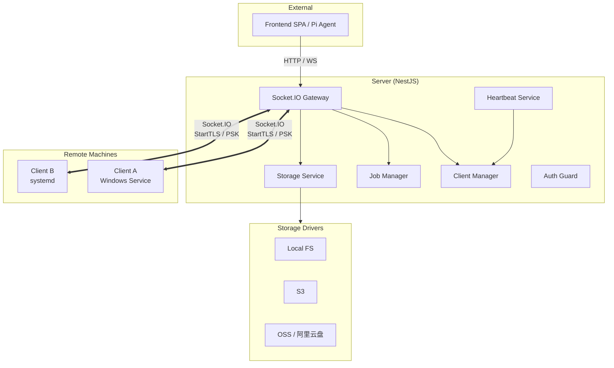
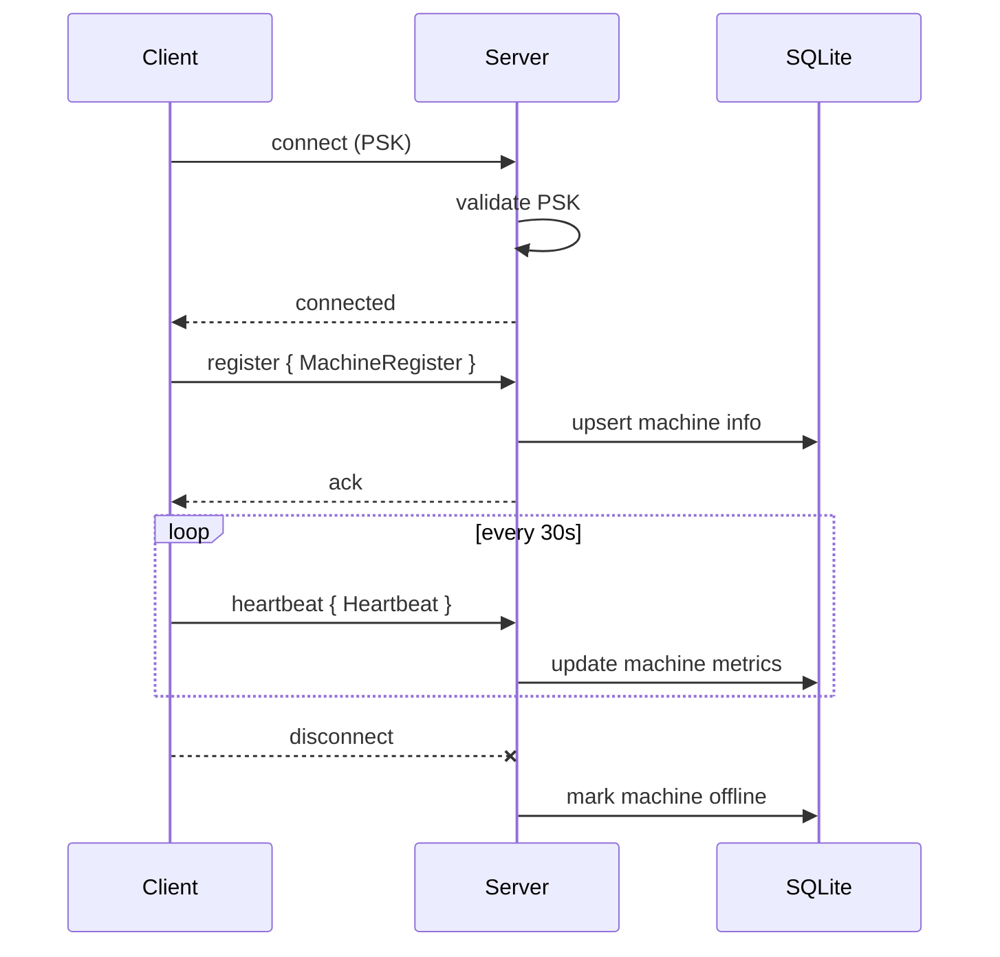
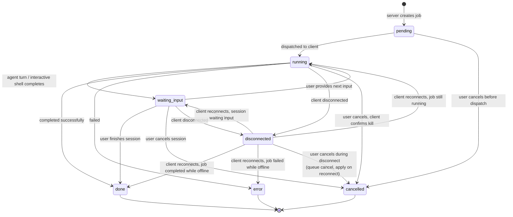
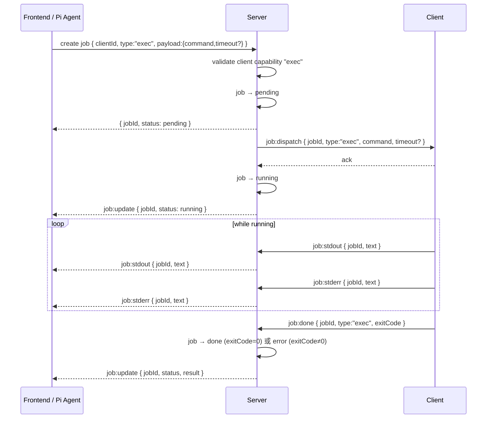
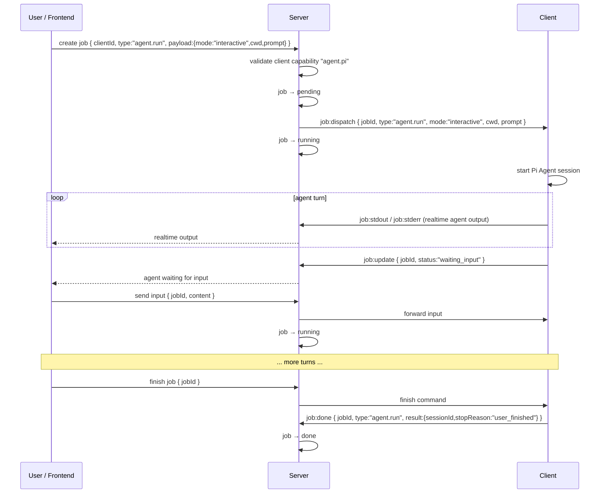
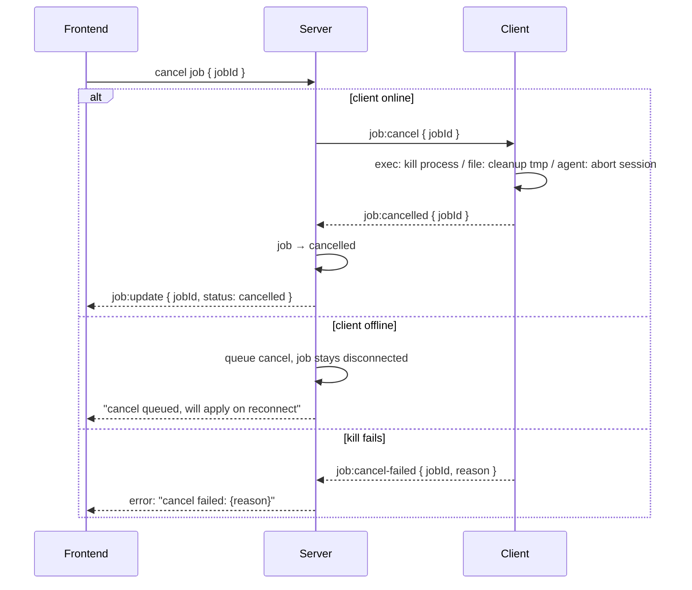
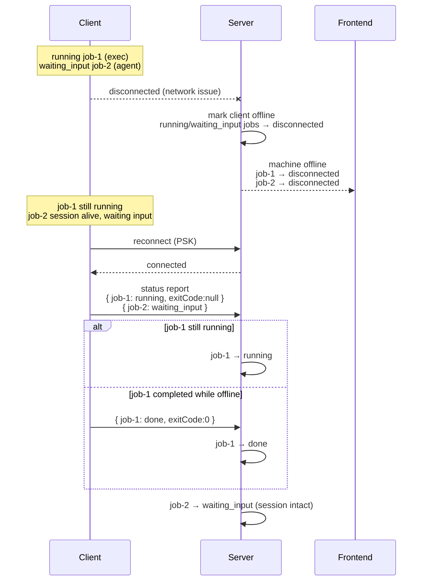
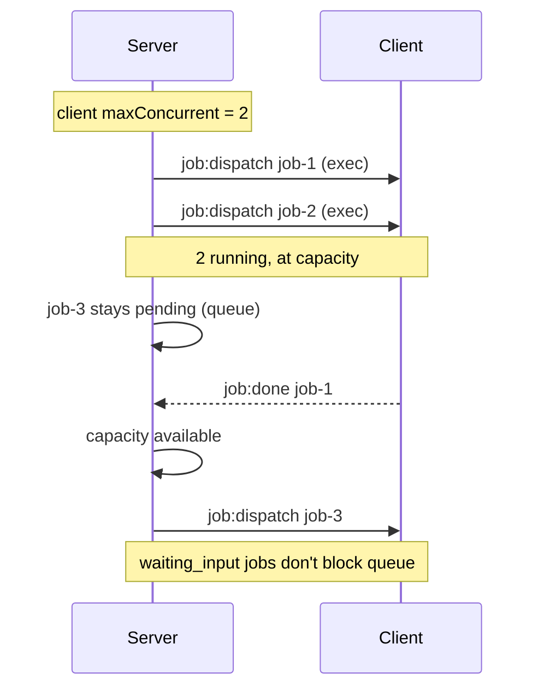
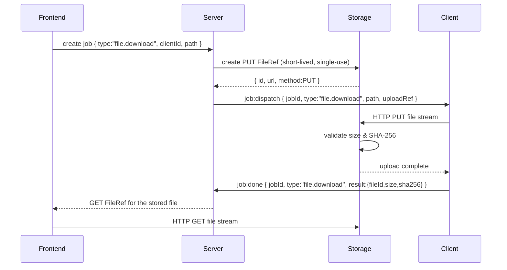
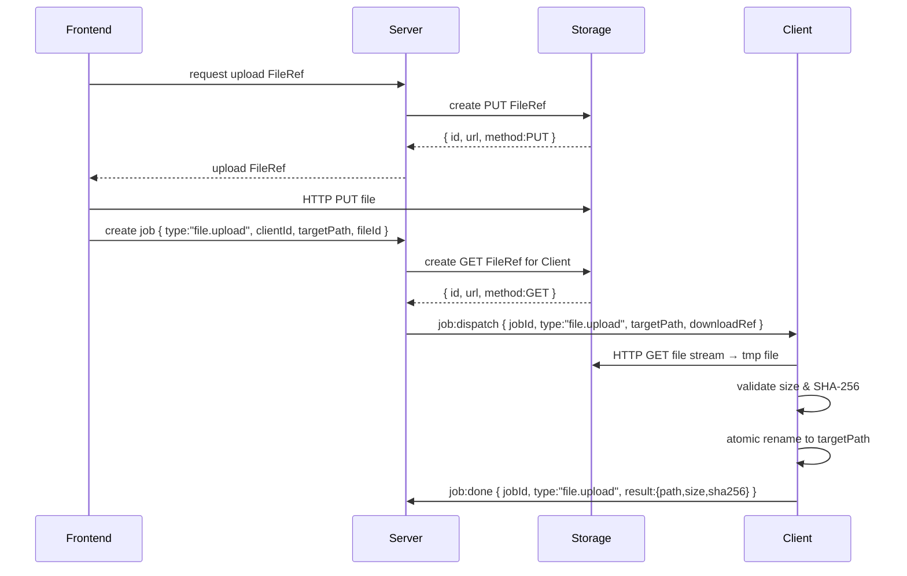

# Server ↔ Client 交互模型设计

> 状态：已确认 | 2026-07-22 | 2026-07-24 更新：Typed Job 模型

## 1. 架构总览



**分层**:

| 层 | 职责 |
|---|---|
| **Server** | 认证、客户端管理、Typed Job 调度、存储代理、心跳收集 |
| **Client** | 命令执行、文件操作、Agent 会话、心跳上报、FRP 映射 |
| **Shared** | Typed Job 类型定义、FileRef、Job 状态等共享类型 |

---

## 2. 通信通道

Socket.IO 是唯一的交互通道。

**原则**：Socket.IO 只传指令和数据，不传文件本体。文件通过 Storage 抽象获取 URL，client / frontend 直接操作。

**连接模型**：每个 Client（远程机器）与 Server 建立 **一个** Socket.IO 连接。
该机器上的所有 Job（不论并发多少）都**复用同一个连接**，通过事件体内的 `jobId` 字段区分。

```
1 台机器 = 1 个 socket
        ├── job-1 (exec)         ── job:stdout { jobId:"1", text:"hello" }
        ├── job-2 (file.list)    ── job:done   { jobId:"2", result:{entries:[...]} }
        └── job-3 (agent.run)    ── job:done   { jobId:"3", result:{sessionId:"...",stopReason:"done"} }
```

Server → 消费者（前端/日志查看器）同理：一个 Socket.IO 连接收到所有 job 的事件，消费者按 `jobId` 过滤展示。

| 通道 | 方向 | 用途 |
|---|---|---|
| `connection` | client → server | 建立连接，带 PSK 握手 |
| `job:*` 事件 | 双向 | Typed Job 生命周期（dispatch、流式输出、结构化结果） |
| `heartbeat` | client → server | 定期上报指标 |
| `tunnel:*` 事件 | 双向 | FRP 端口映射管理 |
| `disconnect` | client → server | 断线，触发状态更新 |

---

## 3. 注册与心跳

客户端启动时一次性发送注册信息，之后通过心跳周期性上报动态指标。

### 注册信息 (一次性)

```ts
interface MachineRegister {
  clientId: string;       // 唯一标识，client 首次启动时生成并持久化
  hostname: string;
  os: string;             // e.g. "Windows 11", "Ubuntu 22.04"
  cpuModel: string;
  totalMemMB: number;
  totalDiskMB: number;
  clientVersion: string;
  capabilities: string[]; // e.g. ["exec", "file.read", "file.write", "agent.pi"]
}
```

### Capability 约定

Capability 声明 Client 实际支持的能力。Server 在创建和下发 Job 前必须校验 type ↔ capability 映射：

| Job type | 所需 capability |
|---|---|
| `exec` | `exec` |
| `file.list`、`file.stat`、`file.readText` | `file.read` |
| `file.writeText`、`file.mkdir`、`file.delete`、`file.move` | `file.write` |
| `file.download` | `file.read` |
| `file.upload` | `file.write` |
| `agent.run` | `agent.pi` |

只声明 `["exec"]` 的旧 Client 不会收到文件或 Agent Job。后续新增 Job 类型时需同步扩展此映射。

### 心跳 (每 30s)

```ts
interface Heartbeat {
  clientId: string;
  cpuPercent: number;
  memPercent: number;
  diskPercent: number;
  runningJobs: string[];  // jobId 列表（含 waiting_input 状态的会话）
  uptime: number;         // client 进程运行秒数
}
```



---

## 4. Typed Job 模型

### 4.1 核心概念

Job 是 VCPDeck 统一的远程执行与审计信封：**一次具有明确目标、目标 Client、类型、权限、生命周期和结构化结果的操作**。

Job 不再等同于"在 Shell 里跑一段命令"。`exec` 只是 Job 的一种类型。

**当前已实现的类型**：

| type | 说明 |
|---|---|
| `exec` | 在目标 Client 通过系统 Shell 执行命令，收集 stdout/stderr 和退出码 |

**本次架构预留、尚未实现的类型**：

| type | 说明 |
|---|---|
| `file.list` | 列目录 |
| `file.stat` | 获取文件元数据 |
| `file.readText` | 读取小文本文件 |
| `file.writeText` | 写入小文本文件 |
| `file.mkdir` | 创建目录 |
| `file.delete` | 删除文件或目录 |
| `file.move` | 移动 / 重命名文件 |
| `file.download` | 从 Client 下载文件（Client → Storage PUT） |
| `file.upload` | 向 Client 上传文件（Storage GET → Client） |
| `agent.run` | 在 Client 上运行 Pi Agent 任务 |

### 4.2 判别联合协议

Job 的 dispatch 和 result 使用判别联合，`type` 字段决定 payload/result 的形状：

```ts
// ── Dispatch：Server → Client ──
type JobDispatch =
  | {
      jobId: string;
      type: "exec";
      command: string;
      timeout?: number;
    }
  | {
      jobId: string;
      type: "file.list";      // 本次只定义枚举，不实现 handler
      path: string;
      timeout?: number;
    }
  | {
      jobId: string;
      type: "agent.run";
      mode: "one-shot" | "interactive";
      cwd: string;
      prompt: string;
      timeout?: number;
    }
  | {
      jobId: string;
      type: string;            // 其他预留 type，兜底
      payload: Record<string, unknown>;
      timeout?: number;
    };

// ── 最终结果：Client → Server ──
type JobDone =
  | { jobId: string; type: "exec"; exitCode: number }
  | { jobId: string; type: string; result: Record<string, unknown> };

// ── 流式输出（所有类型共用，文本不区分 type） ──
interface JobOutput {
  jobId: string;
  text: string;
}
```

新增 Job 类型的扩展方式是：加枚举值 → 收窄 `JobDispatch` / `JobDone` 联合 → Client dispatcher 加 case。不需要新增 Socket.IO 事件。

### 4.3 错误模型

```ts
interface JobError {
  code: string;    // 稳定错误码，如 "PATH_NOT_FOUND"、"PERMISSION_DENIED"、"TIMEOUT"
  message: string; // 安全信息，不含路径内容、密钥、签名 URL 或 stack
}
```

结构化错误码使调用方无需解析 exitCode 或 stderr 字符串即可判断错误类型。

### 4.4 数据库模型

```prisma
model Job {
  id           String    @id
  clientId     String
  client       Client    @relation(fields: [clientId], references: [id])
  type         String    @default("exec")     // JobType 枚举值
  status       String    @default("pending")  // JobStatus 枚举值
  payload      String    @default("{}")       // JSON 文本，结构化输入
  result       String?                         // JSON 文本，结构化结果（完成时写入）
  errorCode    String?                         // 稳定错误码
  errorMessage String?                         // 安全错误信息
  timeout      Int?
  createdAt    DateTime  @default(now())
  startedAt    DateTime?
  finishedAt   DateTime?
  updatedAt    DateTime  @updatedAt
}
```

`payload` 以 JSON 文本存储 dispatch 的结构化输入——`exec` 为 `{"command":"ls -la"}`，`file.list` 为 `{"path":"/foo"}`，`agent.run` 为 `{"mode":"one-shot","cwd":"...","prompt":"..."}`。

`result` 在 Job 完成时写入结构化结果——`exec` 为 `{"exitCode":0}`，`file.list` 为 `{"entries":[...]}`，`agent.run` 为 `{"sessionId":"...","stopReason":"done"}`。

### 4.5 扩展点

Client 通过 typed dispatcher 分发：

```ts
// client/src/dispatcher.ts
function dispatch(job: JobDispatch, socket: Socket) {
  switch (job.type) {
    case "exec":
      return executeExec(job, socket);     // 现有逻辑，零改动
    case "file.list":
    case "file.stat":
    // ... 其他 file.* 和 agent.run
      throw new Error(`Job type "${job.type}" not yet implemented`);
    default:
      throw new Error(`Unknown job type: ${(job as any).type}`);
  }
}
```

Server 侧 `JobService.create()` 签名对应更新：

```ts
async create(params: {
  clientId: string;
  type: JobType;
  payload: Record<string, unknown>;
  timeout?: number;
}): Promise<{ result: JobCreateResult; dispatch: DispatchPayload | null }>
```

---

## 5. Job 生命周期

### 5.1 状态机



**关键设计**：

- `waiting_input` 是通用状态设施，不做 type 限制。`exec` 和 `file.*` 的 handler 永远不会进入此状态，`agent.run`（interactive）和未来的交互式终端会使用。这使状态机保持简单的同时覆盖所有交互场景。
- `waiting_input` 不计入执行并发槽（maxConcurrentJobs），避免少量等待用户的 Session 阻塞其他排队的 Job。
- `disconnected` 期间 Server 无法区分 Client 是正在执行还是等待输入，统一标 `disconnected`。重连后 Client 通过 `status:report` 回报实际状态。

### 5.2 Exec Job 执行流



### 5.3 Agent Interactive Job 执行流



### 5.4 取消执行



---

## 6. 断线重连



**关键约定**：

- 断线期间 client 不缓冲输出，中间输出丢失。此策略对 `exec` 和 `file.*` 适用，对 `agent.run` 不适用——Agent Job 需后续引入本地事件 spool 与补传机制（见后续细化方向）。
- 重连时 client 主动上报所有运行中 / 等待输入 / 刚完成的 job 状态。
- server 如果 during disconnect 有排队的取消，重连后优先下发。
- `waiting_input` 状态的 Job 在重连时按 client 回报恢复；Server 不假设其自动进入或退出。

---

## 7. Job 并发控制

```ts
interface ClientConfig {
  maxConcurrentJobs: number;  // default 3，仅统计 running 状态的 Job
  maxInteractiveSessions: number; // default 5，统计 waiting_input 状态的 Job
  interactiveIdleTimeout: number; // default 30 min，waiting_input 超时自动 cancel
  jobTimeoutMs: number;      // default 30 min, 0 = no limit
}
```

`waiting_input` 不计入 `maxConcurrentJobs`，避免等待用户的会话占用执行槽。分别限制执行并发和交互会话数量，防止交互会话无限增长。



---

## 8. 存储与文件操作

Socket.IO 只传 FileRef，文件本体由 client / frontend 按照 FileRef 直接操作。

```ts
interface FileRef {
  id: string;
  url: string;              // 下载 / 上传地址
  method: "GET" | "PUT";
  expiresAt: number;
  headers?: Record<string, string>;
}
```

### 8.1 从 Client 下载文件（file.download）



`file.download` 语义：从 Client **取出** 文件，Client 向 Storage 上传（PUT）。Server 不直接接触 Client 的本地文件系统，而是由 Client 将文件流推入 Storage，再由 Server 签发 GET FileRef 给消费者。

### 8.2 向 Client 上传文件（file.upload）



`file.upload` 语义：向 Client **放入** 文件，Client 从 Storage 下载（GET）→ 校验 → 原子替换。始终写入临时文件后 rename，失败时不破坏原文件。

### 8.3 轻量文件操作（不经过 Storage）

`file.list`、`file.stat`、`file.readText`、`file.writeText`、`file.mkdir`、`file.delete`、`file.move` 不涉及文件本体传输，仅通过 Job dispatch 下发元数据参数，结果以结构化 JSON 回报。文件本体不进入 Socket.IO 或数据库。

---

## 9. 事件汇总

| 事件 | 方向 | 说明 |
|---|---|---|
| `register` | C → S | 注册信息（含 capabilities） |
| `heartbeat` | C → S | 30s 心跳 + 指标 |
| `job:dispatch` | S → C | 下发 Typed Job（含 type + payload） |
| `job:stdout` | C → S | 实时 stdout（所有 type 共用） |
| `job:stderr` | C → S | 实时 stderr（所有 type 共用） |
| `job:done` | C → S | 执行完成（含 type + 结构化 result） |
| `job:cancel` | S → C | 取消指令 |
| `job:cancelled` | C → S | 取消确认 |
| `job:cancel-failed` | C → S | 取消失败 |
| `job:update` | S → FE | 状态变更广播（含 type、status、result） |
| `tunnel:create / delete` | C ↔ S | FRP 隧道管理 |
| `tunnel:status` | C → S | 隧道状态上报 |

---

## 10. 后续细化方向

以下在此文档中未深入定义，留待各自独立设计：

- **file.\* 和 agent.run 的 handler 实现**（Client 侧 typed dispatcher 的各个 case）
- **Storage 抽象层接口与驱动实现**（本地 / S3 / 阿里云盘等）
- **Tunnel (FRP) 详细协议**（端口映射的创建、生命周期、健康检查）
- **PSK 生成、轮换与分发机制**
- **Agent Job 增强**：AgentRun / JobEvent / Pi Session / Artifact 持久化、断线事件 spool 与 sequence 补传、修复链（rootJobId/parentJobId）
- **Client 路径安全策略**（允许根目录、`..` 处理、跨盘路径、symlink/junction 策略）
- **FileRef 限权**（短期有效、单次使用、大小限制、签名 URL 不写入日志）
- **交互终端 Attachment**（结构化终端 vs 原生 PTY）
- **Agent 人工输入审计**（actor、source、mode、content）

---

## 确认记录

| 决策点 | 结论 |
|---|---|
| 认证方式 | PSK |
| Job 模型 | Typed Job（判别联合），exec 退化为一种类型 |
| 断线重连 | client 继续执行，重连回报最终状态 |
| 并发 | `running` 计入 maxConcurrentJobs（默认 3），`waiting_input` 不计入 |
| 文件操作 | Storage 抽象 + FileRef，Socket.IO 不传本体；download = Client PUT → Storage；upload = Storage GET → Client |
| 心跳 | 注册发静态信息 + 心跳带动态指标 |
| Job 状态 | pending / running / waiting_input / done / error / disconnected / cancelled |
| waiting_input | 通用状态设施，不做 type 限制；仅交互式 Job 使用 |
| 取消语义 | 严格确认（client 必须证实 kill 成功）；file Job 清理临时文件；agent Job 先 abort session 再终止 worker |
| Capability 校验 | Server 下发前校验 type ↔ capability 映射 |
| 扩展方式 | 加枚举值 → 收窄联合类型 → Client dispatcher 加 case；不新增 Socket.IO 事件 |
