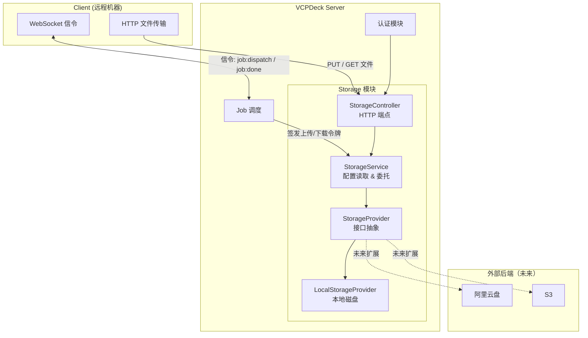
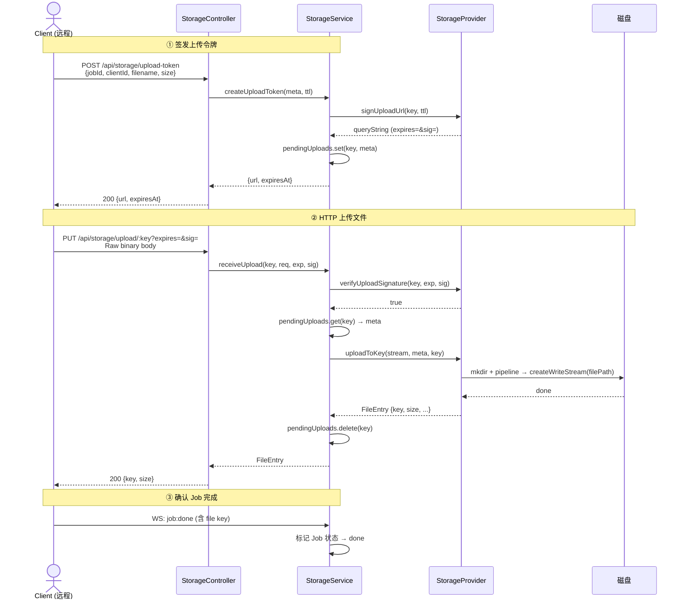
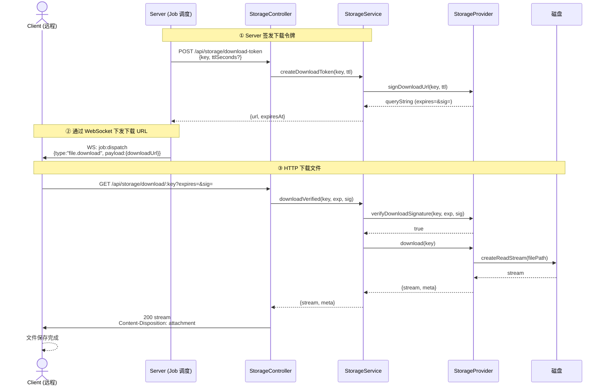
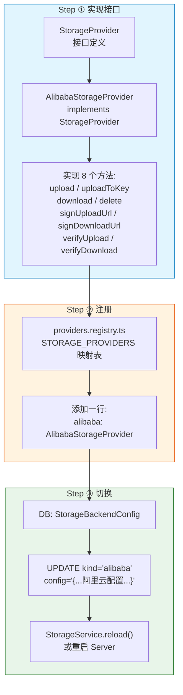
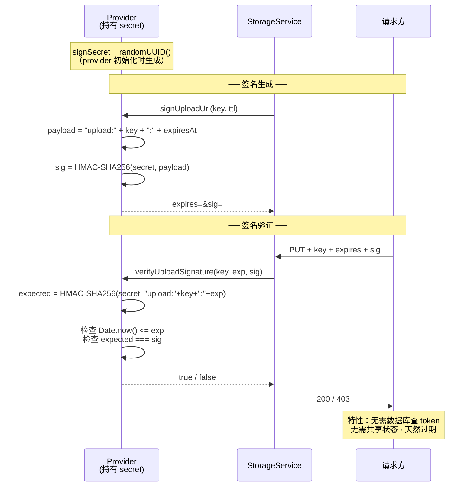
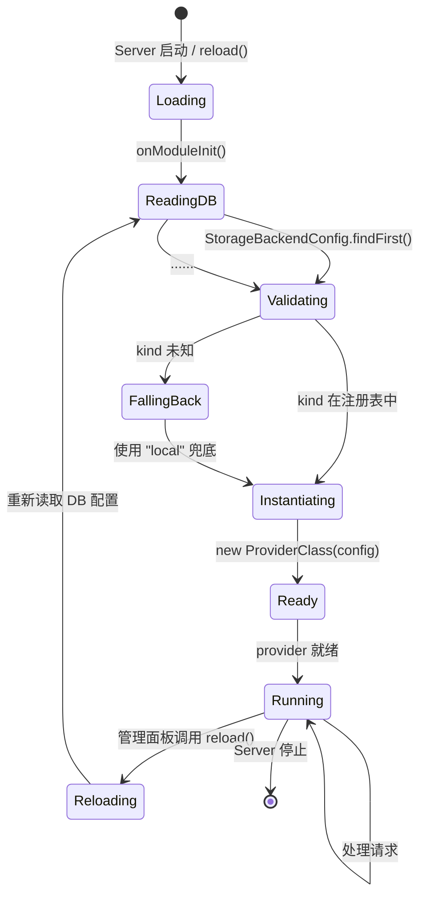
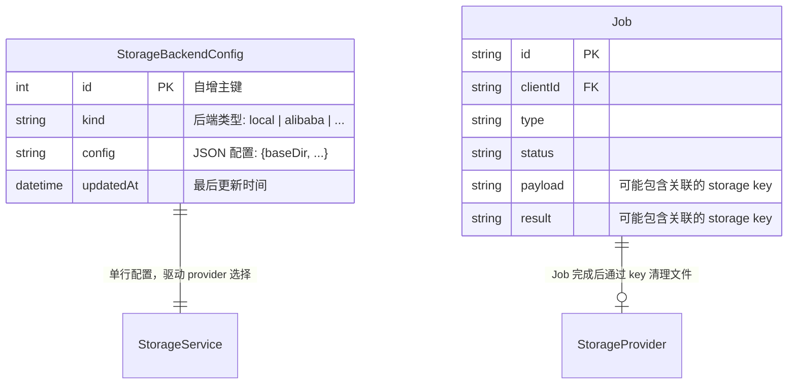

# Storage 存储系统 — 代码设计模型

> 日期：2025-07-25
>
> 本文档描述 VCPDeck storage 模块的内部设计，用 Mermaid 图表展示架构、交互和扩展机制。

## 1. 系统上下文

Storage 模块在 VCPDeck 整体架构中的位置：Server 内部的独立模块，通过 HTTP 端点对外提供服务，内部通过 Provider 接口委托给具体存储后端。



## 2. 模块结构

```
packages/server/src/storage/
├── storage.module.ts              ← NestJS 模块入口
├── storage.service.ts             ← 核心服务（读 DB 配置、委托 provider）
├── storage.controller.ts          ← HTTP 端点
└── providers/
    ├── storage-provider.interface.ts  ← 接口定义
    ├── local-storage.provider.ts      ← 本地磁盘实现
    └── providers.registry.ts          ← kind → Provider 注册表
```

## 3. 类关系图

```mermaid
classDiagram
    class StorageProvider {
        <<interface>>
        upload(stream, meta) FileEntry
        uploadToKey(stream, meta, key) FileEntry
        download(key) {stream, meta}
        delete(key) void
        signUploadUrl(key, ttl) string
        signDownloadUrl(key, ttl) string
        verifyUploadSignature(key, exp, sig) boolean
        verifyDownloadSignature(key, exp, sig) boolean
    }

    class FileMeta {
        +string jobId
        +string clientId
        +string filename
        +string? mimeType
        +number size
    }

    class FileEntry {
        +string key
        +string storageKind
        +Date createdAt
    }

    class LocalStorageProvider {
        -string baseDir
        -string signSecret
        +upload(stream, meta) FileEntry
        +uploadToKey(stream, meta, key) FileEntry
        +download(key) {stream, meta}
        +delete(key) void
        +signUploadUrl(key, ttl) string
        +signDownloadUrl(key, ttl) string
        +verifyUploadSignature() boolean
        +verifyDownloadSignature() boolean
        -makeKey(meta) string
        -sign(payload) string
    }

    class StorageService {
        -Logger logger
        -StorageProvider provider
        -Map~string,PendingUpload~ pendingUploads
        +onModuleInit() void
        +loadProvider() void
        +reload() void
        +createUploadToken(meta, ttl) {url, expiresAt}
        +createDownloadToken(key, ttl) {url, expiresAt}
        +receiveUpload(key, stream, exp, sig) FileEntry
        +downloadVerified(key, exp, sig) {stream, meta}
        +delete(key) void
    }

    class StorageController {
        -StorageService storageService
        +POST upload-token
        +POST download-token
        +PUT upload/:key(*)
        +GET download/:key(*)
        +DELETE :key(*)
    }

    class StorageBackendConfig {
        +int id
        +string kind
        +string config
        +DateTime updatedAt
    }

    FileMeta <|-- FileEntry : extends
    StorageProvider <|.. LocalStorageProvider : implements
    StorageService --> StorageProvider : delegates to
    StorageService --> StorageBackendConfig : reads
    StorageController --> StorageService : calls
    LocalStorageProvider ..> FileMeta : creates
    LocalStorageProvider ..> FileEntry : returns
```

## 4. 上传完整流程



## 5. 下载完整流程



## 6. 后端扩展机制

新增存储后端只需两步：实现接口 + 注册。



## 7. 预签名 URL 鉴权模型



## 8. 配置热切换流程



## 9. 数据模型


