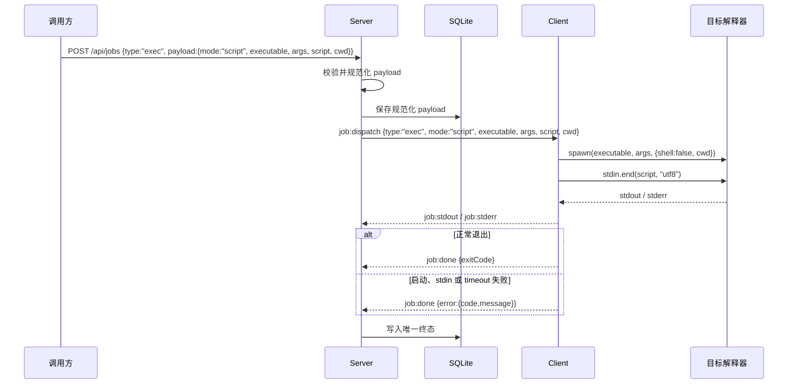

# Job 命令与脚本执行设计

> 状态：已确认
>
> 日期：2026-07-24
>
> 范围：`exec` Job 协议、Server 请求校验、Client 执行器与生命周期测试
>
> 参考：`docs/script-execution-design.md`、`docs/server-client-interaction-design.md`

## 1. 目标

改进现有 `exec` Job，使其同时支持：

1. 通过系统 Shell 执行普通命令；
2. 直接启动 Node、Python、PowerShell、Bash 或其他相近解释器，并通过 stdin 发送脚本源码；
3. 使用 PATH 中的可执行文件名或可执行文件完整路径；
4. 为命令和脚本指定可选工作目录；
5. 保持旧 `{ command }` payload 兼容；
6. 以稳定错误码区分执行基础设施失败与脚本自身非零退出；
7. 确保每个 Job 只产生一个终态。

本次不提供运行时白名单、Client 运行时注册表、解释器自动识别、参数自动补全、环境变量覆盖、脚本大小限制或跨平台进程树终止。

## 2. 方案选择

采用扩展现有 `exec` Job 的方案，不新增 `script` Job 类型。

命令和脚本共用现有调度、输出、取消和审计生命周期。二者的差异仅在 `exec` payload 和 Client 启动子进程的方式，因此拆成新的 Job 类型只会增加协议与 dispatcher 分支，暂时没有独立授权、审计或结果模型作为拆分依据。

不把普通命令统一改成 `executable + args`，因为这会破坏管道、重定向、`&&` 和 Shell 内置命令等现有行为。

## 3. 协议

### 3.1 REST payload

显式 command 模式：

```json
{
  "clientId": "client-id",
  "type": "exec",
  "payload": {
    "mode": "command",
    "command": "echo hello",
    "cwd": "D:/work"
  },
  "timeout": 30000
}
```

script 模式：

```json
{
  "clientId": "client-id",
  "type": "exec",
  "payload": {
    "mode": "script",
    "executable": "python",
    "args": ["-u", "-"],
    "script": "print('hello')",
    "cwd": "D:/work"
  },
  "timeout": 30000
}
```

`executable` 可以是 PATH 中的名称，例如 `python`、`python3`、`node`、`pwsh`、`powershell.exe`、`bash`；也可以是绝对路径，例如 `C:/Python312/python.exe` 或 `/usr/bin/python3`。

调用方负责提供解释器从 stdin 执行脚本所需的完整参数。Client 不根据名称或路径猜测运行时类型，也不补充参数。

### 3.2 Shared 类型

```ts
export type ExecJobDispatch =
  | {
      jobId: string;
      type: "exec";
      mode: "command";
      command: string;
      cwd?: string;
      timeout?: number;
    }
  | {
      jobId: string;
      type: "exec";
      mode: "script";
      executable: string;
      args: string[];
      script: string;
      cwd?: string;
      timeout?: number;
    };
```

`ExecJobDispatch` 作为 `JobDispatch` 判别联合中的 `exec` 分支。其他 Job 类型保持现状。

### 3.3 旧 payload 兼容

下面的旧 payload 继续合法：

```json
{
  "command": "echo hello",
  "cwd": "D:/work"
}
```

Server 在 REST 创建边界将其规范化为：

```json
{
  "mode": "command",
  "command": "echo hello",
  "cwd": "D:/work"
}
```

旧格式仅适用于 command。脚本必须显式提供 `mode: "script"`。

数据库保存规范化后的 payload。首次下发、排队续派和重连后的续派都读取同一份规范化数据，不在 Gateway 内重新推断模式。

## 4. 执行模型

### 4.1 普通命令

```ts
spawn(command, {
  shell: true,
  cwd,
});
```

实际实现继续传入 Job timeout。此模式保留现有 Shell 语义，包括管道、重定向、命令连接符和 Shell 内置命令。

### 4.2 脚本

```ts
const child = spawn(executable, args, {
  shell: false,
  cwd,
});

child.stdin.end(script, "utf8");
```

实际实现继续传入 Job timeout，并监听 stdin 错误。

脚本源码只通过 stdin 发送，不拼接到命令字符串或参数中。Client 不启动额外的 `cmd.exe`、PowerShell、`sh` 或 Bash 作为包装层。

常见调用由调用方明确表达：

| 解释器 | executable 示例 | args 示例 |
|---|---|---|
| Node | `node` 或 Node 绝对路径 | `["-"]` |
| Python | `python`、`python3` 或绝对路径 | `["-u", "-"]` |
| PowerShell | `pwsh`、`powershell.exe` 或绝对路径 | `["-NoProfile", "-NonInteractive", "-Command", "-"]` |
| Bash | `bash` 或绝对路径 | `["-s", "--"]` |

这些只是调用示例，不是 Client 固定策略。不同解释器版本需要不同参数时，由调用方选择。

### 4.3 工作目录

command 和 script 都接受可选 `cwd`。未提供时继承 Client 进程当前工作目录。

Client 将 `cwd` 原样交给 Node `spawn`，不做路径重写。目录不存在或不可访问时按启动失败处理。

## 5. Server 校验与规范化

Server 在 REST 创建边界执行运行时校验，不能只依赖 TypeScript 类型。

共同规则：

- `clientId` 是非空字符串；
- `type` 默认为 `exec`，本设计只改变 `exec` 校验；
- `payload` 是普通对象；
- `timeout` 未提供或为正整数；
- `cwd` 未提供或为非空字符串；
- 不接受 `env`、`shell` 等协议未定义的执行选项。

command 模式：

- `mode === "command"`，或旧 payload 未提供 `mode` 且提供 `command`；
- `command` 是非空字符串；
- 不得提供 `executable`、`args` 或 `script`；
- 旧 payload 在校验后补为 `mode: "command"`。

script 模式：

- `mode === "script"`；
- `executable` 是非空字符串；
- `args` 是字符串数组，空数组合法；
- `script` 是字符串，空字符串合法；
- 不得提供 `command`。

字段类型错误、模式字段混用、未知模式或未知执行选项返回 `INVALID_JOB_PAYLOAD`。错误信息不得回显脚本源码。

本次不增加应用层脚本大小限制，继续受现有 HTTP body、Socket.IO 消息和数据库容量边界约束。需要大脚本或脚本 artifact 时再采用 FileRef 或临时文件方案。

## 6. 结果与错误

### 6.1 Exec 终态协议

```ts
export type ExecJobDone =
  | {
      jobId: string;
      type: "exec";
      exitCode: number;
    }
  | {
      jobId: string;
      type: "exec";
      error: JobError;
    };
```

正常启动的命令或解释器退出后，上报真实 `exitCode`。`exitCode === 0` 时 Job 为 `done`，非零时为 `error`，结果保留 `{ exitCode }`。

执行基础设施失败时，上报 `error`，Server 将 Job 标记为 `error` 并写入 `errorCode`、`errorMessage`。

### 6.2 稳定错误码

| Code | 含义 |
|---|---|
| `INVALID_JOB_PAYLOAD` | REST payload 的模式、字段组合或字段类型不合法 |
| `EXEC_SPAWN_FAILED` | 命令、解释器或工作目录导致子进程无法启动 |
| `EXEC_STDIN_FAILED` | 无法确认脚本完整写入解释器 stdin |
| `EXEC_TIMEOUT` | Job 超过 timeout |

错误 message 保持安全，不包含脚本源码、环境变量、凭证或 stack。底层错误包含完整本地路径时不得直接原样对外发送。

## 7. 进程生命周期

Executor 为每个 active Job 保存子进程、启动时间和生命周期状态。所有终态事件必须通过同一个幂等 `settle` 入口：

- 正常 `close`；
- spawn `error`；
- stdin `error`；
- timeout；
- cancel。

第一个终态获胜。`settle` 负责且只负责一次：

1. 标记 Job 已终结；
2. 从 `activeJobs` 删除 Job；
3. 清理 timeout 或 cancel timer；
4. 上报对应的唯一终态。

### 7.1 stdin 失败

script 模式监听 `child.stdin` 的 `error`。如果脚本不能完整送达：

1. 尝试终止直接解释器进程；
2. 以 `EXEC_STDIN_FAILED` 结束；
3. 忽略随后出现的 `close` 或 `error` 终态。

### 7.2 timeout

timeout 到达时：

1. 尝试终止直接子进程；
2. 以 `EXEC_TIMEOUT` 结束；
3. 忽略随后出现的 `close`。

不依靠 Node `spawn` 的 timeout 与 `close` 竞态来决定业务终态；Executor 显式收敛 timeout 结果。

### 7.3 cancel

取消找到 active Job 后，将其标记为 cancelling 并尝试向直接子进程发送终止信号。

- 终止信号成功发送后，等待 `close`，只上报 `JOB_CANCELLED`；
- 不再为同一 Job 上报 `JOB_DONE`；
- 发送终止信号失败时上报 `JOB_CANCEL_FAILED`，Job 保持 active；
- 找不到 Job 时保持现有 `JOB_CANCEL_FAILED` 行为。

首版只终止直接子进程。脚本创建的后代进程可能继续运行；需要严格取消时再增加 Windows `taskkill /T` 与类 Unix 进程组终止，并单独验证平台行为。

## 8. 组件改动

| 文件 | 职责 |
|---|---|
| `packages/shared/src/index.ts` | 定义 command/script exec dispatch 和成功/基础设施失败终态 |
| `packages/server/src/events/events.controller.ts` | 在 REST 边界校验并规范化 exec payload |
| `packages/server/src/job/job.service.ts` | 保存规范化 payload；记录结构化执行错误 |
| `packages/server/src/events/client.gateway.ts` | 完整透传规范化后的两种 exec payload；处理 exec error 终态 |
| `packages/client/src/dispatcher.ts` | 按 exec mode 分发并防止无效 dispatch 使 Client 崩溃 |
| `packages/client/src/executor.ts` | 执行 command/script，写 stdin，管理 timeout、cancel 和唯一终态 |
| Client/Server 现有测试位置 | 覆盖协议、执行和竞争终态 |

`packages/client/src/register.ts` 继续声明 `exec`，不新增脚本运行时 capability，因为脚本仍属于开放的 exec 能力。

## 9. 数据流



排队 Job 完成后的续派使用数据库中的同一份规范化 payload，不能把 script 重新拼成 command。

## 10. 测试与验收

最小必跑验收：

1. 旧 `{ command }` payload 被规范化并继续成功执行；
2. 显式 command 支持 `cwd`、管道和重定向；
3. Node 通过 stdin 执行多行、Unicode、单双引号、反斜杠和模板字符串脚本；
4. PATH 中的 executable 名称可以启动；可执行文件完整路径也可以启动；
5. script 使用 `shell: false`，源码不进入命令字符串或 argv；
6. `args: []` 和 `script: ""` 合法；
7. 字段混用、错误字段类型、未知字段和非法 timeout 在 REST 边界返回 `INVALID_JOB_PAYLOAD`；
8. 不存在的 executable 和非法 cwd 返回 `EXEC_SPAWN_FAILED`；
9. stdin 写入失败返回 `EXEC_STDIN_FAILED`；
10. timeout 返回 `EXEC_TIMEOUT`，并清理 `activeJobs`；
11. cancel、timeout、spawn error、stdin error 与 close 竞争时只产生一个终态；
12. cancel 成功时只发送 `JOB_CANCELLED`，不发送 `JOB_DONE`；
13. pending Job 续派完整保留 mode、executable、args、script 和 cwd；
14. command 模式现有行为没有回归。

Node 使用 Client 当前 Node 或测试进程的 `process.execPath`，作为跨平台必跑脚本基线。Python、PowerShell 和 Bash 测试仅在对应解释器可用时运行，不要求 CI 安装额外运行时。

## 11. 对参考设计的评估

参考设计中以下判断仍然合理并予以保留：

- command 与 script 模式分离；
- script 直接启动目标解释器并使用 stdin；
- script 不经过额外 Shell 包装；
- spawn、stdin、timeout、cancel 和 close 经过幂等终态；
- 错误信息不回显源码；
- 大脚本最终应升级到 FileRef 或临时文件，而不是命令字符串。

以下内容不符合本次开放运行时目标，予以舍弃：

- Client 运行时注册表；
- `exec.script.<runtime>` capability；
- Client 固定解释器路径和参数；
- 未配置运行时必须失败的白名单策略；
- 任意的 64 KiB 应用层脚本上限。

未来需要安全限制时，Server 可以对 `executable`、`args`、`cwd` 和调用者权限建立拦截策略；Client 协议无需改变。该策略是选择限制，不是沙箱。即使使用 `shell: false`，脚本仍可在 Client OS 账号权限内访问文件、网络、环境变量和子进程。

## 12. 非目标与升级信号

本次不实现：

- 自定义 `env`；
- 解释器自动探测或语言类型识别；
- 运行时注册表和白名单；
- 脚本 artifact、版本、缓存或复用；
- 真实脚本文件名、`__file__`、脚本目录和相对模块语义；
- Client 本地脚本临时文件；
- 跨平台进程树终止；
- OS 级沙箱或低权限账号配置；
- 独立 script Job 类型。

出现以下需求时再升级：

- 脚本超过现有消息或数据库容量边界；
- 运行时不能可靠地从 stdin 执行；
- 需要真实文件路径、扩展名、相对 import 或可复用 artifact；
- 需要独立授权、审计、保留周期或结构化脚本结果；
- 后代进程残留成为实际取消问题；
- 需要按调用者、Client 或环境限制可执行文件与参数。
